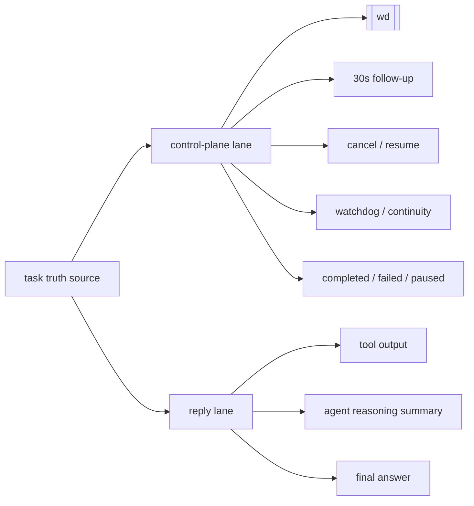

# OpenClaw Task System Architecture

这份文档描述的，不是单个 channel 的调优技巧，而是整个项目的核心架构：

> 如何在“不改 OpenClaw core / 不改宿主 / 不改其它插件”的前提下，为 OpenClaw 建立一层统一任务运行时和控制平面。

## 0. 架构速览

如果先不看细节，这个项目的核心信息路径可以先看成下面三张图。

### 0.0 一张图看整体

```mermaid
flowchart LR
    A[用户消息] --> B[channel / plugin 扩展点]
    B --> C[task-system producer]
    C --> D[task truth source]
    D --> E[control-plane lane]
    D --> F[reply lane]
    E --> G[[wd] / follow-up / cancel / watchdog / continuity]
    F --> H[agent 正式回复]
    D --> I[/tasks / queues / dashboard]
```

这张图想表达的只有三件事：

- 用户消息不是直接等于“普通回复”，中间要先经过 task-system
- task-system 内部要先形成统一 truth source
- 用户最终看到的内容至少分成两条 lane：
  - control-plane lane
  - reply lane

### 0.1 消息处理主路径

```mermaid
flowchart TD
    A[message received] --> B{能否在 receive 时刻产出 producer?}
    B -- 能 --> C[pre-register / early ack]
    B -- 暂时不能 --> D[dispatch 前进入 plugin]
    C --> E[写入 task truth source]
    D --> E
    E --> F[admission / queue / active task 决策]
    F --> G[control-plane message 生成]
    F --> H[reply 执行链]
    G --> I[control-plane scheduler]
    I --> J[发送 [wd] / follow-up / task 管理消息]
    H --> K[agent / tool / final reply]
    J --> L[更新可见状态]
    K --> L
```

这张图对应的是项目现在真正做的事：

- 能前移到 receive 时刻的，就尽量前移
- 不能前移的，至少也要在 plugin 侧先统一进入 task truth source
- 然后再分成：
  - task 管理与控制面发送
  - 普通 reply 执行链

### 0.2 为什么一定要分 lane



这里的关键不是“分两条队列看起来更优雅”，而是：

- 如果不分 lane，`[wd]` 和 cancel / watchdog 这些控制面消息就会被普通 reply 挤住
- 一旦被挤住，用户看到的就不是任务系统，而只是“偶尔能发出状态文案的回复链”

### 0.3 人类阅读顺序

如果你第一次看这份架构文档，建议按这个顺序理解：

1. 先看上面三张图，理解项目的信息路径
2. 再看“北极星目标”和“当前差距”
3. 再看 control-plane 的 schema / priority / delivery / conflict rules
4. 最后再看 queue identity、admission、projection 这些细节设计

## 1. 北极星目标

这份设计文档的最终目标，不是“让某几个 case 体感好一点”，而是：

- `[wd]` 必须在用户发出消息后的第一时间可见
- task-system 的用户可见控制面消息必须具备最高优先级
  - 不止首条 `[wd]`
  - 还包括 30 秒 follow-up、task 状态消息、queue/cancel/resume/watchdog 等管理反馈
  - 这些消息必须优先于普通任务执行与普通回复链路
  - 不能被普通任务链路排队
- 这一点必须对所有 channel 成立，而不是只对某一个 channel 成立

这里的“第一时间”按用户视角定义，而不是按内部 hook 视角定义：

- 不是“进入 `before_dispatch` 后很快返回”就算完成
- 不是“只有首条 `[wd]` 快”就算完成
- 不是“30 秒 progress / task 管理消息最终会发”就算完成
- 不是“task-system 已经 register”就算完成
- 而是用户在消息界面里，发出消息后就能立刻知道系统已经收到并登记

因此，所有临时补丁、阶段性兼容、局部 channel 优化，都只能视为过渡：

- 不能把 “dispatch 后 ack 很快” 误报成 “receive-time ack 已解决”
- 不能把 “某个 channel 先做到” 误报成 “所有 channel 已满足目标”
- 不能把 “单个特例被补平” 误报成 “机制已经根治”

### 1.0 实现边界

这个方案的实现边界也必须固定下来：

- 只改 `openclaw-task-system` 自身代码
- 不改 OpenClaw core
- 不改宿主代码
- 不改其它插件代码
- 只通过现有扩展点、我们自己的 plugin/runtime 脚本、以及本项目可控状态层来工作

因此，哪怕目标是“所有 channel 都要做到 receive-time `[wd]` + 高优先级 control-plane”，实现上也不能偷走捷径：

- 不能直接改宿主 dispatch / channel / queue
- 不能直接改别的 channel 插件内部实现
- 不能靠宿主侧硬编码 bypass 来假装完成

### 1.1 当前差距

离这个北极星目标，当前还差三层：

1. receive-time truth source
   - task-system 必须在用户消息真正到达时，就拿到 arrival truth
2. highest-priority control-plane delivery path
   - 不只是 `[wd]`
   - 整个 task-system 控制面消息都必须有一条优先于正常执行/回复链路的发送路径
   - 并且不能与普通任务回复共用会被串行阻塞的排队语义
   - 同时还缺：
     - control-plane message schema
     - priority rules
     - delivery path
     - conflict rules
3. channel-neutral producer contract
   - 上述两点必须能被不同 channel 以同一套 contract 接入，而不是各做各的特判

当前状态是：

- Feishu 已经部分具备第 1/2 层雏形
- Telegram 目前主要只具备 dispatch 后 ack 能力
- 多 channel 统一 contract 目前主要还停留在 task-system consumer 侧，producer 侧尚未在所有 channel 建立
- 高优先级控制面消息链路目前也还没有在所有 channel 与普通任务链路彻底解耦

### 1.2 高优先级控制面消息定义

为了避免后面继续把不同类型的消息混在一起，先明确：

#### A. 哪些属于高优先级控制面消息

以下消息都属于 task-system control-plane，而不是普通 agent reply：

1. 首次可见确认
   - early `[wd]`
   - immediate `[wd]`
2. 排队与等待状态
   - queue position
   - ahead count
   - estimated wait
3. 周期性进展同步
   - 30 秒 follow-up
   - watchdog 驱动的“仍在处理中 / 当前卡点”同步
4. 任务管理结果
   - cancel 成功 / 失败
   - resume / auto-resume 结果
   - task paused / resumed / failed / settled 状态变更
5. 风险与恢复提示
   - continuity / watchdog / manual-review 需要用户感知的结果

#### B. 哪些不属于高优先级控制面消息

以下仍然属于普通业务回复链：

- agent 的正式回答
- tool summary
- 普通 reasoning / block / final reply
- 与 task-system 无关的 channel 普通系统消息

#### C. 核心要求

高优先级控制面消息必须满足：

1. 发送优先级高于普通 reply
2. 不与普通 reply 共享“谁先排到谁先发”的串行语义
3. 可以复用同一 truth source，但不能被普通 reply 阻塞
4. 同一任务的控制面消息之间也要有稳定顺序

更具体地说：

- 首条 `[wd]` 必须最先可见
- 后续 30 秒 follow-up / watchdog 同步必须优先于普通长任务结果链上的次级文本
- cancel / resume / failed / settled 这类管理消息必须优先于同一任务后续普通输出

#### D. 最小顺序模型

同一 task 的用户可见消息，建议至少分成两条逻辑 lane：

1. control-plane lane
   - early `[wd]`
   - immediate `[wd]`
   - queue / cancel / resume / watchdog / 30 秒 follow-up
2. reply lane
   - agent 正式回复
   - tool summary
   - final answer

要求：

- control-plane lane 优先于 reply lane
- control-plane lane 不应等待 reply lane 排空
- reply lane 可以引用 control-plane truth source
- 但 reply lane 不能反过来决定 control-plane 是否发送

#### E. 明确禁止的坏味道

以下情况都不符合最终目标：

- `[wd]` 虽然是控制面消息，但仍然和正式 reply 共用同一条串行发送队列
- 30 秒 follow-up 必须等 agent 正式输出让路之后才能发
- cancel 成功消息排在普通进展文本后面才送达
- watchdog 同步因为普通任务链拥堵而失去“用户当前可感知状态”的意义

#### F. 设计落点

因此后续实现上，必须显式定义：

- control-plane message schema
- control-plane priority rules
- control-plane delivery path
- control-plane 与普通 reply 的冲突处理规则

如果这四件事没有单独定义，只是继续在现有 reply 链上补 if/else，那么最后仍然会退化成“能发，但会排队”。

### 1.3 control-plane message schema

先定义一个 channel-neutral 的最小 schema，避免不同 channel 各自拼一套“像状态消息”的对象。

#### A. 建议结构

```ts
type ControlPlaneMessage = {
  version: 1
  messageId: string
  taskId?: string | null
  sessionKey?: string | null
  queueIdentity?: QueueIdentity | null

  kind:
    | "ack.early"
    | "ack.immediate"
    | "queue.update"
    | "followup.progress"
    | "watchdog.notice"
    | "task.cancelled"
    | "task.resumed"
    | "task.paused"
    | "task.failed"
    | "task.settled"
    | "continuity.notice"

  priority: "control-plane"
  createdTs: number
  visibleTs?: number

  ordering: {
    lane: "control-plane"
    sequence: number
    supersedesMessageId?: string | null
    dedupeKey?: string | null
  }

  audience: {
    channel: string
    accountId?: string | null
    conversationId: string
    threadId?: string | null
    recipientId?: string | null
  }

  delivery: {
    mode: "immediate" | "best-effort-retry"
    mustBypassReplyQueue: boolean
    mustPreserveOrderWithinLane: boolean
  }

  status: {
    admissionState?:
      | "received"
      | "acknowledged"
      | "admitted"
      | "running"
      | "settled"
      | null
    taskStatus?:
      | "received"
      | "queued"
      | "running"
      | "paused"
      | "done"
      | "failed"
      | "cancelled"
      | null
    cancelability?: "cancelable" | "not_yet_cancelable" | "not_cancelable" | null
    queuePosition?: number | null
    aheadCount?: number | null
    estimatedWaitSeconds?: number | null
  }

  text: {
    visibleText: string
    locale?: string | null
    reason?: string | null
  }

  metadata?: Record<string, unknown>
}
```

#### B. 字段意图

- `kind`
  - 明确这是一条什么控制面消息，不能只靠文案猜
- `ordering`
  - 明确它属于 control-plane lane，并带有稳定顺序
- `delivery.mustBypassReplyQueue`
  - 这是后续实现的关键字段，明确表达“不能和普通 reply 共排”
- `status`
  - 使用 task-system truth source，而不是让每个 channel 自己再算一遍
- `text.visibleText`
  - 允许当前阶段继续先发可见文案，但文案不再承担全部语义

#### C. 最小去重原则

至少按下面维度去重：

- `taskId + kind`
- 没有 `taskId` 时，按 `queueIdentity.queueKey + kind + dedupe window`
- `supersedesMessageId` 可用于新的 queue/update 覆盖旧的 queue/update

#### D. 与普通 reply 的边界

普通 reply 不应该使用这个 schema。

如果一条消息需要：

- 描述 task admission / queue / cancel / watchdog / continuity
- 且必须优先于普通任务输出

那它就应该是 `ControlPlaneMessage`，而不是普通 text reply。

#### E. 第一轮可接受的简化

第一轮不要求一次性把所有 channel 都完整实现这个 schema，但至少要做到：

1. task-system 内部有 canonical schema
2. 现有 `[wd]` / follow-up / cancel 类消息能映射到这个 schema
3. 后续 channel adapter 可以围绕这套 schema 接 producer / delivery

### 1.4 control-plane priority rules

有了统一 schema 之后，下一步必须明确优先级，不然 control-plane 仍然会退化成“也是消息，但只是另一种文案”。

#### A. 优先级层级

建议至少分成 4 个等级：

```ts
type ControlPlanePriority =
  | "p0-receive-ack"
  | "p1-task-management"
  | "p2-progress-followup"
  | "p3-advisory"
```

对应语义：

1. `p0-receive-ack`
   - early `[wd]`
   - immediate `[wd]`
   - 目标：用户刚发出消息后最先可见
2. `p1-task-management`
   - cancel / resumed / paused / failed / settled
   - queue update 中会改变用户决策的关键信息
   - 目标：管理动作和最终状态必须优先送达
3. `p2-progress-followup`
   - 30 秒 follow-up
   - watchdog progress notice
   - 目标：在没有正式结果前保持体感连续性
4. `p3-advisory`
   - continuity notice
   - manual-review / risk advisory
   - 目标：提示风险与下一步，但优先级低于前面三层

#### B. 总规则

必须满足：

1. `p0` 绝不能等待任何普通 reply
2. `p1` 绝不能被同一 task 的普通 reply 抢先
3. `p2` 不能阻塞 `p0/p1`，但也不能长期饿死
4. `p3` 可以延后，但不能覆盖更高优先级控制面消息

换句话说：

- 普通 reply 的优先级永远低于任何 control-plane 消息
- control-plane 内部再按 `p0 -> p1 -> p2 -> p3` 排序

#### C. 覆盖与合并规则

为了避免刷屏，control-plane 消息之间允许覆盖，但必须按规则覆盖：

1. `p0` 不被较低优先级覆盖
   - 首条可见 ack 一旦发出，就视为已经完成它的职责
2. `queue.update` 可以覆盖旧的 `queue.update`
   - 前提是针对同一 `taskId` / `queueKey`
3. `followup.progress` 可以覆盖旧的 `followup.progress`
   - 但不能覆盖 `task.cancelled` / `task.failed` / `task.settled`
4. 终态管理消息会终止低优先级进展消息
   - `task.cancelled`
   - `task.failed`
   - `task.settled`
   - 一旦发出，后续同 task 的 `p2/p3` 进展类消息应停止

#### D. 抢占规则

建议采用最小抢占语义：

- 若当前待发消息是普通 reply，而有新的 `p0/p1` control-plane 消息到来
  - 允许 control-plane 先发
- 若当前待发消息是 `p2/p3`，而有新的 `p0/p1` 到来
  - 必须让 `p0/p1` 先发
- 若当前待发消息是 `p2`，而有新的 `p2` 到来
  - 可按去重/覆盖规则合并

不要求中断一个已经完成网络发送中的消息，但要求：

- 不能因为 reply lane 已有 backlog，就阻止更高优先级 control-plane 进入发送

#### E. 饥饿保护

虽然 control-plane 优先级更高，但仍要避免内部低优先级永远发不出去：

- `p2` follow-up 若已到期，不能因为连续 advisory 消息长期跳过
- `p3` advisory 可合并，但不应无限期推迟到失去意义

因此建议：

- `p2` 设置最小可见间隔
- `p3` 默认合并而不是排长队

#### F. 与用户心智相关的特别规则

这些规则必须优先满足用户理解一致性：

1. 首条 `[wd]` 一定先于任何正式回复
2. cancel 成功消息一定先于同 task 后续普通输出
3. settled / failed 一定终止后续 progress 文案
4. queue position 更新不能在旧状态之后很久才送达，导致用户看到倒退信息

#### G. 第一轮可接受实现

第一轮不要求做复杂抢占器，但至少要做到：

1. control-plane 与普通 reply 分 lane
2. lane 内支持 `p0 -> p1 -> p2 -> p3`
3. settled/cancelled/failed 能停止同 task 的低优先级 follow-up
4. queue/update 与 follow-up 支持基本 supersede / dedupe

### 1.5 control-plane delivery path

schema 和 priority rules 定义好后，真正决定“会不会排队”的是 delivery path。

#### A. 目标

control-plane delivery path 必须满足：

1. producer 在 receive-time 或 task-state-change 时即可产出消息
2. scheduler 按 control-plane priority 独立调度
3. sender 不与普通 reply 共享同一条串行排队语义
4. visible delivery 能回写成功/失败/可见时间

#### B. 最小链路

建议至少拆成下面 5 步：

```text
producer
  -> control-plane store / queue
  -> control-plane scheduler
  -> channel delivery adapter
  -> visible delivery ack / retry result
  -> task-system truth source update
```

#### C. 各环节职责

##### 1. producer

触发时机：

- receive-time
- queue/admission state changed
- 30 秒 follow-up 到期
- watchdog / continuity / cancel / resume / settled

职责：

- 生成 `ControlPlaneMessage`
- 写入 canonical control-plane store
- 不直接决定普通 reply 是否发送

##### 2. control-plane store / queue

职责：

- 保存待发 control-plane 消息
- 按 `taskId / queueKey / kind` 去重
- 保存 `createdTs / visibleTs / superseded / failed / delivered`

关键要求：

- 这条 store 不能退化成“复用普通 reply backlog”
- 否则即使 schema 和 priority 正确，最终还是会排队

##### 3. control-plane scheduler

职责：

- 按 `p0 -> p1 -> p2 -> p3` 挑选待发消息
- 应用 supersede / dedupe / starvation protection
- 对同一 audience 保持 control-plane lane 内顺序

关键要求：

- scheduler 只负责 control-plane lane
- reply lane 应由现有普通 reply 机制继续处理
- 二者共享 truth source，但不共享调度优先级

##### 4. channel delivery adapter

职责：

- 把 `ControlPlaneMessage` 映射成每个 channel 的可见消息
- 负责 channel-specific recipient / thread / account 路由

关键要求：

- adapter 只做映射与发送
- 不重新计算 task 状态
- 不自己决定优先级

##### 5. visible delivery ack / retry result

职责：

- 记录这条 control-plane 消息是否真正可见送达
- 失败时决定是否重试、合并、降级

建议结果字段：

```ts
type ControlPlaneDeliveryResult = {
  messageId: string
  delivered: boolean
  visibleTs?: number
  attemptCount: number
  terminal: boolean
  reason?: string | null
}
```

#### D. 与普通 reply lane 的关系

两条 lane 应该是：

- truth source 尽量统一
- scheduling 分离
- delivery adapter 可部分复用

也就是说：

- 可以共用同一个 channel adapter 底层发消息能力
- 但不能共用“谁先排到谁先发”的 reply backlog

#### E. 当前边界下的实现落点

在“不改 OpenClaw core / 不改其它插件”的前提下，delivery path 应优先分成两类：

1. 已有可控 producer 的 channel
   - 例如 Feishu receive-side 已有补丁入口
   - 可以先建立完整 control-plane path
2. 暂无 receive-side producer 的 channel
   - 例如当前边界下的 Telegram
   - 仍可先建立：
     - task-state-change producer
     - 独立 control-plane scheduler / sender
   - 但 receive-time ack 仍会受入口边界限制

#### F. 第一轮可接受实现

第一轮不要求做完整可靠消息系统，但至少要做到：

1. control-plane message 有单独 store
2. control-plane scheduler 不复用普通 reply queue
3. channel delivery adapter 支持发送后回写可见结果
4. follow-up / cancel / settled 这些消息不再只是普通 reply 文本旁路发送

#### G. 如果做不到这些，会怎么失败

如果 delivery path 没单独定义，常见失败方式会是：

- `[wd]` 虽然有更高优先级定义，但仍卡在 reply backlog 里
- 30 秒 follow-up 明明到期，却要等普通输出先清空
- cancel / settled 明明已经发生，却被旧进展文案抢先显示
- 某些 channel 看起来“逻辑支持了”，但用户体感仍然像没接管

### 1.6 control-plane 与普通 reply 的 conflict rules

有了 schema、priority 和 delivery path，还需要最后一层：冲突规则。

不然系统仍然会在这些地方失真：

- 同一时刻既有 control-plane 消息，又有普通 reply
- 同一 task 上既有新状态，又有旧进展文本
- 同一 audience 下多个 lane 同时想发东西

#### A. 冲突类型

至少要处理 4 类冲突：

1. control-plane vs reply
   - 例：首条 `[wd]` 与正式回复几乎同时可发
2. control-plane vs control-plane
   - 例：旧 queue.update 与新 queue.update
3. terminal vs non-terminal
   - 例：`task.settled` 到来时，旧 `followup.progress` 还在待发
4. audience collision
   - 例：同一个 chat/thread 同时有多条控制面消息争抢可见位

#### B. 总原则

建议固定 5 条硬规则：

1. control-plane 胜过 reply
2. terminal control-plane 胜过 non-terminal control-plane
3. 同 kind 新状态胜过旧状态
4. 同 audience 下 control-plane lane 自己保持顺序
5. reply lane 不得反向阻塞 control-plane lane

#### C. control-plane vs reply

当同一 task / 同一 audience 同时存在 control-plane 与 reply 待发时：

- `p0/p1` control-plane 必须先发
- reply 可以延后
- reply 不得因为“已经排队较久”就反超 control-plane

特别规则：

- 首条 `[wd]` 与正式 reply 冲突时，永远先 `[wd]`
- cancel / failed / settled 与普通 reply 冲突时，永远先管理结果

#### D. control-plane vs control-plane

同 lane 内允许冲突解决，但必须按类型处理：

1. replace
   - `queue.update` 替换旧 `queue.update`
   - 新 `followup.progress` 替换旧 `followup.progress`
2. append
   - `ack.immediate` 之后仍允许出现 `queue.update`
   - `queue.update` 之后仍允许出现 `followup.progress`
3. terminate
   - `task.cancelled`
   - `task.failed`
   - `task.settled`
   - 这三类一旦进入待发集，会终止同 task 的低优先级 progress/update

#### E. terminal vs non-terminal

终态消息有额外规则：

- 一旦 `task.cancelled / failed / settled` 成为最新状态
- 同 task 的 `queue.update / followup.progress / watchdog.notice` 应立即 supersede
- 如果普通 reply 仍未发送：
  - 需要重新判断是否还允许发送
  - 不能默认继续发，避免“任务已结束但还在继续说处理中”

#### F. audience collision

同一个可见目标下，若多个 control-plane 消息同时竞争：

- 先按 priority 排
- 再按 `createdTs`
- 再按 `sequence`

这样至少能保证：

- 同一个 chat/thread 不会出现后来者插队导致语义倒退
- 用户不会先看到旧 queue position，再看到新的 ack

#### G. reply 失效规则

当 reply lane 中的待发消息与最新 task truth source 冲突时，必须允许 reply 失效：

建议最少支持：

1. stale reply drop
   - reply 仍引用“处理中”，但 task 已 settled
2. stale reply re-check
   - reply 发送前重新核对 task 是否仍允许发送
3. task-bound reply invalidation
   - 某些 reply 绑定旧 taskId 时，在 task 已 cancelled/failed 后失效

#### H. 第一轮可接受实现

第一轮不要求做复杂事务系统，但至少要做到：

1. terminal control-plane 能压掉低优先级 progress
2. queue/update 与 follow-up 能 supersede 旧版本
3. reply 发送前有一次最小 re-check
4. 不再出现“已取消 / 已完成后还继续补 progress”的明显冲突

#### I. 如果不定义 conflict rules，会怎么失败

典型失败方式会是：

- `[wd]` 和正式 reply 顺序偶发倒置
- queue position 更新晚于旧状态，用户看到倒退
- cancel 成功后还收到“当前仍在处理中”
- settled 后又冒出 watchdog 跟进文案

### 1.7 第一轮代码切分

前面四块设计完成后，第一轮实现不应该同时大改所有地方，而应按当前仓库的真实边界拆成最小写入集。

#### A. 第一轮目标

第一轮只追求：

1. task-system 内部形成 canonical control-plane message
2. control-plane 与普通 reply 开始显式分 lane
3. 终态控制面消息能压掉低优先级 follow-up
4. 不破坏现有 `[wd]` / follow-up / queue / continuity 行为

第一轮不追求：

- 一次性做完所有 channel 的 receive-time producer
- 一次性做完真正的通用抢占发送器
- 一次性把所有运维输出都迁到新 truth source

#### B. 建议写入集

第一轮写入集仅限本项目自身代码，不外溢到宿主或其它插件。

##### 1. `plugin/src/plugin/index.ts`

职责：

- 新增 canonical control-plane mapping helper
- 把现有：
  - `sendImmediateAck(...)`
  - `sendStatusMessage(...)`
  - short follow-up 触发点
  收敛到 control-plane lane 入口

第一轮应至少抽出：

- `buildControlPlaneMessage(...)`
- `enqueueControlPlaneMessage(...)`
- `flushControlPlaneLane(...)`
- `shouldSupersedeControlPlaneMessage(...)`

##### 2. `scripts/runtime/openclaw_hooks.py`

职责：

- 为 runtime 产出的：
  - short follow-up
  - watchdog notice
  - continuity notice
  - cancel / resume / settled
  提供统一 payload 结构

第一轮重点不是直接发消息，而是：

- 先让 runtime 说清楚“这是一条什么 control-plane 消息”

##### 3. `scripts/runtime/openclaw_bridge.py`

职责：

- 继续作为 `BridgeDecision` truth source
- 为 control-plane status 字段提供稳定输入

第一轮不要求它直接理解 lane，但要求：

- queue/admission/status 字段不要再分散漂移

##### 4. `scripts/runtime/main_ops.py`

职责：

- 暂时仍可维持现有输出
- 后续逐步对齐 control-plane truth source

第一轮可只做：

- 文本/JSON 输出不要与新的 canonical status 语义打架

##### 5. tests

至少新增/调整两类回归：

1. `plugin/tests/*.test.mjs`
   - 已拆分为：
     - `plugin/tests/pre-register-and-ack.test.mjs`
     - `plugin/tests/control-plane-lane.test.mjs`
     - `plugin/tests/scheduler-diagnostics.test.mjs`
     - `plugin/tests/delivery-runners.test.mjs`
   - 覆盖：
     - control-plane lane 优先于 reply lane
     - terminal control-plane 停止 follow-up
     - queue/update supersede 旧 queue/update
2. `tests/test_openclaw_hooks.py`
   - runtime hook 输出统一 control-plane payload
   - priority / kind / status 字段稳定

#### C. 第一轮最小实现顺序

建议顺序：

1. 在 plugin 侧引入 canonical `ControlPlaneMessage`
2. 让 immediate ack / short follow-up 先走 control-plane lane
3. 加 terminal-stop-followup 规则
4. 再让 runtime hook 输出更明确的 control-plane payload
5. 最后补测试

#### D. 为什么先从 plugin 下刀

因为当前仓库里最接近“发送控制面消息”的现成入口，就在 plugin：

- `before_dispatch`
- `sendImmediateAck(...)`
- `sendStatusMessage(...)`
- short-task follow-up

先把这些点收敛到一个 lane，即使外部 channel producer 还没全部统一，至少 task-system 自己内部已经不会继续把 control-plane 当普通 reply 文本旁路处理。

## 1. 背景

当前 `openclaw-task-system` 已经在任务生命周期层实现了：

- `[wd]` 可见回执
- 排号与队列状态
- delayed reply / continuation
- watchdog
- continuity / auto-resume
- OpenClaw 重启后的任务恢复

但在 Feishu `health` 实际演练中暴露出一个关键问题：

- 第一条消息处理较慢时
- 第二条消息虽然已经被 Feishu 收到
- 但因为 Feishu channel 自己先有一层 `chat queue`
- 第二条消息要等第一条 `dispatch complete` 之后，才真正进入 task-system 的 `before_dispatch`
- 导致第二条消息的 `[wd]` 无法第一时间返回

这会直接削弱“排号系统”的意义。

如果用户已经发出第二条消息，但系统因为 channel 内部排队导致 `[wd]` 迟迟不可见，那么：

- 用户会认为系统没有收到
- 排号系统看起来不可信
- cancel / queue / wd 的用户心智会被破坏

## 2. 问题定义

### 2.1 当前实际问题

当前 Feishu 的队列，发生在 task-system 之前。

实际链路如下：

```text
Feishu websocket event
    -> handleMessageEvent
    -> enqueueFeishuChatTask
    -> handleFeishuMessage
    -> dispatchToAgent
    -> OpenClaw before_dispatch
    -> task-system register / wd / queue
    -> agent run
```

当同一 chat 有一条消息正在处理中时，第二条消息会先卡在：

```text
enqueueFeishuChatTask(... status = queued)
```

此时：

- task-system 还不知道第二条消息已经到达
- `[wd]` 还没机会发
- 排号也还没建立

### 2.2 为什么这是架构问题

当前的 task-system 是从 `before_dispatch` 开始接管任务。

这意味着：

- 它只能管理“已经进入 agent dispatch 流”的消息
- 无法管理“channel 已收到，但尚未进入 dispatch”的消息

因此 Feishu channel 的内部 queue 抢走了三个关键控制点：

1. 第一时间可见确认
2. 统一排号
3. 统一取消 / 恢复 / 状态语义

### 2.3 为什么这会让叫号系统失真

用户看到的是：

- 第二条消息已经发出
- 但 `[wd]` 没回来
- 第一条结果先回来
- 第二条 `[wd]` 才出现

这会让用户自然地认为：

- 系统没有及时收到第二条
- 排号系统只是“事后补写”的状态
- `[wd]` 不是“收到即确认”，而是“排到你了才确认”

这和 task-system 想表达的语义是相反的。

## 3. 当前架构与目标架构

### 3.1 当前架构

```text
[用户发消息到 Feishu]
          |
          v
[Feishu channel 收到 websocket event]
          |
          v
[handleMessageEvent]
          |
          v
[Feishu chat queue]
  | immediate                    | queued
  |                              |
  v                              |
[handleFeishuMessage]            |
  |                              |
  v                              |
[dispatchToAgent]                |
  |                              |
  v                              |
[OpenClaw before_dispatch] <-----+
  |
  v
[task-system register]
  |
  v
[[wd] / 排号 / task queue]
  |
  v
[agent 执行]
  |
  v
[最终回复]
```

当前问题的本质是：

> Feishu 的业务可感知队列，发生在 task-system 之前。

### 3.2 目标架构

`message receive` 仍然应该按 channel 区分，但**业务级排队**不应该再被 channel 私有队列控制。

目标架构：

```text
[channel receive]
    -> normalize inbound event
    -> resolve target agent
    -> agent-scoped task queue
    -> immediate [wd]
    -> queue / cancel / watchdog / continuity
    -> serial or parallel execution policy
    -> final reply back to original channel
```

更具体地说：

```text
Feishu receive
  -> normalize inbound message
  -> resolve agent (main / health / code / ...)
  -> task-system queue (agent-scoped)
  -> immediate [wd]
  -> business queue / cancel / resume
  -> execution dispatch
  -> channel delivery
```

### 3.3 边界原则

正确边界不是“所有 channel 前面一个全局 queue”，而是：

- `receive` 继续按 channel 区分
- `queue / wd / cancel / resume` 按 agent-scoped task queue 统一

也就是说：

- channel 层负责“收到什么”
- task-system 层负责“怎么排、怎么回、怎么恢复”

## 4. 当前临时修补与局限

为了快速修复 Feishu 的用户体感，这一轮已经做了一个临时补丁：

### 4.1 已实现的临时补丁

在 Feishu channel 层，当消息进入：

```text
enqueueFeishuChatTask(... status = queued)
```

时，立即发送一条早期 `[wd]`：

```text
[wd] 已收到，前一条消息仍在处理中；这条我先登记，处理一结束就继续。
```

同时 task-system 插件层做了去重：

- 如果稍后真正进入 `before_dispatch`
- 且这条消息的早期 `[wd]` 已经发过
- 则跳过重复 `[wd]`

### 4.2 这个补丁解决了什么

- 第二条消息不会再完全“无感”
- Feishu queued 场景下用户能更早知道系统已经收到
- 不会出现完全重复的双 `[wd]`

### 4.3 这个补丁没有从根上解决什么

它仍然是 Feishu 特例，不是统一架构。

它没有解决：

- task-system 仍然不知道 queued 消息的真实到达时刻
- 统一排号还没有前移到 message receive 之后
- cancel 仍然不能完整接管“channel 已排但 task-system 未登记”的消息
- 其它 channel 也还没有统一遵守同样规则

因此它只能算：

> 临时缓解，不是最终方案。

## 5. 最终解决思路

### 5.1 核心目标

把“业务可感知 queue”的控制权，从 channel 私有队列前移到 task-system。

目标行为：

1. 消息一被 channel 收到并标准化
2. 就进入 agent-scoped task queue
3. 立刻获得 task id / queue position / wd 资格
4. 后续由 task-system 决定：
   - 什么时候执行
   - 是否串行
   - 是否允许并发
   - 是否可取消
   - 是否需要 watchdog

### 5.2 transport queue 与 business queue 分离

最终应该把 queue 分成两层：

#### 第一层：transport queue

保留在 channel 层，只负责底层发送/流式冲突保护。

例如：

- 同 chat 的 card 更新顺序
- abort fast-path
- SDK 级发消息顺序
- thread 相关底层一致性

这层 queue 不应该承载用户可感知的排号语义。

#### 第二层：business queue

前移到 task-system，负责用户感知到的业务任务管理：

- `[wd]`
- 排号
- cancel
- queue position
- delayed reply
- watchdog
- continuity
- restart recovery

用户眼中的“前面还有几个号”，应该只来自这层。

## 6. 推荐实施方案

前置约束：

- 不改 OpenClaw core
- 不改其它插件代码
- 只使用 OpenClaw 现有扩展点
- 只在本项目可控范围内推进这条改造
- 不做无意义的硬编码补丁
- 临时补丁可以存在，但目标必须是逐步收敛到可复用、可解释、能解决根因的机制

### Phase 0. 现有 Feishu queued 早期 `[wd]`

目标：

- 先缓解最明显的体验问题

状态：

- 已实现

### Phase 1. 在现有可控 receive 接入层尽早登记 task

目标：

- 在不改 OpenClaw core 的前提下
- 利用现有可控 receive 接入层尽早调用 task-system register
- 尽量不再等到 `before_dispatch`

结果：

- task-system 可以拿到真实 arrival time
- 第二条消息能更早生成 task id
- 排号真正基于 task queue，而不是 channel queue

### Phase 2. 引入 agent-scoped admission

目标：

- 将“能不能真正开始执行”变成 task-system 决策
- 对同 agent / 同 session / 同 chat 的并发与串行做统一策略

结果：

- Feishu queue 不再决定业务排队
- task-system 决定哪个 task 可以进入执行态

### Phase 3. 把 cancel 接到前移后的 queue

目标：

- queued / received task 统一可取消
- 不再区分“已经进 task-system”和“还卡在 channel queue”

结果：

- cancel 才会真正和排号语义一致

### Phase 4. 统一多 channel

目标：

- Feishu 只是第一站
- Telegram / WebChat / 其它 channel 也逐步统一成同一模型

结果：

- receive 按 channel 区分
- queue 语义按 agent/task-system 统一

## 7. 推荐数据流

推荐的数据流如下：

```text
[channel receive]
    |
    v
[normalize inbound event]
    |
    v
[task-system pre-register]
    |
    +--> create task id
    +--> assign queue position
    +--> decide wd payload
    |
    v
[send early wd]
    |
    v
[task-system admission decision]
    |
    +--> execute now
    +--> keep queued
    +--> delayed continuation
    |
    v
[agent run / continuation run]
    |
    v
[final delivery to original channel]
```

## 8. 开发切入点

### 8.1 第一优先级

把 task-system 的 register 能力前移到 `message receive` 后。

需要研究的位置：

- `openclaw-lark`
  - `src/channel/event-handlers.js`
  - `src/messaging/inbound/handler.js`
- `openclaw-task-system`
  - `plugin/src/plugin/index.ts`
  - `scripts/runtime/openclaw_hooks.py`

补充结论：

- OpenClaw 当前虽然存在通用 `message_received` hook
- 但其触发点位于 `dispatch-from-config`
- 仍然晚于 Feishu `chat queue`
- 因此它不足以单独解决“channel 已收到，但 task-system 还没看到”的问题
- 在当前约束下，不走“修改 OpenClaw core / 新增更早通用 hook”路线
- 因此后续工作应聚焦：
  - 用现有可控 receive 接入层把 pre-register 做完整
  - 用 task-system 插件把 pre-register / dedupe / admission / cancel 语义补齐

扩展到多 channel 后，还需要补一个现实判断：

- “进入 `before_dispatch` 后很快发出 `[wd]`”与“用户发送后第一时间就看见 `[wd]`”不是一回事
- Telegram 真实验收已经证明：
  - dispatch 后 ack 速度可以做到很快
  - 但如果前面已有长任务占住同一 session，后续消息仍会等到真正进入 `before_dispatch` 时，才第一次看见 `[wd]`
- 在当前边界下，这不是 task-system 插件内部继续微调就能彻底解决的问题
- 如果某个 channel 没有像 Feishu receive 侧那样、可由本项目直接接住的 producer 入口
- 那么该 channel 的 receive-time `[wd]` 就应该明确标记为“当前边界下未完成”，而不是继续描述成“体感已基本解决”

### 8.2 第二优先级

定义“channel queue 退化为 transport lock”的最小改造。

目标：

- 不粗暴删掉 Feishu queue
- 但把它从业务 queue 降级成 transport lock

### 8.3 第三优先级

让 queued task 的 cancel 完整可用。

### 8.4 建议的 pre-register 协议

为了把当前补丁升级成正式闭环，建议把 receive 侧与 task-system 插件侧之间的共享状态提升成多 channel 通用协议，而不是继续停留在 Feishu 特例。

#### A. PreRegisterSnapshot

用途：

- 表示“channel 已收到消息，并且 task-system 已经做过一次早期 register 决策”
- 后续 `before_dispatch` 可以直接复用这次 register 结果

建议字段：

```ts
type PreRegisterSnapshot = {
  version: 1
  queueIdentity: QueueIdentity
  content: string
  contentFingerprint: string
  arrivalTs: number
  snapshotTs: number
  senderId?: string
  sessionKey?: string
  registerDecision: {
    should_register_task: boolean
    task_id?: string | null
    classification_reason?: string | null
    confidence?: string | null
    task_status?: "received" | "queued" | "running" | "paused" | null
    queue_position?: number | null
    ahead_count?: number | null
    active_count?: number | null
    running_count?: number | null
    queued_count?: number | null
    estimated_wait_seconds?: number | null
    continuation_due_at?: string | null
  }
  ack: {
    earlyAckEligible: boolean
    earlyAckSent: boolean
    earlyAckSentAt?: number
  }
  metadata?: Record<string, unknown>
}
```

说明：

- `queueIdentity`
  - 使用上一节定义的 channel-neutral `QueueIdentity`
- `arrivalTs`
  - 用于表达真实 receive 时刻
  - 当前 `before_dispatch` 无法提供这个真实到达时间，所以这个字段很关键
- `contentFingerprint`
  - 用于在兼容期内辅助匹配
  - 不建议只靠原始文本做命中
- `registerDecision`
  - 应视为 receive 时刻的快照
  - `before_dispatch` 只复用，不再重新推断
- `ack`
  - 表示该 snapshot 在 receive 阶段是否允许、是否已经发送过 early ack

#### B. EarlyAckMarker

用途：

- 表示“这个 queueKey 在 receive 阶段已经发过一条早期 `[wd]`”
- 避免 `before_dispatch` 再发一次相同语义的 `[wd]`

建议字段：

```ts
type EarlyAckMarker = {
  version: 1
  queueKey: string
  sentAt: number
  channel: string
  accountId: string
  conversationId: string
  threadId?: string
  messageId?: string
}
```

当前实现里它还是时间戳数组；后续可以保留兼容，但建议语义上按结构体理解。

### 8.5 建议的状态流

在“不改 core / 不改其它插件”的边界下，建议把 receive 到 dispatch 的状态流定义成：

```text
message received
  -> build QueueIdentity
  -> task-system register(observe_only=true)
  -> store PreRegisterSnapshot
  -> if channel queue says queued:
       send early [wd]
       mark EarlyAckMarker
  -> later before_dispatch:
       consume PreRegisterSnapshot
       reuse registerDecision
       if EarlyAckMarker already exists:
         skip duplicate [wd]
       else:
         send normal immediate [wd]
  -> activate / dispatch / follow-up / finalize
```

建议把它拆成 5 个明确阶段：

1. `received`
   - channel 已收到消息
   - pre-register 已完成
   - 可以拿到最早 arrival time
2. `acknowledged`
   - `[wd]` 已经发出
   - 可能是 queued early ack，也可能是普通 immediate ack
3. `admitted`
   - 允许进入真实 dispatch 流
   - 这一步仍可能晚于 receive
4. `running`
   - agent 已开始执行
5. `settled`
   - done / failed / cancelled / paused continuation

### 8.6 匹配与升级规则

`before_dispatch` 消费 snapshot 时，建议按下面顺序匹配：

1. `queueIdentity.queueKey`
2. `senderId`
3. `contentFingerprint`
4. TTL 内最新未消费 snapshot

升级规则建议明确如下：

- 如果找到 `PreRegisterSnapshot`：
  - 直接复用 `registerDecision`
  - 不再二次调用 register
- 如果 `ack.earlyAckSent=true` 或存在 `EarlyAckMarker`：
  - 跳过重复 `[wd]`
- 如果没找到 `PreRegisterSnapshot`：
  - 回退到当前 `before_dispatch -> register` 路径

### 8.7 在当前边界下能与不能做到的事

当前边界下可以做到：

- 更早给出 `[wd]`
- 更早拿到一份 task queue 快照
- 在 `before_dispatch` 复用 register 结果，避免重复判断
- 在 Feishu direct 场景下让排号语义更接近真实 arrival order

当前边界下暂时做不到完全保证：

- 所有 channel 都统一拥有同样早的 receive 时刻 register
- 完全绕开 channel 内部 queue 对真实 dispatch 时机的影响
- 在不改其它插件的情况下，让所有 channel 的 cancel / queue 语义完全一致

### 8.8 建议的最小抽象层

为了避免继续堆叠硬编码，建议后续实现至少稳定为下面 4 层，而不是把逻辑散落在多个 if/else 分支里。

#### 1. Queue Identity Layer

职责：

- 统一计算业务排队语义使用的 `queueKey`
- 统一描述：
  - channel
  - account
  - conversation
  - sender
  - session

最低要求：

- 同一条消息在 receive 阶段和 `before_dispatch` 阶段必须能算出相同 `queueKey`
- 不能让 Feishu direct / topic / thread 各自走一套随意拼接规则

#### 2. Pre-register Snapshot Layer

职责：

- 在 receive 阶段生成一份稳定快照
- 把最早 arrival truth 固定下来

最低要求：

- 这份快照必须足够支撑：
  - `[wd]`
  - queue position
  - admission 前状态解释
  - `before_dispatch` 复用

#### 3. Admission Layer

职责：

- 决定这条消息当前只是 `received / acknowledged`
- 还是已经可以进入 `admitted / running`

最低要求：

- 必须能解释：
  - 为什么已经收到但还不能开始执行
  - 为什么当前 queue position 是这个值
  - 为什么 cancel 现在可以或不可以生效

#### 4. User-facing Projection Layer

职责：

- 将内部状态投影到用户能理解的输出
- 包括：
  - `[wd]`
  - `/tasks`
  - dashboard / queues / lanes / continuity 文案

最低要求：

- 同一状态在不同入口的解释不能冲突
- 用户看到的排号、运维看到的排号、cancel 实际作用的排号，必须尽量来自同一个 truth source

### 8.9 下一步实现时应避免的坏味道

下面这些都属于“看起来在修，实际在继续制造债务”的做法：

- 为单个 channel 再追加一套新的字符串拼 key 规则
- 在 receive 和 `before_dispatch` 分别各算一套 queue 语义
- 用 message text 的临时模糊匹配替代稳定 identity
- `[wd]`、`/tasks`、`queues`、`cancel` 各自读不同状态源
- 为了让某个 case 过掉，再增加一个新的 channel-specific flag，但没有沉淀成通用抽象

### 8.10 建议的代码落地计划

为了避免后续实现时继续扩散，建议把当前代码收敛成下面的职责分布。

#### A. `openclaw-lark/src/channel/event-handlers.js`

这里应承担的职责：

- receive 阶段的最早 pre-register
- queue identity 计算
- early ack 发送
- pre-register snapshot 写入

这里不应长期承担的职责：

- 自己重新定义一套 task queue 语义
- 自己维护多套 message 文案决策逻辑
- 自己决定 admission / running / cancel 规则

建议保留并收敛的函数：

- `preRegisterTaskAtReceive`
  - 继续保留
  - 但应升级为正式的 receive pre-register 入口
- `callTaskSystemRegister`
  - 继续保留
  - 但参数结构应和正式 pre-register snapshot 对齐
- `setPreRegisterEntry`
  - 继续保留
  - 但 entry 结构应升级成正式协议
- `markEarlyAckSent`
  - 继续保留
  - 但建议逐步升级为结构化 early ack entry

建议新增的本地抽象：

- `buildQueueIdentity(...)`
  - 统一产出：
    - `queueKey`
    - `channel`
    - `accountId`
    - `conversationId`
    - `senderId`
    - `sessionKey`
- `buildPreRegisterSnapshot(...)`
  - 统一把 register result + arrival truth 组装成快照

#### B. `openclaw-task-system/plugin/src/plugin/index.ts`

这里应承担的职责：

- 消费 pre-register snapshot
- 根据 snapshot 做 dedupe
- 将 pre-register 状态升级成正式 immediate ack / follow-up / activation 流程

这里不应长期承担的职责：

- 再反向推断 receive 时刻的真实 arrival truth
- 重新拼接一套 queue identity
- 继续扩展多组“chatId 或 senderId 二选一”的匹配兜底逻辑

建议保留并收敛的函数：

- `consumePreRegisterEntry`
  - 继续保留
  - 但入参与匹配规则应统一使用 `queueKey`
- `consumeQueuedEarlyAck`
  - 继续保留
  - 但也应收敛到相同的 `queueKey`
- `buildEarlyAckKey`
  - 可保留，但应逐步让语义升级为真正的 `queueKey`

建议新增的本地抽象：

- `consumePreRegisteredSnapshot(queueIdentity, contentFingerprint, senderId)`
- `consumeEarlyAckMarker(queueIdentity)`

#### C. `openclaw-task-system/scripts/runtime/openclaw_hooks.py`

这里应承担的职责：

- 输出正式、稳定、可复用的 register snapshot
- 不关心 channel 的早期 ack 发送细节

建议目标：

- `register` 命令返回的字段应成为唯一可信 snapshot
- 不同入口不要自己拼补充字段

#### D. `openclaw-task-system/scripts/runtime/openclaw_bridge.py`

这里应承担的职责：

- 统一 queue metrics / wait estimate / task status snapshot
- 让 receive 阶段和 dispatch 阶段看到同一套排号 truth

建议目标：

- `BridgeDecision` 逐步成为 pre-register snapshot 的内核
- 后续 `/tasks`、`queues`、`dashboard` 都尽量复用这套结果，不要另起炉灶

更具体地说：

- `registerDecision` 应尽量直接映射自 `BridgeDecision`
- 不同 channel 不要自己重新拼一份“像 queue snapshot 的东西”
- 通用 snapshot 的 truth source 应优先来自 runtime bridge，而不是 channel adapter 自己计算

### 8.11 下一步最小实现单元

如果下一轮开始真正改代码，建议按下面顺序落，不要一次改太散：

1. 先统一 `queue identity`
   - 让 receive 和 `before_dispatch` 拿到同一个 `queueKey`
2. 再升级 pre-register entry 结构
   - 加入 `queueKey / arrivalTs / register snapshot`
3. 再收敛 plugin 侧消费逻辑
   - 优先按 `queueKey` 匹配
   - 保留旧匹配仅作兼容过渡
4. 最后再补 `/tasks` 和 cancel 语义
   - 建立在前面统一 truth source 之上

### 8.12 Queue Identity 设计稿

当前最需要先稳定的是：

> 在 receive 阶段、channel queue 阶段、`before_dispatch` 阶段，到底什么才算“同一个业务队列”。

如果这个 identity 不稳定，那么：

- pre-register 会命中错对象
- early ack 会重复或漏跳
- queue position 会漂
- `/tasks` 和 cancel 都会说不清

#### 设计目标

业务 `queueKey` 应满足：

1. 同一消息在 receive 和 `before_dispatch` 两个阶段可重复计算
2. 与当前 channel transport lock 的粒度尽量一致
3. 能表达 direct / group / topic / thread 的语义边界
4. 不依赖 message text 本身
5. 不依赖某个阶段才有、另一个阶段没有的字段

#### 多 channel 原则

虽然当前问题是从 Feishu 暴露出来的，但 `queue identity` 不应设计成 Feishu-only。

建议原则：

- 统一抽象先按 channel-neutral 方式定义
- 每个 channel 再提供自己的 `QueueIdentity adapter`
- Feishu 只是第一个落地实现，不是模型本身

当前 OpenClaw / plugin 扩展点里已经有较稳定的共性字段：

- `channelId`
- `accountId`
- `conversationId`
- `senderId`
- `threadId` 或 thread-like identity

因此后续设计应优先围绕这些通用字段，而不是围绕某个 channel 的临时字符串规则。

#### 通用 QueueIdentity

建议正式定义成：

```ts
type QueueIdentity = {
  channel: string
  accountId: string
  conversationId: string
  threadId?: string
  senderId?: string
  sessionKey?: string
  scope: "direct" | "conversation" | "thread"
  queueKey: string
}
```

设计含义：

- `conversationId`
  - 代表当前 channel 里“默认串行语义”的会话标识
- `threadId`
  - 代表在 conversation 之下进一步隔离的 thread / topic / sub-conversation
- `scope`
  - 只负责解释业务语义
- `queueKey`
  - 负责唯一标识业务队列

#### Channel Adapter 模式

建议每个 channel 最终都通过自己的 adapter 产出同一个 `QueueIdentity` 结构。

例如：

```ts
type QueueIdentityAdapter = (input: {
  channel: string
  accountId?: string
  conversationId?: string
  senderId?: string
  threadId?: string
  sessionKey?: string
  metadata?: Record<string, unknown>
}) => QueueIdentity | null
```

这样做的价值：

- Feishu 可以先落地
- Telegram / Discord / WebChat 以后也有同样入口
- `/tasks`、cancel、dedupe、admission 不需要为每个 channel 再重新发明一套状态机

#### Feishu 作为第一个 adapter

当前可直接复用的最稳定来源，是 Feishu channel 现有的 transport queue key：

```ts
buildQueueKey(accountId, chatId, threadId)
```

它当前的语义是：

```text
{accountId}:{chatId}
{accountId}:{chatId}:thread:{threadId}
```

这是一个很好的起点，因为：

- receive 阶段就能拿到 `accountId / chatId / threadId(root fallback)`
- dispatch 阶段也能拿到同样一组字段
- 它已经是当前 Feishu transport lock 的真实粒度

建议它产出的 `QueueIdentity` 为：

```ts
type FeishuQueueIdentity = QueueIdentity & {
  channel: "feishu"
  conversationId: string // chatId
  threadId?: string
  senderId?: string
  chatType?: "p2p" | "group"
  scope: "direct" | "conversation" | "thread"
}
```

#### Feishu 下的推荐规则

##### 1. Direct / p2p

建议：

- `chatType = p2p`
- `conversationId = event.message.chat_id`
- `threadId = undefined`
- `scope = direct`
- `queueKey = buildQueueKey(accountId, conversationId, undefined)`

为什么不用 `senderId` 当主 key：

- `senderId` 可以作为 identity 的补充字段
- 但业务 queue 粒度更应该和 channel 当前真实串行粒度一致
- 当前 Feishu transport lock 用的是 `chatId`，不是 `senderId`

##### 2. Group chat 非 topic

建议：

- `chatType = group`
- `conversationId = event.message.chat_id`
- `threadId = undefined`
- `scope = conversation`
- `queueKey = buildQueueKey(accountId, conversationId, undefined)`

##### 3. Group topic / thread

建议：

- 优先 `thread_id`
- 没有 `thread_id` 但有 `root_id` 时，用 `root_id` 作为 thread fallback
- `scope = thread`
- `queueKey = buildQueueKey(accountId, conversationId, resolvedThreadId)`

这样做的原因：

- 当前 channel queue 和 dispatch 路径已经在用 thread 维度隔离 topic
- 如果业务 queueKey 不跟随这个粒度，后面 `/tasks` 和 cancel 会和真实执行粒度打架

#### 不建议的做法

下面这些都不建议作为主 queue identity：

- 只用 `senderId`
  - direct 场景看起来可行，但会和 channel queue 粒度脱节
- `chatId` 和 `senderId` 混用，谁能匹配上就算谁
  - 这会让 dedupe 规则不可解释
- 用 `sessionKey` 单独当业务 queueKey
  - session 语义和当前 transport lock 语义不完全等价

#### 其它 channel 的预留规则

后续如果其它 channel 要接入，建议也按同样模式处理：

- 若 channel 本身只有 conversation 粒度
  - `scope = conversation`
  - `queueKey = {channel}:{accountId}:{conversationId}`
- 若 channel 支持 thread / topic / forum / sub-thread
  - `scope = thread`
  - `queueKey = {channel}:{accountId}:{conversationId}:thread:{threadId}`
- direct / DM 场景
  - 优先使用 channel 的 `conversationId`
  - `senderId` 只作为辅助 identity，不作为主 key

换句话说：

- 先统一成“conversation + optional thread”模型
- 不为某个 channel 额外发明新的主键体系

#### 兼容过渡策略

为了兼容当前已经上线的补丁，建议分两步走：

第一步：

- 正式新增 `QueueIdentity`
- pre-register entry 和 early ack entry 都写入 `queueKey`
- plugin 侧优先按 `queueKey` 匹配
- 旧的 `chatId / senderId` 多候选匹配逻辑保留为 fallback

第二步：

- 当真实验收稳定后
- 再逐步移除“chatId 或 senderId 谁匹配上都行”的兼容兜底

#### 这个设计解决的根本问题

如果 `queueKey` 定稳了，后面这些事才有统一 truth source：

- receive 时刻的 pre-register 属于哪个业务队列
- early ack 到底是不是已经发过
- `before_dispatch` 到底应该复用哪一个 snapshot
- `/tasks` 展示的排队项和真正执行队列是不是同一条线
- cancel 到底作用于哪一个队列对象

### 8.13 AdmissionState 设计稿

`QueueIdentity` 和 `PreRegisterSnapshot` 稳定之后，第三层必须补的是：

> 这条消息现在到底只是“被收到了”，还是已经“允许进入执行流”。

如果这层不明确，就会出现：

- 用户看到“排第 2 位”，但不知道是不是已经真正进执行队列
- `/tasks` 看起来像能取消，实际上取消不到
- `before_dispatch` 到来时，系统自己也无法清楚解释是在“复用 snapshot”还是“正式准入”

#### 通用 AdmissionState

建议定义为：

```ts
type AdmissionState =
  | "received"
  | "acknowledged"
  | "admitted"
  | "running"
  | "settled"
```

配套建议结构：

```ts
type AdmissionSnapshot = {
  state: AdmissionState
  queueKey: string
  taskId?: string
  queuePosition?: number | null
  aheadCount?: number | null
  estimatedWaitSeconds?: number | null
  admittedAt?: number
  runningAt?: number
  settledAt?: number
  reason: string
  cancelability: "cancelable" | "not_yet_cancelable" | "not_cancelable"
}
```

#### 各状态的建议语义

##### 1. `received`

表示：

- channel 已收到消息
- task-system 已完成 pre-register
- 但还没有发出用户可见确认

推荐解释：

- 系统已经知道这条消息存在
- 已经拥有最早 arrival truth
- 但用户还没看到 `[wd]`

##### 2. `acknowledged`

表示：

- 用户已经看到 `[wd]`
- 但这条消息还没真正进入默认 dispatch 流

推荐解释：

- 这是“业务上已登记，但尚未 admitted”的状态
- 这个状态应该成为 queued early ack 的主要归宿

##### 3. `admitted`

表示：

- 这条消息已经被允许进入正式 dispatch 流
- 后续只差 agent 真正开始执行

推荐解释：

- admission 是“允许进入执行流”
- 它不等于已经 running
- 它也不等于用户已经看到最终结果

##### 4. `running`

表示：

- agent 已经开始执行
- 后续按现有 task-system 的 progress / watchdog / finalize 流转

##### 5. `settled`

表示：

- 这条消息的当前生命周期已经收口
- 包括：
  - done
  - failed
  - cancelled
  - paused continuation

#### 建议的升级规则

```text
receive
  -> received
  -> if any ack sent:
       acknowledged
  -> when default dispatch path accepts this task:
       admitted
  -> when agent execution actually starts:
       running
  -> when lifecycle reaches terminal/paused outcome:
       settled
```

#### 在当前边界下 admission 的实际判定

在“不改 core / 不改其它插件”的前提下，建议 admission 暂时按下面规则近似定义：

- `received`
  - pre-register 已完成，但尚未发任何 `[wd]`
- `acknowledged`
  - early ack 或 immediate ack 已发出，但尚未进入正式 `before_dispatch`
- `admitted`
  - `before_dispatch` 已命中该消息，并已消费对应 snapshot
- `running`
  - runtime task status 为 `running`
- `settled`
  - runtime task status 为 `done / failed / cancelled / paused`

这不是最终完美解，但已经能把“已收到”和“已准入”区分开。

#### cancel 生效边界

cancel 语义建议直接绑定到 AdmissionState，而不是绑定到某个入口命令文案。

推荐规则：

- `received`
  - `cancelability = not_yet_cancelable`
  - 原因：当前只是内部已看到，还未形成稳定业务可见对象
- `acknowledged`
  - `cancelability = cancelable`
  - 原因：用户已经看到 `[wd]`，这时就应尽量拥有一致的取消语义
- `admitted`
  - `cancelability = cancelable`
  - 原因：已经正式进入业务队列，但还未 running 时，最需要支持取消
- `running`
  - `cancelability = not_cancelable` 或进入“停止当前任务”的另一条语义
  - 原因：这时不应再假装它和 queued cancel 是一回事
- `settled`
  - `cancelability = not_cancelable`

#### `/tasks` 应如何解释

`/tasks` 不应该只显示 task status，还应显示 admission 语义。

推荐最少展示：

- 当前状态：
  - `received / acknowledged / admitted / running / settled`
- 当前排位：
  - `queuePosition`
- 前面还有几个号：
  - `aheadCount`
- 是否可以取消：
  - `cancelability`
- 如果不能取消：
  - 给出原因文案

推荐的用户解释示例：

- `acknowledged`
  - “已收到并登记，当前尚未轮到正式处理”
- `admitted`
  - “已进入正式处理队列，等待真正开始执行”
- `running`
  - “正在处理”

#### 这个设计解决的根本问题

如果 AdmissionState 明确了，后面这些解释才能统一：

- 为什么第二条消息已经 `[wd]` 了，但还没开始跑
- 为什么看起来在队列里，却还不是 running
- 为什么某个时刻 cancel 可以生效，另一个时刻就不应该再走同一语义
- 为什么 `/tasks`、`queues`、follow-up 文案应该展示不同层级的信息

### 8.14 User-facing Projection 设计稿

前三层稳定之后，最后一个必须统一的是：

> 同一个内部状态，在不同用户入口到底该如何投影。

如果这一层不统一，就会出现：

- `[wd]` 说“正在处理”，`/tasks` 却显示“尚未 admitted”
- `queues` 看起来像排第 2，`dashboard` 却像没风险
- follow-up 文案像 running，但 cancel 实际还按 queued 处理

因此建议所有对外入口都基于同一套 projection 规则，而不是各自拼文案。

#### 通用 Projection 输入

建议所有用户可见入口都从同一份组合状态生成文案：

```ts
type UserFacingProjectionInput = {
  queueIdentity: QueueIdentity
  preRegisterSnapshot?: PreRegisterSnapshot
  admission?: AdmissionSnapshot
  registerDecision?: BridgeDecisionLike
  taskStatus?: "received" | "queued" | "running" | "paused" | "done" | "failed" | "cancelled"
  queuePosition?: number | null
  aheadCount?: number | null
  estimatedWaitSeconds?: number | null
  cancelability?: "cancelable" | "not_yet_cancelable" | "not_cancelable"
  lastProgressNote?: string
}
```

原则：

- `[wd]`
  - 偏向“第一次解释当前状态”
- `/tasks`
  - 偏向“完整展示当前状态 + 可操作性”
- `queues`
  - 偏向“结构化队列真相”
- `dashboard`
  - 偏向“汇总风险与下一步”
- follow-up
  - 偏向“状态发生变化后的人话同步”

#### 建议的入口分工

##### 1. `[wd]`

目标：

- 让用户第一时间知道系统已收到
- 说明当前是否已经排队
- 不承担完整运维展示职责

建议：

- `received`
  - 尽量不要长时间停留在这个状态且无可见输出
- `acknowledged`
  - 文案以“已收到并登记”优先
- `admitted`
  - 文案以“已进入正式处理队列”优先
- `running`
  - 文案以“已开始处理”优先

不建议：

- 在 `[wd]` 里混入太多内部术语
- 把 `[wd]` 写成运维面板

##### 2. `/tasks`

目标：

- 成为普通用户理解当前任务状态的主入口
- 明确“我现在在哪、能做什么”

建议最少展示：

- 当前状态标签
- 当前排位
- 前面还有几个号
- 是否已 admitted
- 是否正在 running
- 是否可以 cancel
- 如果不能 cancel，给出原因

推荐这是最完整的普通用户入口。

##### 3. `queues`

目标：

- 保持结构化真相源
- 面向运维 / 调试 / 自动化脚本

建议：

- 不为了“好看”而牺牲状态准确性
- 尽量展示真实 queue truth，而不是投影后的模糊文案

##### 4. `dashboard`

目标：

- 汇总系统层风险与建议动作

建议：

- 不负责替代 `/tasks`
- 不负责逐条解释每个任务的细节
- 重点放在：
  - 有无风险
  - 需不需要处理
  - 推荐下一条命令

##### 5. follow-up / 30 秒提醒

目标：

- 当任务仍未收口时，用最短文案解释“现在卡在哪”

建议映射：

- `acknowledged`
  - “已收到并登记，当前还在等待正式开始处理”
- `admitted`
  - “已进入正式处理队列，马上继续”
- `running`
  - 优先显示 `lastProgressNote`
  - 没有时再回退到预计时间

#### 建议的投影规则

##### A. 面向用户的状态标签

建议统一成以下有限集合：

- `已收到`
- `排队中`
- `待开始`
- `处理中`
- `已暂停`
- `已完成`
- `已失败`
- `已取消`

映射建议：

- `received` -> `已收到`
- `acknowledged` + queuePosition>1 -> `排队中`
- `acknowledged` + queuePosition<=1 -> `待开始`
- `admitted` -> `待开始`
- `running` -> `处理中`
- `settled + paused` -> `已暂停`
- `settled + done` -> `已完成`
- `settled + failed` -> `已失败`
- `settled + cancelled` -> `已取消`

##### B. 面向用户的解释优先级

建议统一优先级：

1. 先解释当前是否已经 running
2. 若未 running，再解释是否已经 admitted
3. 再解释 queue position / aheadCount
4. 再解释 estimated wait
5. 最后解释 cancelability

不要把这个优先级顺序在不同入口反过来。

#### `/tasks` 与 `queues` 的关系

这两个入口不应该互相替代。

推荐关系是：

- `queues`
  - 真相源
  - 面向系统和调试
- `/tasks`
  - 面向普通用户的投影层
  - 基于同一 truth source，但文案更可理解

换句话说：

- `/tasks` 应该“读 `queues` 所代表的 truth”
- 但不应该直接把 `queues --json` 原样甩给用户

#### 这个设计解决的根本问题

如果 Projection 统一了，后面这些矛盾才能避免：

- 同一个状态在 `[wd]`、`/tasks`、follow-up 中各说各话
- 用户看起来可以 cancel，但系统实际不允许
- 运维看到的是一套 truth，用户看到的是另一套 truth

## 9. 实施清单

前面的 4 层抽象已经足够开始落地。为了避免实现再次发散，建议第一轮严格按下面范围推进。

### 9.1 第一轮目标

第一轮只追求这几件事：

1. `queue identity` 稳定
2. `pre-register snapshot` 结构化
3. plugin 侧优先按 `queueKey` 消费 snapshot
4. 现有 `[wd]` / follow-up / queues 语义不回退

第一轮不追求：

- 一次性把所有 channel 都接入 receive pre-register
- 一次性把 `/tasks` 做完
- 一次性把 cancel 全改成 AdmissionState 驱动
- 一次性删除所有旧兼容逻辑

### 9.2 第一轮改动边界

建议只动这些可控位置：

- `workspace/openclaw-task-system/plugin/src/plugin/index.ts`
- `workspace/openclaw-task-system/scripts/runtime/openclaw_hooks.py`
- `workspace/openclaw-task-system/scripts/runtime/openclaw_bridge.py`
- 本项目测试与文档

不动：

- OpenClaw core
- 其它插件
- 其它 channel 的内部实现

说明：

- receive 侧 producer 的最终落地虽然会依赖外部接入层
- 但在当前约束下，第一轮只在 task-system 范围内定义并固化协议
- 不直接改 `openclaw-lark` 或其它 channel 插件实现

### 9.3 建议的实现顺序

#### Step 1. 在 task-system 内引入通用 QueueIdentity 结构

目标：

- 不再把 `chatId / senderId` 混当主键
- 统一得到：
  - `channel`
  - `accountId`
  - `conversationId`
  - `threadId`
  - `queueKey`
  - `senderId`
  - `sessionKey`
  - `scope`

落点建议：

- `plugin/index.ts`
  - 新增同构的 `buildQueueIdentityFromBeforeDispatch(...)`
- 文档中明确 producer contract
  - 规定外部 receive 侧如果要写 snapshot，必须产出同样的 `QueueIdentity`

完成标准：

- task-system 侧已经拥有稳定的 `QueueIdentity` 定义
- plugin 侧不再依赖 `chatId / senderId` 混合猜测作为长期主路径

#### Step 2. 在 task-system 内升级 PreRegisterSnapshot

目标：

- 当前 `PreRegisterEntry` 升级为正式 snapshot

落点建议：

- `plugin/index.ts`
  - 升级 snapshot 类型定义与消费逻辑
- 文档中明确 producer contract
  - 外部 receive 侧未来只能写入结构化 snapshot，而不是旧裸字段集合

建议新增字段：

- `version`
- `queueIdentity`
- `contentFingerprint`
- `arrivalTs`
- `snapshotTs`
- `registerDecision`
- `ack`

完成标准：

- plugin 侧已经能消费正式 snapshot 结构
- snapshot 协议已经稳定到可以交给外部 producer 对接

#### Step 3. 收敛 plugin 侧消费逻辑

目标：

- plugin 侧优先按 `queueKey` 消费 snapshot 和 ack marker
- 旧多候选匹配只作为 fallback

落点建议：

- `plugin/index.ts`
  - `consumePreRegisterEntry(...)`
  - `consumeQueuedEarlyAck(...)`
  - `buildEarlyAckKey(...)`

建议做法：

- 新增：
  - `consumePreRegisteredSnapshot(...)`
  - `consumeEarlyAckMarker(...)`
- 原有 `chatId / senderId` 多候选逻辑保留兼容，但不再作为主路径

完成标准：

- 一条已经 pre-register 的消息，在 `before_dispatch` 时优先通过 `queueKey` 命中

#### Step 4. 让 registerDecision 对齐 BridgeDecision

目标：

- 各入口不再自己拼 queue snapshot

落点建议：

- `openclaw_bridge.py`
  - 保持 `BridgeDecision` 为唯一 truth source
- `openclaw_hooks.py`
  - `register_from_payload` 输出字段保持稳定

完成标准：

- receive pre-register 与 `before_dispatch` 回退 register，拿到的是同一套字段语义

#### Step 5. 补测试

第一轮至少补 3 类测试：

1. queue identity 一致性
   - producer contract 给出的 `queueKey` 与 plugin 侧 `before_dispatch` 算出的 `queueKey` 一致
2. snapshot 复用
   - `before_dispatch` 命中 snapshot 后不再重复 register
3. early ack 去重
   - 已发送 early ack 时，不重复发 `[wd]`

### 9.4 第一轮兼容策略

第一轮应保留这些兼容：

- 旧 `chatId / senderId` 多候选匹配 fallback
- 旧 early ack 时间戳数组存储
- 现有 immediate ack 文案生成逻辑

第一轮不应保留的方向：

- 再增加新的 Feishu-only 特判 key
- 再为某个 case 扩大模糊匹配范围

### 9.5 第一轮验收标准

第一轮完成后，至少应满足：

1. 同一条消息在 receive 和 `before_dispatch` 使用同一 `queueKey`
2. `before_dispatch` 能稳定复用 receive 阶段 snapshot
3. queued early ack 不会重复发送
4. 当前 CLI 回归、plugin smoke、dashboard/continuity 输出不退化

在当前边界下，这里的 “receive 阶段” 指：

- 已有外部 producer 写入 snapshot 时
- task-system 插件能够稳定消费它

而不是要求第一轮直接去改外部 channel 插件实现

补充说明：

- 因此第一轮验收通过，并不等于“所有 channel 都已经具备 receive-time `[wd]`”
- 更准确地说，它只代表：
  - task-system 内部已经准备好消费这类 producer contract
  - 一旦外部已有可控 producer，plugin 可以复用 snapshot、避免重复 ack
- 对没有现成 receive-side producer 的 channel，当前仍只能保证：
  - `before_dispatch` 后 ack 快
  - 不重复 ack
  - 队列/残留治理更稳

### 9.6 第二轮再做什么

等第一轮稳定后，再进入第二轮：

- 引入显式 `AdmissionState`
- 用 AdmissionState 重构 cancel 语义
- 补 `/tasks` 用户入口
- 统一 follow-up / `/tasks` / `queues` / `dashboard` 的 projection

## 9. 验收标准

### 9.1 Feishu 双消息实际演练

场景：

- 第一条消息处理较慢
- 第二条消息在第一条未完成时发出

预期：

- 第二条消息在 receive 之后很快获得 `[wd]`
- 不需要等第一条 `dispatch complete`
- queue position 基于 task-system queue
- 不出现重复 `[wd]`

### 9.2 排号一致性

预期：

- dashboard / queues / lanes / triage / continuity
- 与用户看到的 `[wd]` 语义一致

### 9.3 cancel 一致性

预期：

- 用户取消 queued task 时
- 不再出现“UI 说在排队，但系统取消不了”的情况

## 10. 结论

当前 Feishu 的 queue 问题，不是简单的“回执慢一点”，而是一个架构边界问题：

- channel queue 发生得太早
- task-system 接管得太晚

临时补丁已经能缓解体感，但真正正确的长期解法是：

> 保留 channel-specific receive，前移 task-system queue，缩减 channel queue 为 transport lock。

这条改造完成后，叫号系统、取消任务、watchdog、continuity 才会真正站在同一条任务真相源之上。

补充原则：

- 如果后续实现只是继续给单个 channel 追加硬编码分支，而没有收敛到统一的 pre-register / admission / queue 语义，那么价值有限
- 真正值得继续做的方案，应至少满足：
  - 能解释为什么 queue position 是这样算出来的
  - 能解释为什么某条消息已经 acknowledged 但尚未 admitted
  - 能解释 cancel 为什么能或不能生效
  - 能被当前 channel 复用，并为将来其它 channel 预留相同抽象
