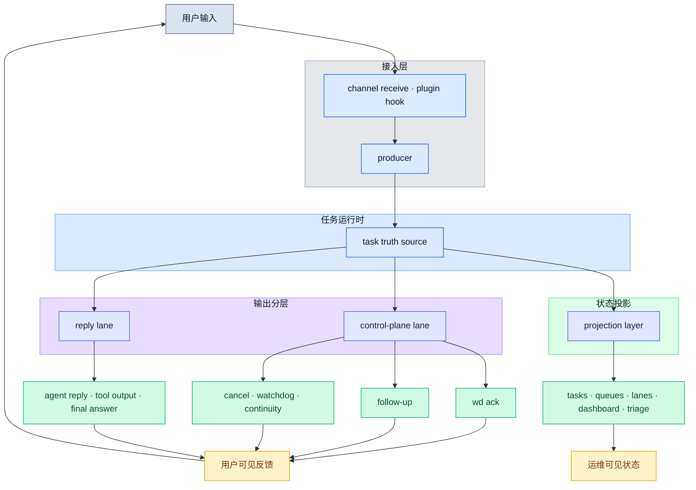
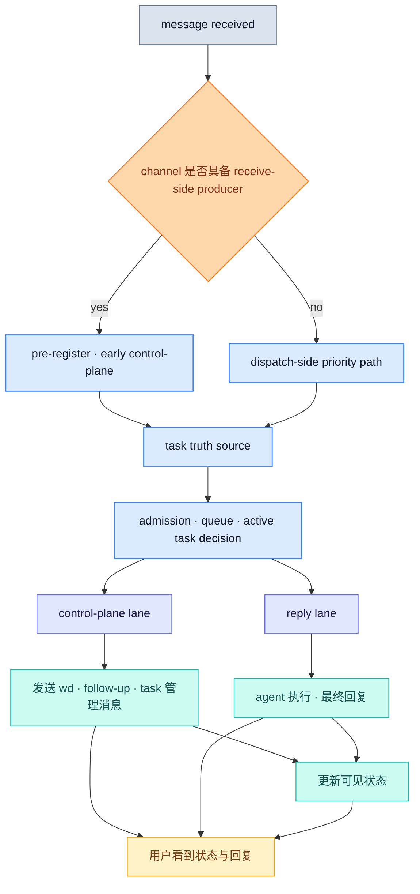
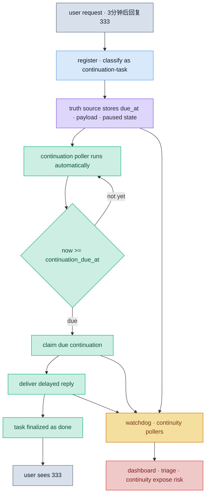

# OpenClaw Task System Architecture

> 角色：这是本项目的正式架构文档。它回答“系统由哪些层组成、这些层为什么存在、它们如何协同工作”。

## 1. 架构目标

`openclaw-task-system` 的目标不是优化某个单独 channel，而是在以下边界内，为 OpenClaw 建立统一任务运行时和控制面：

- 不改 OpenClaw core
- 不改宿主代码
- 不把改其他插件当作前提
- 只通过本仓库的 plugin、runtime、state 和现有扩展点工作

它要解决的核心问题是：

- 消息不等于任务
- 控制面消息不能和普通 reply 混在一起
- 用户侧和运维侧必须读同一份任务真相
- 多 channel 需要在同一 contract 下工作

## 2. 一张图看整体

这张图表达 5 件事：

1. 用户消息先进入 producer，不直接等于普通 reply
2. 所有任务状态先进入统一 truth source
3. control-plane lane 与 reply lane 分离
4. 输出最终必须变成用户可见反馈，而不是停在内部 lane
5. 用户与运维视图都从 projection layer 读取同一份真相

## 3. 核心分层

### 3.1 Producer

producer 负责把 channel 侧消息转成 task-system 可消费的入站任务事件。

当前正式 contract：

- `feishu`: `receive-side-producer`
- `telegram`: `dispatch-side-priority-only`
- `webchat`: `dispatch-side-priority-only`

producer 层的职责：

- 建立 arrival truth
- 产出 queue identity / pre-register snapshot
- 尽可能前移首条控制面反馈

### 3.2 Task Truth Source

这是系统的唯一任务真相源。

它负责：

- task register / resume / finalize
- queue identity
- admission / status / lifecycle
- user-facing status projection
- continuity / watchdog / recovery 的统一状态基础

这层存在的意义是：

- 不让 `[wd]`、`/tasks`、`dashboard`、`queues`、`lanes` 各自重新计算一份状态

### 3.3 Control-Plane Lane

control-plane lane 是本项目最关键的设计。

这里承载的不是普通 reply，而是：

- 首条 `[wd]`
- queue position / wait state
- 30 秒 follow-up
- watchdog / continuity 提示
- cancel / resume / paused / failed / settled

核心原则：

- 优先级高于普通 reply
- 不应被普通 reply 阻塞
- 必须具备结构化证据链

### 3.4 Reply Lane

reply lane 承载：

- agent 正式回复
- tool 输出
- final answer

它可以读取 truth source，但不能反过来决定 control-plane 是否发送。

### 3.5 Projection Layer

projection layer 负责把 truth source 投影给不同入口：

- `/tasks`
- `queues`
- `lanes`
- `dashboard`
- `triage`
- follow-up / `[wd]` 用户状态文案

当前已经统一的用户状态投影包括：

- `user_facing_status_code`
- `user_facing_status`
- `user_facing_status_family`

## 4. 关键处理路径

这条路径对应当前正式实现：

- 能前移到 receive-time 的 channel，尽量前移
- 不能前移的 channel，至少保证 dispatch-side 的 control-plane 优先级
- 所有路径最终都落到统一 truth source

## 5. 延迟任务如何“到点执行”

带明确时间要求的请求，例如：

- `3分钟后回复333`
- `2 分钟后回 222`
- `1分钟后提醒我开会`

不是靠模型“记住三分钟后再说”，而是靠 task-system 创建一个真正的延迟任务。

### 5.1 谁负责执行

正常情况下，**系统负责执行**，不是 agent 临时记忆，也不是人工盯时间。

实际链路是：

1. producer / register 阶段先把请求识别成 `continuation-task`
2. truth source 写入：
   - `continuation_due_at`
   - `continuation_payload`
   - `status = paused`
3. 后台 `continuation runner` 周期轮询
4. 到点后 claim 任务并直接发送结果
5. 任务更新成 `done`

这也是为什么 OpenClaw 重启后，延迟任务仍然可以补发：

- 到点时间和任务状态都已经持久化
- 不依赖单次会话内存

### 5.2 谁在什么时候检查

系统里有两类自动检查器：

- `continuation runner`
  - 检查“有没有已经到点、但还没发送的延迟任务”
  - 通过周期调用 `claim-due-continuations` 触发
- `watchdog / continuity`
  - 检查“本来应该推进的任务为什么没推进”
  - 负责暴露沉默、卡住、未收口等异常状态

这两类检查都不是用户手动发起，也不是 agent “想到才检查”，而是：

- **task-system plugin 启动时自动创建后台 poller**
- 后续按固定周期持续执行

### 5.3 系统没做成时，怎么发现并兜底

如果一个“3分钟后回复”请求没有真正变成延迟任务，问题会出在两种地方：

- **注册阶段失败**
  - 没建出 continuation task
  - 常见表现：
    - `classification_reason != continuation-task`
    - `continuation_due_at = null`
- **执行阶段失败**
  - 任务建出来了，但到点没有正常 claim / delivery
  - 常见表现：
    - 没有 `continuation-delivery:sent`
    - watchdog / continuity 暴露风险

因此兜底链路是：

- 先由 `continuation runner` 在每一轮 poll 中尝试执行
- 如果没有正常推进，再由 `watchdog / continuity` 持续检查并暴露异常
- 运维入口再从 truth source 读取：
  - `dashboard`
  - `triage`
  - `continuity`
  - `queues / lanes`

### 5.4 一张图看延迟任务闭环

## 6. 为什么必须分 lane

如果不分 lane，会出现这些退化：

- `[wd]` 被普通 reply 挤住
- cancel / resume 结果比普通输出还晚到
- watchdog / follow-up 失去“用户当前可感知状态”的意义
- 用户看到的不是任务系统，而是一条偶尔插播状态文案的回复链

因此：

- control-plane lane 是独立层
- reply lane 是独立层
- 两者共享 truth source，但不共享“谁先排到谁先发”的语义

## 7. 当前正式 contract

### 7.1 Producer Contract

当前 producer contract 已正式落成到代码与运维输出。

重点包括：

- `queue identity`
- `pre-register snapshot`
- `producerMode`
- `producerConsumerAligned`
- channel capability matrix

### 7.2 Channel Acceptance

当前 acceptance matrix：

- `feishu`: validated
- `telegram`: accepted-with-boundary
- `webchat`: accepted-with-boundary

这表示：

- Feishu 已满足当前 receive-side contract
- Telegram / WebChat 在当前边界下按 dispatch-side contract 验收通过

## 8. 当前边界

以下不是当前架构承诺的一部分：

- 所有 channel 都达到完全对等的 receive-time `[wd]`
- 通过修改 OpenClaw core 或宿主来“硬接管” queue
- 把项目扩成通用多 agent orchestrator

这个项目仍然是：

- OpenClaw 上的 chat-native task runtime
- 重点是消息到任务的提升
- 重点是控制面独立成层
- 重点是统一状态真相源

## 9. 和路线图的关系

当前架构已经支撑并对应：

- `Phase 2`: control-plane lane / scheduler
- `Phase 3`: 统一用户状态投影
- `Phase 4`: channel-neutral producer contract
- `Phase 5`: channel acceptance rollout

后续如果继续增强，应继续在这套架构上演进，而不是回退到：

- channel-specific if/else
- 文案驱动状态判断
- reply 链里夹带控制面消息
