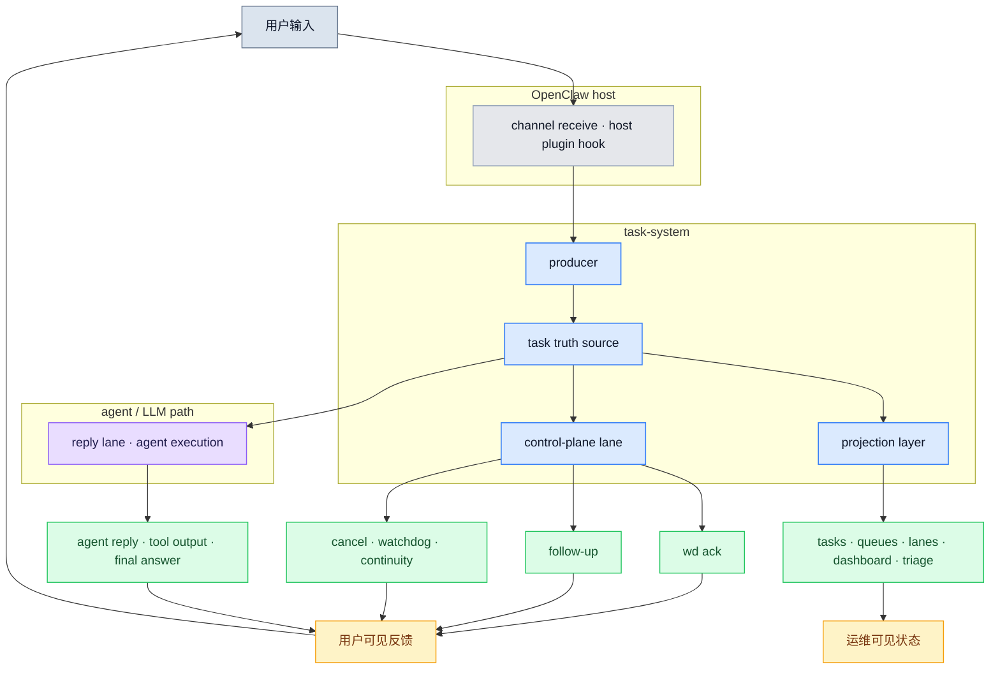
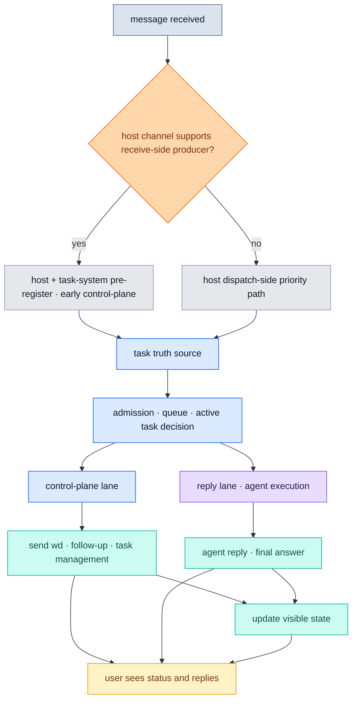
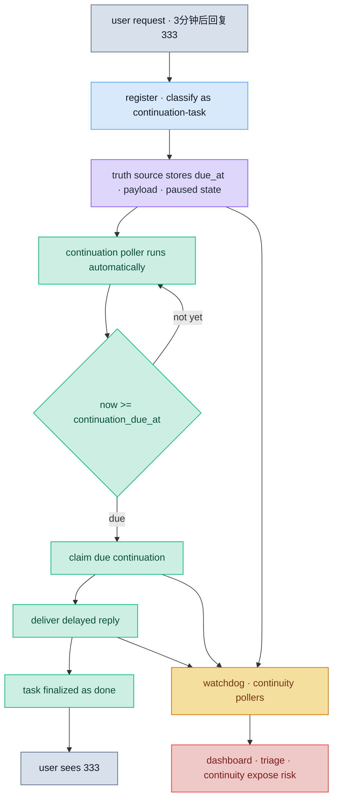

[English](architecture.md) | [中文](architecture.zh-CN.md)

# OpenClaw Task System Architecture

> 角色：这是本项目的正式架构文档。它回答“系统由哪些层组成、这些层为什么存在、它们如何协同工作”。

## 1. 架构目标

`openclaw-task-system` 的目标不是优化某个单独 channel，而是在以下边界内，为 OpenClaw 建立统一任务运行时和控制面：

- 不改 OpenClaw core
- 不改宿主代码
- 不把改其他插件当作前提
- 只通过本仓库的 plugin、runtime、state 和现有扩展点工作

它要解决的核心问题是：

- 消息不等于任务
- 控制面消息不能和普通 reply 混在一起
- 用户侧和运维侧必须读同一份任务真相
- 多 channel 需要在同一 contract 下工作

## 1.1 重要约束：它是监工，不是执行者替身

`openclaw-task-system` 的主要职责不是替代 LLM，也不是替代原有任务执行架构。

它的主要职责是：

1. 告诉用户系统已经收到任务
2. 监督后续执行直到拿到结果
3. 在执行过程中持续提供有价值的控制面信息，避免用户空等
4. 在重启、恢复、超时、异常时，把真实状态如实告诉用户
5. 把聊天驱动的任务执行过程变得透明，而不是黑盒

所以它首先是：

- `supervisor`
- `control-plane runtime`
- `task truth source`

而不是：

- 任务执行引擎本身
- LLM 的替代品
- 一个想要接管所有语义判断的 orchestrator

当前代码与这条约束的关系是：

- 大方向已经符合：
  - `[wd]`
  - follow-up
  - watchdog / continuity
  - restart recovery
  - dashboard / triage
  - truth source
- 但还存在一个明确偏离点：
  - runtime 仍然对 delayed / compound 请求做了一部分语义判断与 stopgap 拆解
  - 这部分是当前兼容桥接，不应被视为长期职责边界

同时有一个重要的现场事实：

- 当前 OpenClaw 默认连简单请求也会进入 agent / LLM 路径

因此长期设计上更合理的方向是：

- 不让 task-system 再前置做一层“简单 / 复杂”主判断
- 而是让原执行架构继续理解请求
- task-system 专注于监督、约束 future promise、持久化和恢复

### review constraints to keep stable

The following constraints are now part of the intended design and should be treated as default assumptions in future work:

1. task-system is supervisor-first, not executor-first
2. normal request understanding remains on the original agent / LLM path
3. task-system should not keep growing front-door simple-versus-complex classifiers
4. `[wd]` must stay outside the LLM path
5. if a future action is promised, task-system must be able to prove a real task exists
6. if planning fails, times out, or is skipped, the system must tell the user the truth
7. if a delayed task already has an authoritative due time, execution must still happen even when that time has passed, and the user should be told it is overdue or recovered
8. regex-based or phrase-list-based cleanup must not become the primary mechanism for separating scheduling status from user content

These constraints were added after live review and should not be silently relaxed by later implementation work.

### 已确认评审约束

下面这些约束现在已经成为默认设计前提，后续继续做时不应再反复摇摆：

1. task-system 以“监工优先”为主，不以“执行优先”为主
2. 普通请求理解仍然留在原 agent / LLM 路径
3. task-system 不应继续扩张成前置的 simple/complex 主分类器
4. `[wd]` 必须始终在 LLM 路径之外
5. 只要系统承诺 future action，task-system 就必须能证明背后存在真实 task
6. 只要 planning 失败、超时或被跳过，系统就必须如实告诉用户
7. 只要 delayed task 已经有权威的绝对时间点，即使真正执行时已过点，也必须执行，并告诉用户这是 overdue 或 recovered
8. tool 链路内部状态不直接作为用户输出
9. 排程状态属于 runtime-owned 控制面，不属于普通主答复
10. 严禁把 regex / 句式表 / 关键词过滤 / 硬编码文本清洗扩张成长期主方案

这些约束来自真实评审结论，后续实现不应无声偏离。

11. 如果一条请求的核心价值在未来提醒 / 未来同步，那么即时用户可见消息默认应以控制面为主，而不是提前发出未来结果
12. `[wd] 已安排妥当...` 这类调度确认必须带可读的 follow-up 摘要，不能只报时间不报内容

### tool-chain 信息边界

还有一条需要固定下来的约束是：

- tool-chain information is not user output

这里的 tool-chain information 指：

- plan id
- promise guard
- accepted / rejected 调度状态
- due_at / follow-up task id
- 裸 tool 返回结果

这些信息首先属于：

- task truth source
- scheduler metadata
- anomaly / verification state

它们不应直接以主答复形式暴露给用户。

同样也不应采用下面这种方向来解决：

- 先允许模型把调度状态说进主答复
- 再在后面不断补 regex / 句式表 / 关键词过滤把这些词抠掉

这类做法只能作为短期止血，不得演化成正式架构。

正式架构应当依赖：

- structured tool result
- task truth source
- runtime-owned control-plane projection
- user-content channel separation

在当前阶段，这条 `user-content channel separation` 的最小实现是：

- 当 planning tools 已参与当前任务时
- 用户可见业务内容必须通过：
  - `<task_user_content> ... </task_user_content>`
 这个结构化内容块输出
- runtime 只转发这个内容块里的内容
- 排程成功 / 失败仍然单独投影成 `[wd]`

用户真正应该看到的是两类投影：

1. runtime-owned control-plane
   - `[wd] 已收到...`
   - `[wd] 已安排妥当...`
   - `[wd] 这次还没有排上...`
   - watchdog / continuity / recovery
2. business content
   - 即时业务结果
   - 或到点后的 follow-up 正文

这里还有一条需要固定的产品语义：

- 如果请求本身是 future-first 的，例如“2分钟后告诉我明天天气，3分钟后告诉我后天天气”
- 那么默认即时可见输出应是：
  - `[wd] 已安排妥当：2分钟后同步明天天气。`
  - `[wd] 已安排妥当：3分钟后同步后天天气。`
- 而不应该立刻把未来真正要发送的业务结果提前发出来

这意味着当前架构不仅需要分离：

- control-plane channel
- business-content channel

还需要让 runtime 能根据结构化 planning 结果决定：

- 这次是否应该立刻发业务内容
- 还是只先发 `[wd]` 调度状态，等到点再发真正结果

设计缘由是：

- “是否安排妥当”本质上是监督状态，不是业务内容
- tool 结果必须先被 task-system 消化，才能变成用户可见状态
- 这样可以避免模型把内部调度状态和最终业务内容混成同一条回复

还有两条实现约束现在也要保持稳定：

- `[wd]` 和 runtime-owned follow-up 只要存在源消息上下文，就应尽量保留 `reply_to_id / thread_id`，避免同一条控制面消息有时是回复、有时变成普通新消息
- control-plane lane 可以按 audience 串行化，但单次 adapter load / send 不能无限期占住 lane；runtime 必须对 direct delivery 设置明确超时边界
- 当 direct control-plane delivery 超时或失败时，runtime 不应无限等待；对于仍然值得补发的高价值 `[wd]`，应转入受监督的异步补投路径，而不是静默丢弃

## 2. 一张图看整体

这张图表达 5 件事：

1. 用户消息先进入 producer，不直接等于普通 reply
2. 所有任务状态先进入统一 truth source
3. control-plane lane 与 reply lane 分离
4. 输出最终必须变成用户可见反馈，而不是停在内部 lane
5. 用户与运维视图都从 projection layer 读取同一份真相

ownership 说明：

- `OpenClaw host`
  - 负责 channel receive、hook 生命周期、把请求交给原执行架构
- `task-system`
  - 负责 producer、truth source、control-plane、projection、监督与恢复
- `agent / LLM path`
  - 负责理解请求、执行正常工作、生成正式回复

## 3. 核心分层

### 3.1 Producer

producer 负责把 channel 侧消息转成 task-system 可消费的入站任务事件。

对 `receive-side producer` 还需要固定一条实现约束：

- pre-register snapshot 和 queued early ack marker 的保留时间必须覆盖真实 channel queue drain 时间
- 不能把这类入口快照只按“短交互窗口”保留，否则消息一旦在宿主队列里排久一点，就会退化回 dispatch-side contract

当前实现里，这意味着：

- Feishu 的 receive-side snapshot / early-ack marker 需要跨长队列等待保持可消费
- consumer 在 `before_dispatch` 阶段仍应尽量命中入口侧 snapshot，而不是因为 TTL 过短退化成重新 register

当前正式 contract：

- `feishu`: `receive-side-producer`
- `telegram`: `dispatch-side-priority-only`
- `webchat`: `dispatch-side-priority-only`

producer 层的职责：

- 建立 arrival truth
- 产出 queue identity / pre-register snapshot
- 尽可能前移首条控制面反馈

### 3.2 Task Truth Source

这是系统的唯一任务真相源。

它负责：

- task register / resume / finalize
- queue identity
- admission / status / lifecycle
- user-facing status projection
- continuity / watchdog / recovery 的统一状态基础

这层存在的意义是：

- 不让 `[wd]`、`/tasks`、`dashboard`、`queues`、`lanes` 各自重新计算一份状态
- 不让“用户现在到底该知道什么”退化成黑盒执行后的猜测

### 3.3 Control-Plane Lane

control-plane lane 是本项目最关键的设计。

这里承载的不是普通 reply，而是：

- 首条 `[wd]`
- queue position / wait state
- 30 秒 follow-up
- watchdog / continuity 提示
- cancel / resume / paused / failed / settled

核心原则：

- 优先级高于普通 reply
- 不应被普通 reply 阻塞
- 必须具备结构化证据链
- 其核心目标是让用户持续知道“系统现在正在做什么”和“系统是否还活着”

### 3.4 Reply Lane

reply lane 承载：

- agent 正式回复
- tool 输出
- final answer

它可以读取 truth source，但不能反过来决定 control-plane 是否发送。

### 3.5 Projection Layer

projection layer 负责把 truth source 投影给不同入口：

- `/tasks`
- `queues`
- `lanes`
- `dashboard`
- `triage`
- follow-up / `[wd]` 用户状态文案

当前已经统一的用户状态投影包括：

- `user_facing_status_code`
- `user_facing_status`
- `user_facing_status_family`

## 4. 关键处理路径

这条路径对应当前正式实现：

- 能前移到 receive-time 的 channel，尽量前移
- 不能前移的 channel，至少保证 dispatch-side 的 control-plane 优先级
- 所有路径最终都落到统一 truth source

ownership 说明：

- `host dispatch-side priority path`
  - 属于 OpenClaw host 当前 channel 行为
- `task truth source / admission / control-plane lane`
  - 属于 task-system
- `reply lane · agent execution`
  - 属于原 agent / LLM 执行路径

## 5. 延迟任务如何“到点执行”

带明确时间要求的请求，例如：

- `3分钟后回复333`
- `2 分钟后回 222`
- `1分钟后提醒我开会`

不是靠模型“记住三分钟后再说”，而是靠 task-system 创建一个真正的延迟任务。

### 5.1 谁负责执行

正常情况下，**系统负责执行**，不是 agent 临时记忆，也不是人工盯时间。

实际链路是：

1. producer / register 阶段先把请求识别成 `continuation-task`
2. truth source 写入：
   - `continuation_due_at`
   - `continuation_payload`
   - `status = paused`
3. 后台 `continuation runner` 周期轮询
4. 到点后 claim 任务并直接发送结果
5. 任务更新成 `done`

这也是为什么 OpenClaw 重启后，延迟任务仍然可以补发：

- 到点时间和任务状态都已经持久化
- 不依赖单次会话内存

这里要注意职责边界：

- task-system 负责把“已经确认存在的 delayed task”按时检查、执行、恢复、投影给用户
- task-system 不应长期承担“替 LLM 猜复杂复合意图”的职责
- 对复合 follow-up 的 planning，长期正确方向仍然是：
  - LLM 做任务拆解
  - task-system 做监督、验证、持久化与兜底

### 5.2 谁在什么时候检查

系统里有两类自动检查器：

- `continuation runner`
  - 检查“有没有已经到点、但还没发送的延迟任务”
  - 通过周期调用 `claim-due-continuations` 触发
- `watchdog / continuity`
  - 检查“本来应该推进的任务为什么没推进”
  - 负责暴露沉默、卡住、未收口等异常状态

这两类检查都不是用户手动发起，也不是 agent “想到才检查”，而是：

- **task-system plugin 启动时自动创建后台 poller**
- 后续按固定周期持续执行

### 5.3 系统没做成时，怎么发现并兜底

如果一个“3分钟后回复”请求没有真正变成延迟任务，问题会出在两种地方：

- **注册阶段失败**
  - 没建出 continuation task
  - 常见表现：
    - `classification_reason != continuation-task`
    - `continuation_due_at = null`
- **执行阶段失败**
  - 任务建出来了，但到点没有正常 claim / delivery
  - 常见表现：
    - 没有 `continuation-delivery:sent`
    - watchdog / continuity 暴露风险

因此兜底链路是：

- 先由 `continuation runner` 在每一轮 poll 中尝试执行
- 如果没有正常推进，再由 `watchdog / continuity` 持续检查并暴露异常
- 运维入口再从 truth source 读取：
  - `dashboard`
  - `triage`
  - `continuity`
  - `queues / lanes`

对用户来说，这意味着：

- 如果系统正常，就持续告诉用户任务在推进
- 如果系统重启，就告诉用户是否正在恢复
- 如果 LLM planning 超时、异常或根本没有创建后续任务，也必须如实告诉用户
- 能保留任务就保留；不能保留时，把失败直接抛给用户，而不是继续黑盒承诺

### 5.4 一张图看延迟任务闭环

ownership 说明：

- `register / truth source / continuation poller / watchdog · continuity`
  - 都属于 task-system
- 这不是 OpenClaw core 原生的 delayed-task runner
- OpenClaw host 提供的是插件运行环境与消息/agent 生命周期

### continuation lane

delayed follow-ups stay in the same user-facing session context, but they no longer share the same blocking lane semantics as the main task path.

- `openclaw_host` and `agent_llm_path` own the main execution lane
- `task_continuation_runner` owns the continuation lane
- due follow-ups are claimed in absolute `due_at` order
- a running main task must not block a due continuation
- one due continuation must not starve another due continuation in the same session

## 6. 为什么必须分 lane

如果不分 lane，会出现这些退化：

- `[wd]` 被普通 reply 挤住
- cancel / resume 结果比普通输出还晚到
- watchdog / follow-up 失去“用户当前可感知状态”的意义
- 用户看到的不是任务系统，而是一条偶尔插播状态文案的回复链

因此：

- control-plane lane 是独立层
- reply lane 是独立层
- 两者共享 truth source，但不共享“谁先排到谁先发”的语义

## 7. 当前正式 contract

### 7.1 Producer Contract

当前 producer contract 已正式落成到代码与运维输出。

重点包括：

- `queue identity`
- `pre-register snapshot`
- `producerMode`
- `producerConsumerAligned`
- channel capability matrix

### 7.2 Channel Acceptance

当前 acceptance matrix：

- `feishu`: validated
- `telegram`: accepted-with-boundary
- `webchat`: accepted-with-boundary

这表示：

- Feishu 已满足当前 receive-side contract
- Telegram / WebChat 在当前边界下按 dispatch-side contract 验收通过

## 8. 当前边界

以下不是当前架构承诺的一部分：

- 所有 channel 都达到完全对等的 receive-time `[wd]`
- 通过修改 OpenClaw core 或宿主来“硬接管” queue
- 把项目扩成通用多 agent orchestrator
- 让 task-system 长期承担复杂复合语义的主判断职责

这个项目仍然是：

- OpenClaw 上的 chat-native task runtime
- 重点是消息到任务的提升
- 重点是控制面独立成层
- 重点是统一状态真相源
- 重点是“监督执行并把真实状态告诉用户”，而不是替代原执行架构

## 9. 和路线图的关系

当前架构已经支撑并对应：

- `Phase 2`: control-plane lane / scheduler
- `Phase 3`: 统一用户状态投影
- `Phase 4`: channel-neutral producer contract
- `Phase 5`: channel acceptance rollout

后续如果继续增强，应继续在这套架构上演进，而不是回退到：

- channel-specific if/else
- 文案驱动状态判断
- reply 链里夹带控制面消息
