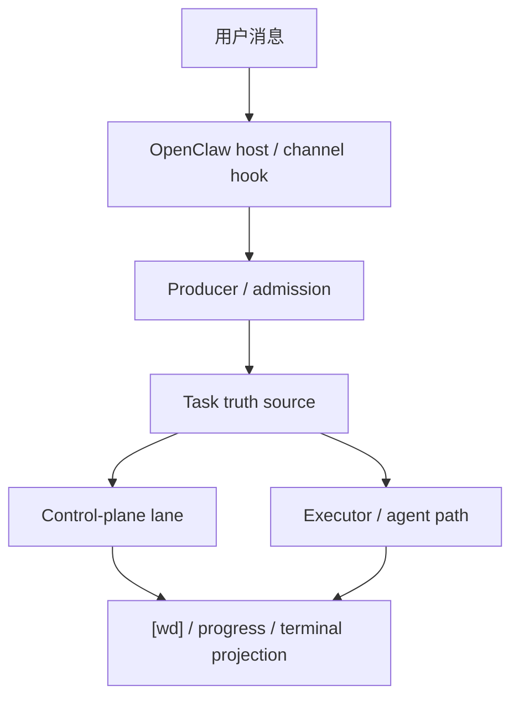
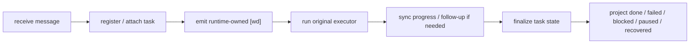

[English](architecture.md) | [中文](architecture.zh-CN.md)

# OpenClaw Task System 架构

## 目的与范围

这份文档回答三件事：

- `openclaw-task-system` 由哪些运行时层组成
- 哪些状态属于 task-system 真相源，哪些属于宿主或执行器
- `[wd]`、follow-up、watchdog、continuity 与最终业务回复如何协同

本项目的边界保持不变：

- 不改 OpenClaw core
- 不要求宿主代码打补丁
- 不把其他插件改造当作前提
- 只通过本仓库的 plugin、runtime、state 与现有扩展点工作

## 系统上下文

## 模块清单

| 模块 | 职责 | 关键接口 |
| --- | --- | --- |
| Producer / Admission | 把消息提升成可管理任务，并决定是否立即登记 | `openclaw_hooks.py`、register decision |
| Task Truth Source | 保存任务、队列、连续性与投影所需真相 | task store、snapshot、status policy |
| Control-plane Lane | 单独发送 `[wd]`、follow-up、watchdog、terminal 等控制面消息 | control-plane lane、delivery runners |
| Execution Path | 继续复用原 agent / LLM 执行链路 | bridge、instruction executor |
| Projection / Ops | 面向用户与运维输出同一份状态 | `main_ops.py`、dashboard、queues、lanes |

## 核心流程

## 接口与契约

- 第一条 `[wd]` 由 runtime 负责，不走 LLM 自由生成
- 只要系统承诺未来动作，就必须能证明背后存在真实 task
- tool 链路的内部调度状态不直接作为用户输出
- 业务内容与控制面消息必须分离投影

## 状态与数据模型

核心状态围绕三组真相组织：

- 任务真相：task id、status、queue identity、continuity metadata
- 控制面真相：`[wd]`、follow-up、watchdog、terminal 的投影条件
- 运维真相：dashboard、triage、queues、lanes、planning health

## 运维关注点

- `[wd]` 是否第一时间可见
- control-plane 是否被普通 reply 堵住
- restart / continuity / watchdog 是否能如实恢复
- dashboard 与用户可见状态是否仍然一致

## 架构整改收口结果

这条架构整改 workstream 已经收口。

最终明确下来的决定是：

- `lifecycle_coordinator.py` 拥有 runtime lifecycle projection

- `scripts/runtime/` 是唯一 canonical editable runtime source
- `plugin/scripts/runtime/` 是 installable plugin payload 使用的严格同步镜像
- `runtime_mirror.py --check`、`plugin_doctor.py`、`scripts/install_remote.sh` 与 `scripts/run_tests.sh` 共同承担这条规则的 enforcement

后续剩余工作属于 post-hardening 扩展项，不再属于未收口的架构整改债务。

## 取舍与非目标

- 它是监督运行时，不是新的通用 orchestrator
- 它不负责替代原 agent / LLM 的请求理解
- 它允许短期桥接逻辑存在，但不鼓励 regex / 文本清洗无限扩张

## 相关 ADR / 参考

- [task_user_content_decision.zh-CN.md](task_user_content_decision.zh-CN.md)
- [continuation_lane_decision_log.zh-CN.md](continuation_lane_decision_log.zh-CN.md)
- [external_comparison.zh-CN.md](external_comparison.zh-CN.md)
- [workstreams/architecture-hardening/README.zh-CN.md](workstreams/architecture-hardening/README.zh-CN.md)
