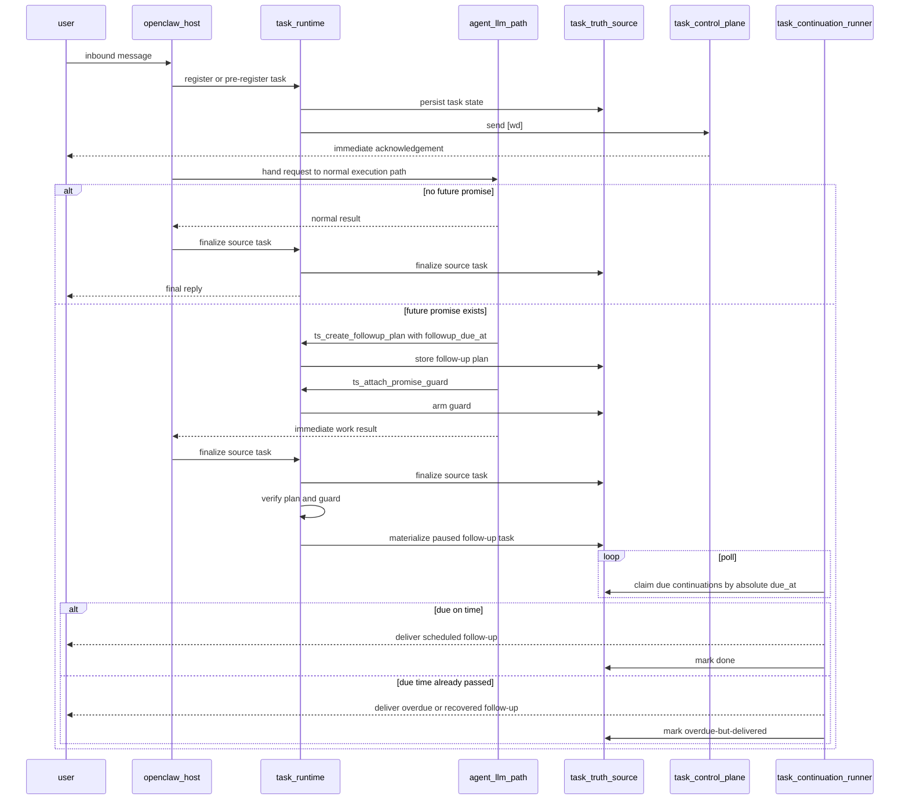

# LLM-assisted task planning and follow-up tools

[English](llm_tool_task_planning.md) | [中文](llm_tool_task_planning.zh-CN.md)

> Status: design draft
> Scope: compound requests, delayed follow-up planning, and tool-assisted task decomposition

### stable review constraints

The following review constraints should be treated as fixed unless explicitly changed:

1. task-system supervises execution; it does not replace the original executor
2. normal request interpretation remains on the original agent / LLM path
3. task-system should not keep adding front-door simple-versus-complex routing logic as a long-term design
4. `[wd]` must remain outside the LLM path
5. future promises must be backed by real tasks in the truth source
6. if planning fails, times out, or is skipped, the user must be told explicitly
7. delayed follow-up scheduling should use an absolute due time as the authoritative field
8. if execution happens after that absolute time, the follow-up must still run and the user must be told it is overdue or recovered
9. tool-chain information is not user output
10. scheduling status is runtime-owned control-plane, not normal assistant prose
11. hard-coded regex or phrase-list cleanup must not be used as the long-term mechanism for separating scheduling status from user content

### hard constraint: tool-chain information is not user output

The following rule should now be treated as fixed:

- tool outputs and internal planning state must not be projected directly to the user as part of the normal assistant reply

This includes:

- plan ids
- promise guards
- accepted or rejected scheduling state
- due-time bookkeeping
- follow-up task ids
- raw tool results

Those signals must first land in task-system, then be projected in one of two forms:

1. runtime-owned control-plane messages
   - `[wd] 已收到...`
   - `[wd] 已安排妥当...`
   - `[wd] 这次还没有排上...`
   - recovery or fallback messages
2. business content replies
   - the immediate answer
   - or the actual delayed follow-up content when it is due

So the user-facing rule is:

- scheduling status belongs to task-system
- business content belongs to the main answer or the actual follow-up reply
- tool-chain information itself is not user output

Two product constraints follow from this:

1. scheduling confirmation must include a human-meaningful follow-up summary
   - bad: `[wd] 已安排妥当，将在 2分钟后 回复。`
   - good: `[wd] 已安排妥当：2分钟后同步明天天气。`
2. if the request is primarily about future reminders or future follow-up delivery, the immediate user-visible output should usually be control-plane only
   - do not emit the eventual business result immediately by default
   - let `[wd]` tell the user what has been arranged
   - deliver the actual business content when the scheduled follow-up fires

### hard constraint: no hard-coded text cleanup as the primary design

The following rule should be treated as a top-level design constraint:

- do not solve scheduling-status leakage by growing regex lists, phrase tables, keyword filters, or ad-hoc text cleanup rules over free-form model output

Why this must stay fixed:

- that path becomes unbounded
- wording variants will always leak through
- it mixes control-plane semantics into the content channel first, then tries to pull them back out
- it makes future maintenance unpredictable

The required direction is:

1. keep scheduling state in structured tool results
2. let task-system project that state into runtime-owned `[wd]` messages
3. keep normal assistant prose focused on business content only
4. treat channel separation as the solution, not text post-processing

In the current minimum implementation, that channel separation is enforced by a dedicated business-content block:

- `<task_user_content> ... </task_user_content>`

When planning tools have been used for the current task, runtime forwards only the content inside that block.

That content channel must also support an explicit runtime choice:

- `main_user_content_mode = none`
- `main_user_content_mode = immediate-summary`
- `main_user_content_mode = full-answer`

The intended default for future-first requests is:

- `main_user_content_mode = none`

In that mode:

- runtime sends `[wd]` scheduling state immediately
- runtime does not send the eventual business result yet
- the delayed follow-up later carries the real content

### problem

Some user requests contain more than one task intent in a single message:

- do something now
- then come back later
- maybe come back only after the first part finishes

Examples:

- `你先查一下天气，然后5分钟后回复我信息`
- `先整理这个问题，10分钟后再提醒我看结果`
- `先跑一轮检查，半小时后回来告诉我是否还报错`

Regex can catch some low-ambiguity phrases, but it is not the right long-term mechanism for this class of request.

### observed current behavior

Current OpenClaw behavior matters for this design:

- even simple user requests normally still go through the agent and LLM path
- task-system does not directly replace that execution path
- task-system currently wraps the execution with registration, acknowledgement, recovery, and state tracking

That means this design should not assume:

- simple requests are handled fully outside the LLM
- task-system should become the first semantic classifier for all requests

Instead, the safer assumption is:

- the original agent / LLM keeps interpreting requests
- task-system supervises, enforces, and verifies future-action contracts

### goals

This design should:

1. keep the current fast control-plane path intact
2. avoid turning every user request into an LLM planning round
3. let the LLM explicitly create structured follow-up tasks when needed
4. detect cases where the LLM promised a future action but failed to schedule one
5. preserve the task-system runtime as the final source of truth
6. fail honestly when the LLM planning path is unavailable

### non-goals

This design should not:

1. move `[wd]` generation into the LLM
2. make every request depend on tool calls before the first acknowledgement
3. trust free-form model output as proof that a delayed task exists
4. replace deterministic delayed-reply parsing for simple, low-risk phrases

### recommended model: hybrid, not tool-only

The recommended direction is a hybrid model:

1. deterministic runtime fast path
2. tool-assisted planning path
3. runtime verification and fallback

That is better than either extreme:

- regex-only growth is too brittle
- LLM-only task creation is too unreliable

### first principle: the planning path depends on a healthy LLM

The system should treat this as a first-class truth:

- if the LLM planning path is healthy, the runtime can rely on it more
- if the LLM planning path is unavailable, timed out, or anomalous, the runtime must say so honestly

That means:

1. LLM health must be monitored explicitly
2. tool-path expectations must be verified explicitly
3. user-facing output must reflect planning failure truthfully

This is not optional polish. Without it, the whole planning design becomes misleading.

### why `[wd]` must stay outside the LLM

`[wd]` is a control-plane acknowledgement, not a planning artifact.

It must stay outside the LLM because:

1. it must remain first-visible and low-latency
2. it must not wait for model planning or tool latency
3. it must still work if the model times out or skips tool calls

So the order should remain:

```text
message received
  -> register / pre-register
  -> send [wd]
  -> choose execution path
       - deterministic runtime fast path
       - or LLM-assisted planning path
```

### aggressive default mode

The latest review direction is intentionally more aggressive:

1. the first-visible `[wd]` should still stay on the deterministic runtime path
2. 30-second progress updates should remain runtime-owned by default
3. fallback and recovery messaging should also remain runtime-owned by default
4. aside from those control-plane exceptions, the default path should switch to tool-assisted planning

The preferred order becomes:

```text
message received
  -> register / pre-register
  -> send first [wd] without LLM
  -> hand request to agent / LLM
  -> if execution continues:
       keep 30-second nudges on runtime
       keep fallback / recovery on runtime
       use tools for everything else that needs structured future-action planning
```

This means the default bias is now:

- first `[wd]`: runtime-owned
- 30-second progress messages: runtime-owned
- recovery / fallback messages: runtime-owned
- all other planning-sensitive follow-up work: tool-first

The runtime still remains:

- the owner of the task truth source
- the verifier that a promised future action became a real task
- the fallback path when tools are skipped, timed out, or unhealthy

### when the LLM should be involved

Given current OpenClaw behavior, the better assumption is:

- normal requests already go through the agent / LLM
- task-system should not add a second front-door semantic classifier unless there is a very strong reason

So the preferred model is:

- let the original agent / LLM interpret the request
- require tool use only when the agent intends to create a future promise, delayed follow-up, or dependent continuation

In short:

```text
request -> agent / LLM interprets
if future action is intended -> task-system tools must be called
task-system then supervises and verifies that contract
```

This is usually better than:

```text
request -> task-system first decides simple vs complex -> maybe ask LLM
```

because that would duplicate semantic judgment and blur the supervisor boundary.

Under the aggressive default mode above, this section should be read as:

- request interpretation remains on the original agent / LLM path
- after the first `[wd]`, tool-assisted planning becomes the default for future-action work except the fixed runtime-owned control-plane messages
- runtime still decides whether to fall back to deterministic messaging when the planning path is unhealthy

### proposed tools

The LLM should not directly mutate raw task files. It should call explicit task-system tools.

#### tool: `ts_get_task_planning_context`

Purpose:

- fetch the task/session context the planner needs

Input:

```json
{
  "session_key": "agent:main:feishu:direct:...",
  "message_text": "你先查一下天气，然后5分钟后回复我信息"
}
```

Output:

```json
{
  "session_key": "agent:main:feishu:direct:...",
  "agent_id": "main",
  "channel": "feishu",
  "current_queue_state": {
    "position": 2,
    "active_task_id": "task_abc"
  },
  "message_text": "你先查一下天气，然后5分钟后回复我信息"
}
```

#### tool: `ts_create_followup_plan`

Purpose:

- record a structured plan for compound requests

Input:

```json
{
  "source_task_id": "task_main_123",
  "immediate_work": "查一下天气",
  "followup_kind": "delayed-reply",
  "followup_due_at": "2026-04-06T11:30:00+08:00",
  "followup_message": "回来继续汇报天气结果",
  "dependency": "after-source-task-finalized",
  "original_time_expression": "5分钟后"
}
```

Output:

```json
{
  "plan_id": "plan_xyz",
  "source_task_id": "task_main_123",
  "accepted": true,
  "runtime_contract": {
    "followup_kind": "delayed-reply",
    "dependency": "after-source-task-finalized",
    "followup_due_at": "2026-04-06T11:30:00+08:00"
  }
}
```

Notes:

- `followup_due_at` should be the authoritative scheduling field
- relative expressions such as `5分钟后` may still be preserved as source metadata
- before the plan becomes authoritative, the runtime should resolve relative time into an absolute timestamp

#### tool: `ts_schedule_followup_from_plan`

Purpose:

- turn a saved plan into a real scheduled follow-up task

Input:

```json
{
  "plan_id": "plan_xyz"
}
```

Output:

```json
{
  "task_id": "task_followup_456",
  "status": "paused",
  "due_at": "2026-04-06T11:30:00+08:00",
  "scheduled": true
}
```

If the runtime discovers that `now > due_at` when this follow-up is materialized:

- it should still schedule and execute the task
- it should mark the delivery as overdue, recovered, or similar
- it should tell the user that the planned time point has passed and the follow-up is being delivered now

#### tool: `ts_attach_promise_guard`

Purpose:

- tell the runtime that the model intends to promise a future action
- create an explicit guard expectation even before scheduling completes

Input:

```json
{
  "source_task_id": "task_main_123",
  "promise_type": "delayed-followup",
  "expected_by_finalize": true
}
```

Output:

```json
{
  "guard_id": "guard_789",
  "armed": true
}
```

#### tool: `ts_finalize_planned_followup`

Purpose:

- confirm that the planned follow-up has actually been materialized

Input:

```json
{
  "source_task_id": "task_main_123",
  "guard_id": "guard_789",
  "followup_task_id": "task_followup_456"
}
```

Output:

```json
{
  "ok": true,
  "promise_fulfilled": true
}
```

### what the LLM prompt should require

The model needs explicit rules. Without them, tool availability alone is not enough.

Suggested prompt additions:

1. treat the first `[wd]`, the fixed 30-second progress message, and runtime fallback or recovery messages as runtime-owned control-plane messages
2. aside from those fixed control-plane messages, prefer task-system tools by default for future action, structured follow-up, or delayed promise
3. handle the user request through the normal agent path unless a future action needs task-system support
4. if the request clearly asks for delayed follow-up, create a real follow-up plan or task through the task-system tools
5. never promise a future reply in natural language unless a corresponding task-system tool call succeeded
6. if the user request is ambiguous, ask a clarification question rather than silently guessing a delayed follow-up
7. if tool scheduling fails, say so explicitly instead of pretending the future follow-up exists

Recommended system-prompt contract:

```text
You are the normal request executor. task-system runtime is the supervisor and the owner of the task truth source.

Hard rules:
- Do not generate the first [wd]. That is owned by runtime.
- Do not generate the fixed 30-second progress message. That is owned by runtime.
- Do not generate fallback or recovery control-plane text unless runtime explicitly delegates that action.
- For every future promise, delayed follow-up, reminder, or dependent continuation, use task-system tools by default.
- Never say that you will come back later unless runtime has accepted a real scheduled follow-up.
- If task-system tool scheduling fails, times out, or is skipped, say that explicitly to the user.
- If the request is ambiguous, ask a clarification question instead of inventing a delayed task.

Decision policy:
- normal immediate work: stay on the normal agent path
- fixed control-plane messages: leave to runtime
- all other future-action planning: tool-first
```

The most important hard rule:

> Do not say "I will come back in 5 minutes" unless the runtime has accepted a real scheduled follow-up.

One more hard rule should now be treated the same way:

> Do not expose scheduling acceptance, scheduling rejection, or raw tool state directly to the user. Return that state to task-system, and let task-system project it as a `[wd]` control-plane message.

And one more product rule should be treated as fixed:

> If the request is future-first, do not eagerly send the eventual business result. Let runtime send `[wd]` scheduling state first, and let the scheduled follow-up deliver the actual content later.

This prompt contract should be treated as part of the implementation surface, not as optional writing guidance.

For the usable version of this project, this contract should also be user-editable through runtime config:

- `taskSystem.agents.main.planning.systemPromptContract`

That makes the policy reviewable and adjustable without requiring a code patch for every prompt iteration.

### monitoring and fallback

The runtime must assume the LLM may:

- time out
- skip the tool
- choose the wrong tool
- promise future work in plain text without creating a scheduled task

So monitoring must exist even if tools are available.

#### monitor 0: LLM planning health

Before trusting the planning path, the runtime should know whether the LLM planner is healthy.

The health signal should include at least:

- recent success rate
- timeout rate
- tool-call completion rate
- promise-without-task anomaly rate

The system does not need a perfect global health score. It only needs a strong enough signal to answer:

- can we trust the planner now?
- should we let this request depend on planning?

If the answer is no, the runtime should downgrade behavior immediately.

#### monitor 1: promise-without-task detector

At finalize time, check:

- did the model output contain a delayed promise?
- is there a matching follow-up plan or task?

If not:

- mark the task with a planning anomaly
- emit operator-visible diagnostics
- surface it in dashboard / triage / continuity

#### monitor 2: tool expectation guard

If the LLM called `ts_attach_promise_guard`, then finalize must verify:

- guard exists
- follow-up plan or task was created
- guard was closed

If not:

- finalize as `done-with-planning-anomaly` or similar projected status
- emit a watchdog-visible signal

#### monitor 3: fallback runtime scheduling

For low-risk, high-confidence cases, the runtime can still schedule the follow-up directly even if the LLM path is unavailable.

This preserves the current safety net:

- deterministic parsing remains the backup path
- the LLM tool path becomes the structured path

#### monitor 4: overdue follow-up execution

Absolute time must remain authoritative even when the real execution happens later.

Checks:

- does the follow-up plan have a valid `followup_due_at`?
- did the source task finish only after that absolute time?
- did scheduler delay or gateway restart cause late execution?

If yes:

- the follow-up should still run
- the task should be marked as overdue-but-delivered, recovered, or similar
- the user-facing message should mention that the scheduled time was missed and the system is delivering it now

### user-facing behavior when planning fails

If the planning path fails, the runtime should not silently pretend everything is fine.

Recommended policy:

1. if the immediate part can still run safely, run it
2. if the delayed follow-up cannot be scheduled, tell the user explicitly
3. preserve the task if possible
4. if the task cannot be preserved meaningfully, return the failure to the user directly

Examples of honest user-visible outcomes:

- "I completed the immediate part, but I was not able to create the 5-minute follow-up task."
- "The delayed follow-up could not be scheduled because the planning path timed out."
- "The request was accepted, but the follow-up plan was not created. Please resend the delayed part separately."

The important point is:

> the system must never say a future follow-up exists unless the runtime can prove it exists.

### task preservation policy

If planning fails, the runtime should try to preserve useful state in this order:

1. keep the accepted source task
2. keep a planning anomaly record attached to it
3. keep any partial immediate work result that is safe to expose
4. if follow-up scheduling failed completely, expose that failure directly to the user

That gives operators and users a stable truth source even when the LLM did not complete the planning path.

### recommended runtime sequence

```text
user message
  -> register / [wd]
  -> agent / LLM interprets
  -> if no future action is intended:
       run normally
  -> if future action is intended:
       create follow-up plan with absolute due_at
       arm promise guard
  -> source task runs
  -> finalize checks:
       - plan exists?
       - promised follow-up actually scheduled?
       - guard closed?
  -> if yes:
       follow-up task remains in truth source
  -> if no:
       anomaly enters watchdog / triage / dashboard
```

### sequence diagram



ownership notes:

- `openclaw_host`
  - owns message ingress and the normal agent handoff
- `task_runtime`
  - owns registration, guard verification, control-plane signaling, and follow-up materialization
- `task_truth_source`
  - is the persisted task ledger managed by task-system
- `task_continuation_runner`
  - is also owned by task-system, not by OpenClaw core
- `agent_llm_path`
  - still owns request interpretation and the normal execution path
- `task_control_plane`
  - owns `[wd]`, progress nudges, and other user-visible control-plane messages

### why this is better than "more rules"

This hybrid approach is better because:

1. the fast path remains deterministic
2. `[wd]` remains immediate
3. absolute time becomes the authoritative scheduling contract
4. compound follow-up can become structured
5. runtime still catches LLM omission, timeout, lateness, or failure

### rollout suggestion

#### phase A

- keep current simple delayed-reply parser
- add planning tools and prompt contract
- only route obviously compound requests into the tool path

#### phase B

- add promise guard and anomaly detection
- project planning anomalies into dashboard / triage / continuity

#### phase C

- evaluate whether more channels or agents should use tool-assisted planning by default

### final recommendation

The best current direction is:

- do not move `[wd]` into the LLM
- do not rely on regex growth forever
- do not rely on LLM output alone
- expose explicit task-system tools
- add strong prompt rules
- add runtime monitoring that proves the tool path really happened
- treat LLM planning health as a first-class dependency
- tell the user the truth when planning failed, timed out, or was skipped

In one sentence:

> Let the LLM help decompose compound requests, but let the runtime prove that every promised follow-up became a real scheduled task.
