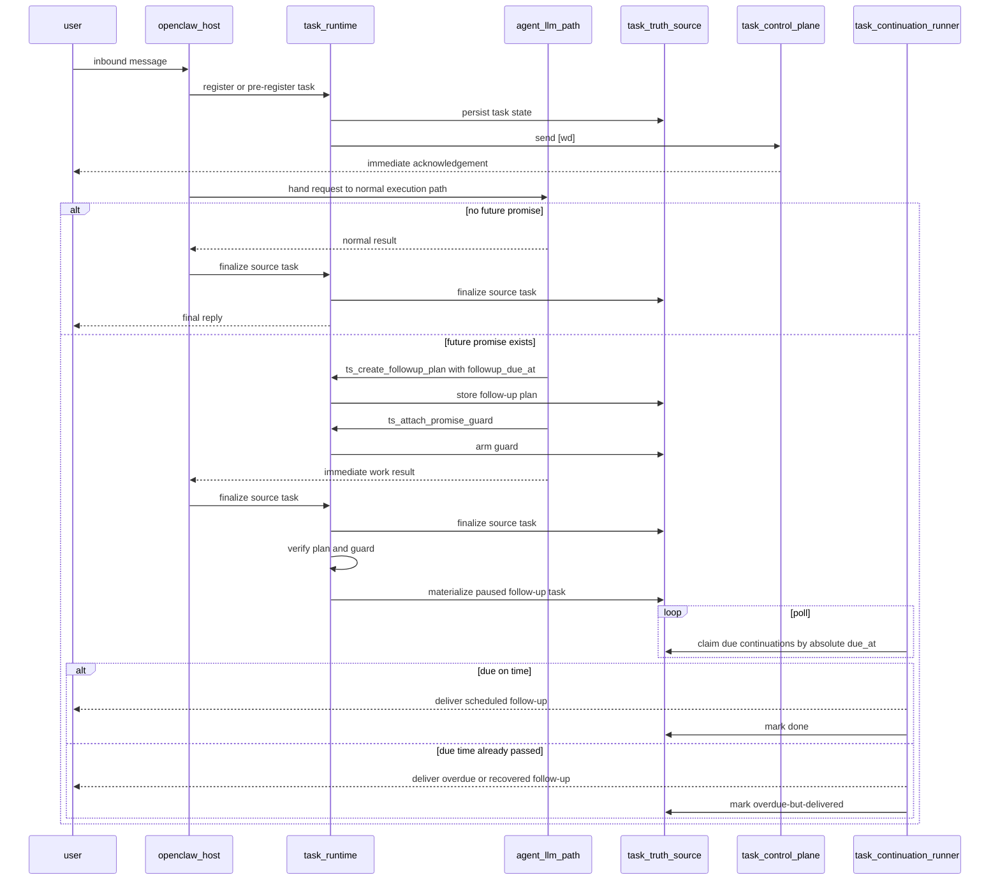
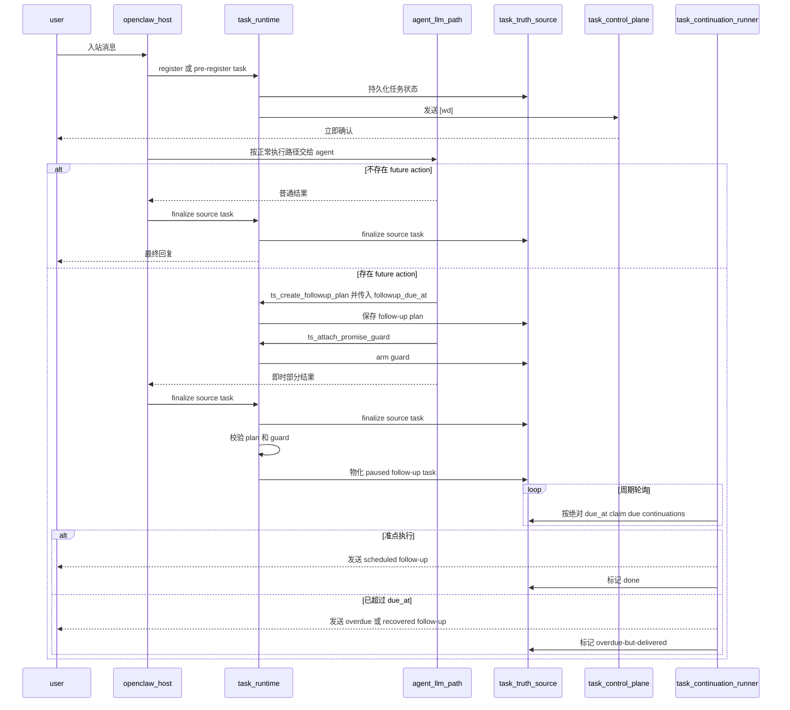

# LLM-assisted task planning and follow-up tools

[English](#english) | [中文](#中文)

## English

> Status: design draft
> Scope: compound requests, delayed follow-up planning, and tool-assisted task decomposition

### stable review constraints

The following review constraints should be treated as fixed unless explicitly changed:

1. task-system supervises execution; it does not replace the original executor
2. normal request interpretation remains on the original agent / LLM path
3. task-system should not keep adding front-door simple-versus-complex routing logic as a long-term design
4. `[wd]` must remain outside the LLM path
5. future promises must be backed by real tasks in the truth source
6. if planning fails, times out, or is skipped, the user must be told explicitly
7. delayed follow-up scheduling should use an absolute due time as the authoritative field
8. if execution happens after that absolute time, the follow-up must still run and the user must be told it is overdue or recovered
9. tool-chain information is not user output
10. scheduling status is runtime-owned control-plane, not normal assistant prose
11. hard-coded regex or phrase-list cleanup must not be used as the long-term mechanism for separating scheduling status from user content

### hard constraint: tool-chain information is not user output

The following rule should now be treated as fixed:

- tool outputs and internal planning state must not be projected directly to the user as part of the normal assistant reply

This includes:

- plan ids
- promise guards
- accepted or rejected scheduling state
- due-time bookkeeping
- follow-up task ids
- raw tool results

Those signals must first land in task-system, then be projected in one of two forms:

1. runtime-owned control-plane messages
   - `[wd] 已收到...`
   - `[wd] 已安排妥当...`
   - `[wd] 这次还没有排上...`
   - recovery or fallback messages
2. business content replies
   - the immediate answer
   - or the actual delayed follow-up content when it is due

So the user-facing rule is:

- scheduling status belongs to task-system
- business content belongs to the main answer or the actual follow-up reply
- tool-chain information itself is not user output

Two product constraints follow from this:

1. scheduling confirmation must include a human-meaningful follow-up summary
   - bad: `[wd] 已安排妥当，将在 2分钟后 回复。`
   - good: `[wd] 已安排妥当：2分钟后同步明天天气。`
2. if the request is primarily about future reminders or future follow-up delivery, the immediate user-visible output should usually be control-plane only
   - do not emit the eventual business result immediately by default
   - let `[wd]` tell the user what has been arranged
   - deliver the actual business content when the scheduled follow-up fires

### hard constraint: no hard-coded text cleanup as the primary design

The following rule should be treated as a top-level design constraint:

- do not solve scheduling-status leakage by growing regex lists, phrase tables, keyword filters, or ad-hoc text cleanup rules over free-form model output

Why this must stay fixed:

- that path becomes unbounded
- wording variants will always leak through
- it mixes control-plane semantics into the content channel first, then tries to pull them back out
- it makes future maintenance unpredictable

The required direction is:

1. keep scheduling state in structured tool results
2. let task-system project that state into runtime-owned `[wd]` messages
3. keep normal assistant prose focused on business content only
4. treat channel separation as the solution, not text post-processing

In the current minimum implementation, that channel separation is enforced by a dedicated business-content block:

- `<task_user_content> ... </task_user_content>`

When planning tools have been used for the current task, runtime forwards only the content inside that block.

That content channel must also support an explicit runtime choice:

- `main_user_content_mode = none`
- `main_user_content_mode = immediate-summary`
- `main_user_content_mode = full-answer`

The intended default for future-first requests is:

- `main_user_content_mode = none`

In that mode:

- runtime sends `[wd]` scheduling state immediately
- runtime does not send the eventual business result yet
- the delayed follow-up later carries the real content

### problem

Some user requests contain more than one task intent in a single message:

- do something now
- then come back later
- maybe come back only after the first part finishes

Examples:

- `你先查一下天气，然后5分钟后回复我信息`
- `先整理这个问题，10分钟后再提醒我看结果`
- `先跑一轮检查，半小时后回来告诉我是否还报错`

Regex can catch some low-ambiguity phrases, but it is not the right long-term mechanism for this class of request.

### observed current behavior

Current OpenClaw behavior matters for this design:

- even simple user requests normally still go through the agent and LLM path
- task-system does not directly replace that execution path
- task-system currently wraps the execution with registration, acknowledgement, recovery, and state tracking

That means this design should not assume:

- simple requests are handled fully outside the LLM
- task-system should become the first semantic classifier for all requests

Instead, the safer assumption is:

- the original agent / LLM keeps interpreting requests
- task-system supervises, enforces, and verifies future-action contracts

### goals

This design should:

1. keep the current fast control-plane path intact
2. avoid turning every user request into an LLM planning round
3. let the LLM explicitly create structured follow-up tasks when needed
4. detect cases where the LLM promised a future action but failed to schedule one
5. preserve the task-system runtime as the final source of truth
6. fail honestly when the LLM planning path is unavailable

### non-goals

This design should not:

1. move `[wd]` generation into the LLM
2. make every request depend on tool calls before the first acknowledgement
3. trust free-form model output as proof that a delayed task exists
4. replace deterministic delayed-reply parsing for simple, low-risk phrases

### recommended model: hybrid, not tool-only

The recommended direction is a hybrid model:

1. deterministic runtime fast path
2. tool-assisted planning path
3. runtime verification and fallback

That is better than either extreme:

- regex-only growth is too brittle
- LLM-only task creation is too unreliable

### first principle: the planning path depends on a healthy LLM

The system should treat this as a first-class truth:

- if the LLM planning path is healthy, the runtime can rely on it more
- if the LLM planning path is unavailable, timed out, or anomalous, the runtime must say so honestly

That means:

1. LLM health must be monitored explicitly
2. tool-path expectations must be verified explicitly
3. user-facing output must reflect planning failure truthfully

This is not optional polish. Without it, the whole planning design becomes misleading.

### why `[wd]` must stay outside the LLM

`[wd]` is a control-plane acknowledgement, not a planning artifact.

It must stay outside the LLM because:

1. it must remain first-visible and low-latency
2. it must not wait for model planning or tool latency
3. it must still work if the model times out or skips tool calls

So the order should remain:

```text
message received
  -> register / pre-register
  -> send [wd]
  -> choose execution path
       - deterministic runtime fast path
       - or LLM-assisted planning path
```

### aggressive default mode

The latest review direction is intentionally more aggressive:

1. the first-visible `[wd]` should still stay on the deterministic runtime path
2. 30-second progress updates should remain runtime-owned by default
3. fallback and recovery messaging should also remain runtime-owned by default
4. aside from those control-plane exceptions, the default path should switch to tool-assisted planning

The preferred order becomes:

```text
message received
  -> register / pre-register
  -> send first [wd] without LLM
  -> hand request to agent / LLM
  -> if execution continues:
       keep 30-second nudges on runtime
       keep fallback / recovery on runtime
       use tools for everything else that needs structured future-action planning
```

This means the default bias is now:

- first `[wd]`: runtime-owned
- 30-second progress messages: runtime-owned
- recovery / fallback messages: runtime-owned
- all other planning-sensitive follow-up work: tool-first

The runtime still remains:

- the owner of the task truth source
- the verifier that a promised future action became a real task
- the fallback path when tools are skipped, timed out, or unhealthy

### when the LLM should be involved

Given current OpenClaw behavior, the better assumption is:

- normal requests already go through the agent / LLM
- task-system should not add a second front-door semantic classifier unless there is a very strong reason

So the preferred model is:

- let the original agent / LLM interpret the request
- require tool use only when the agent intends to create a future promise, delayed follow-up, or dependent continuation

In short:

```text
request -> agent / LLM interprets
if future action is intended -> task-system tools must be called
task-system then supervises and verifies that contract
```

This is usually better than:

```text
request -> task-system first decides simple vs complex -> maybe ask LLM
```

because that would duplicate semantic judgment and blur the supervisor boundary.

Under the aggressive default mode above, this section should be read as:

- request interpretation remains on the original agent / LLM path
- after the first `[wd]`, tool-assisted planning becomes the default for future-action work except the fixed runtime-owned control-plane messages
- runtime still decides whether to fall back to deterministic messaging when the planning path is unhealthy

### proposed tools

The LLM should not directly mutate raw task files. It should call explicit task-system tools.

#### tool: `ts_get_task_planning_context`

Purpose:

- fetch the task/session context the planner needs

Input:

```json
{
  "session_key": "agent:main:feishu:direct:...",
  "message_text": "你先查一下天气，然后5分钟后回复我信息"
}
```

Output:

```json
{
  "session_key": "agent:main:feishu:direct:...",
  "agent_id": "main",
  "channel": "feishu",
  "current_queue_state": {
    "position": 2,
    "active_task_id": "task_abc"
  },
  "message_text": "你先查一下天气，然后5分钟后回复我信息"
}
```

#### tool: `ts_create_followup_plan`

Purpose:

- record a structured plan for compound requests

Input:

```json
{
  "source_task_id": "task_main_123",
  "immediate_work": "查一下天气",
  "followup_kind": "delayed-reply",
  "followup_due_at": "2026-04-06T11:30:00+08:00",
  "followup_message": "回来继续汇报天气结果",
  "dependency": "after-source-task-finalized",
  "original_time_expression": "5分钟后"
}
```

Output:

```json
{
  "plan_id": "plan_xyz",
  "source_task_id": "task_main_123",
  "accepted": true,
  "runtime_contract": {
    "followup_kind": "delayed-reply",
    "dependency": "after-source-task-finalized",
    "followup_due_at": "2026-04-06T11:30:00+08:00"
  }
}
```

Notes:

- `followup_due_at` should be the authoritative scheduling field
- relative expressions such as `5分钟后` may still be preserved as source metadata
- before the plan becomes authoritative, the runtime should resolve relative time into an absolute timestamp

#### tool: `ts_schedule_followup_from_plan`

Purpose:

- turn a saved plan into a real scheduled follow-up task

Input:

```json
{
  "plan_id": "plan_xyz"
}
```

Output:

```json
{
  "task_id": "task_followup_456",
  "status": "paused",
  "due_at": "2026-04-06T11:30:00+08:00",
  "scheduled": true
}
```

If the runtime discovers that `now > due_at` when this follow-up is materialized:

- it should still schedule and execute the task
- it should mark the delivery as overdue, recovered, or similar
- it should tell the user that the planned time point has passed and the follow-up is being delivered now

#### tool: `ts_attach_promise_guard`

Purpose:

- tell the runtime that the model intends to promise a future action
- create an explicit guard expectation even before scheduling completes

Input:

```json
{
  "source_task_id": "task_main_123",
  "promise_type": "delayed-followup",
  "expected_by_finalize": true
}
```

Output:

```json
{
  "guard_id": "guard_789",
  "armed": true
}
```

#### tool: `ts_finalize_planned_followup`

Purpose:

- confirm that the planned follow-up has actually been materialized

Input:

```json
{
  "source_task_id": "task_main_123",
  "guard_id": "guard_789",
  "followup_task_id": "task_followup_456"
}
```

Output:

```json
{
  "ok": true,
  "promise_fulfilled": true
}
```

### what the LLM prompt should require

The model needs explicit rules. Without them, tool availability alone is not enough.

Suggested prompt additions:

1. treat the first `[wd]`, the fixed 30-second progress message, and runtime fallback or recovery messages as runtime-owned control-plane messages
2. aside from those fixed control-plane messages, prefer task-system tools by default for future action, structured follow-up, or delayed promise
3. handle the user request through the normal agent path unless a future action needs task-system support
4. if the request clearly asks for delayed follow-up, create a real follow-up plan or task through the task-system tools
5. never promise a future reply in natural language unless a corresponding task-system tool call succeeded
6. if the user request is ambiguous, ask a clarification question rather than silently guessing a delayed follow-up
7. if tool scheduling fails, say so explicitly instead of pretending the future follow-up exists

Recommended system-prompt contract:

```text
You are the normal request executor. task-system runtime is the supervisor and the owner of the task truth source.

Hard rules:
- Do not generate the first [wd]. That is owned by runtime.
- Do not generate the fixed 30-second progress message. That is owned by runtime.
- Do not generate fallback or recovery control-plane text unless runtime explicitly delegates that action.
- For every future promise, delayed follow-up, reminder, or dependent continuation, use task-system tools by default.
- Never say that you will come back later unless runtime has accepted a real scheduled follow-up.
- If task-system tool scheduling fails, times out, or is skipped, say that explicitly to the user.
- If the request is ambiguous, ask a clarification question instead of inventing a delayed task.

Decision policy:
- normal immediate work: stay on the normal agent path
- fixed control-plane messages: leave to runtime
- all other future-action planning: tool-first
```

The most important hard rule:

> Do not say "I will come back in 5 minutes" unless the runtime has accepted a real scheduled follow-up.

One more hard rule should now be treated the same way:

> Do not expose scheduling acceptance, scheduling rejection, or raw tool state directly to the user. Return that state to task-system, and let task-system project it as a `[wd]` control-plane message.

And one more product rule should be treated as fixed:

> If the request is future-first, do not eagerly send the eventual business result. Let runtime send `[wd]` scheduling state first, and let the scheduled follow-up deliver the actual content later.

This prompt contract should be treated as part of the implementation surface, not as optional writing guidance.

For the usable version of this project, this contract should also be user-editable through runtime config:

- `taskSystem.agents.main.planning.systemPromptContract`

That makes the policy reviewable and adjustable without requiring a code patch for every prompt iteration.

### monitoring and fallback

The runtime must assume the LLM may:

- time out
- skip the tool
- choose the wrong tool
- promise future work in plain text without creating a scheduled task

So monitoring must exist even if tools are available.

#### monitor 0: LLM planning health

Before trusting the planning path, the runtime should know whether the LLM planner is healthy.

The health signal should include at least:

- recent success rate
- timeout rate
- tool-call completion rate
- promise-without-task anomaly rate

The system does not need a perfect global health score. It only needs a strong enough signal to answer:

- can we trust the planner now?
- should we let this request depend on planning?

If the answer is no, the runtime should downgrade behavior immediately.

#### monitor 1: promise-without-task detector

At finalize time, check:

- did the model output contain a delayed promise?
- is there a matching follow-up plan or task?

If not:

- mark the task with a planning anomaly
- emit operator-visible diagnostics
- surface it in dashboard / triage / continuity

#### monitor 2: tool expectation guard

If the LLM called `ts_attach_promise_guard`, then finalize must verify:

- guard exists
- follow-up plan or task was created
- guard was closed

If not:

- finalize as `done-with-planning-anomaly` or similar projected status
- emit a watchdog-visible signal

#### monitor 3: fallback runtime scheduling

For low-risk, high-confidence cases, the runtime can still schedule the follow-up directly even if the LLM path is unavailable.

This preserves the current safety net:

- deterministic parsing remains the backup path
- the LLM tool path becomes the structured path

#### monitor 4: overdue follow-up execution

Absolute time must remain authoritative even when the real execution happens later.

Checks:

- does the follow-up plan have a valid `followup_due_at`?
- did the source task finish only after that absolute time?
- did scheduler delay or gateway restart cause late execution?

If yes:

- the follow-up should still run
- the task should be marked as overdue-but-delivered, recovered, or similar
- the user-facing message should mention that the scheduled time was missed and the system is delivering it now

### user-facing behavior when planning fails

If the planning path fails, the runtime should not silently pretend everything is fine.

Recommended policy:

1. if the immediate part can still run safely, run it
2. if the delayed follow-up cannot be scheduled, tell the user explicitly
3. preserve the task if possible
4. if the task cannot be preserved meaningfully, return the failure to the user directly

Examples of honest user-visible outcomes:

- "I completed the immediate part, but I was not able to create the 5-minute follow-up task."
- "The delayed follow-up could not be scheduled because the planning path timed out."
- "The request was accepted, but the follow-up plan was not created. Please resend the delayed part separately."

The important point is:

> the system must never say a future follow-up exists unless the runtime can prove it exists.

### task preservation policy

If planning fails, the runtime should try to preserve useful state in this order:

1. keep the accepted source task
2. keep a planning anomaly record attached to it
3. keep any partial immediate work result that is safe to expose
4. if follow-up scheduling failed completely, expose that failure directly to the user

That gives operators and users a stable truth source even when the LLM did not complete the planning path.

### recommended runtime sequence

```text
user message
  -> register / [wd]
  -> agent / LLM interprets
  -> if no future action is intended:
       run normally
  -> if future action is intended:
       create follow-up plan with absolute due_at
       arm promise guard
  -> source task runs
  -> finalize checks:
       - plan exists?
       - promised follow-up actually scheduled?
       - guard closed?
  -> if yes:
       follow-up task remains in truth source
  -> if no:
       anomaly enters watchdog / triage / dashboard
```

### sequence diagram



ownership notes:

- `openclaw_host`
  - owns message ingress and the normal agent handoff
- `task_runtime`
  - owns registration, guard verification, control-plane signaling, and follow-up materialization
- `task_truth_source`
  - is the persisted task ledger managed by task-system
- `task_continuation_runner`
  - is also owned by task-system, not by OpenClaw core
- `agent_llm_path`
  - still owns request interpretation and the normal execution path
- `task_control_plane`
  - owns `[wd]`, progress nudges, and other user-visible control-plane messages

### why this is better than "more rules"

This hybrid approach is better because:

1. the fast path remains deterministic
2. `[wd]` remains immediate
3. absolute time becomes the authoritative scheduling contract
4. compound follow-up can become structured
5. runtime still catches LLM omission, timeout, lateness, or failure

### rollout suggestion

#### phase A

- keep current simple delayed-reply parser
- add planning tools and prompt contract
- only route obviously compound requests into the tool path

#### phase B

- add promise guard and anomaly detection
- project planning anomalies into dashboard / triage / continuity

#### phase C

- evaluate whether more channels or agents should use tool-assisted planning by default

### final recommendation

The best current direction is:

- do not move `[wd]` into the LLM
- do not rely on regex growth forever
- do not rely on LLM output alone
- expose explicit task-system tools
- add strong prompt rules
- add runtime monitoring that proves the tool path really happened
- treat LLM planning health as a first-class dependency
- tell the user the truth when planning failed, timed out, or was skipped

In one sentence:

> Let the LLM help decompose compound requests, but let the runtime prove that every promised follow-up became a real scheduled task.

## 中文

> 状态：设计草稿
> 范围：复合请求、延迟 follow-up 规划、以及 tool-assisted task decomposition

### 已确认评审约束

下面这些评审约束，后续默认视为固定前提，除非明确重新改动：

1. task-system 的职责是监督执行，不是替代原执行者
2. 普通请求理解仍然留在原 agent / LLM 路径
3. task-system 不应长期继续增加前置的 simple/complex 路由判断
4. `[wd]` 必须保持在 LLM 路径之外
5. 只要存在 future promise，truth source 中就必须有真实 task 作为背书
6. 只要 planning 失败、超时或被跳过，就必须明确告诉用户
7. delayed follow-up 调度应以绝对时间点作为权威字段
8. 即使真正执行时已经超过这个绝对时间点，也仍然必须执行，并告诉用户这是 overdue 或 recovered
9. 工具链里的内部信息不是用户输出
10. “是否已排上 / 是否安排妥当”属于 runtime-owned 控制面，不属于主答复
11. 严禁把 regex、句式表、关键词过滤或零散文本清洗扩张成长期主方案

### 硬约束：工具链信息不是用户输出

下面这条现在也应视为固定约束：

- tool 输出和内部 planning 状态，不能直接作为用户可见的正常主答复

这里包括：

- plan id
- promise guard
- 调度 accepted / rejected
- due time 记账状态
- follow-up task id
- 裸 tool 结果

这些信号必须先进入 task-system，再投影成下面两类之一：

1. runtime-owned 控制面消息
   - `[wd] 已收到...`
   - `[wd] 已安排妥当...`
   - `[wd] 这次还没有排上...`
   - recovery / fallback 文案
2. 业务内容回复
   - 立即主答复
   - 或真正到点后的 delayed follow-up 正文

所以用户侧规则要明确成：

- 调度状态归 task-system
- 业务内容归主答复或真实 follow-up
- 工具链内部信息本身不直接面向用户

### 硬约束：严禁用硬编码文本清洗当主方案

下面这条要视为最高优先级设计约束：

- 不能通过不断增加 regex、句式表、关键词过滤或零散文本清洗规则，去修补“排程状态混入主答复”这个问题

为什么这条必须固定：

- 这种做法会无限膨胀
- 模型只要换一种说法就会漏
- 它先把控制面语义放进内容通道，再试图事后抽出来，方向本身就是错的
- 后续维护会越来越不可控

正确方向必须是：

1. 排程状态先留在结构化 tool 结果里
2. task-system 再把它投影成 runtime-owned 的 `[wd]`
3. 主答复只承载业务内容
4. 靠通道分离解决问题，而不是靠文本后处理

在当前阶段，这条“通道分离”的最小实现是一个专门的业务内容块：

- `<task_user_content> ... </task_user_content>`

一旦当前任务已经使用 planning tools，runtime 之后只转发这个内容块里的业务内容。

### 问题

有些用户请求在一条消息里同时包含多个任务意图：

- 现在做一件事
- 过一会儿再回来做一件事
- 甚至第二件事还依赖第一件事是否完成

例如：

- `你先查一下天气，然后5分钟后回复我信息`
- `先整理这个问题，10分钟后再提醒我看结果`
- `先跑一轮检查，半小时后回来告诉我是否还报错`

Regex 能兜住一部分低歧义句子，但它不是这类问题的长期正确解法。

### 当前已观察到的系统行为

这份设计需要建立在当前 OpenClaw 的真实行为之上：

- 即使是简单请求，默认也通常还是会进入 agent / LLM 路径
- task-system 目前并不会直接替代这条执行路径
- task-system 现在主要是在执行外层补上登记、确认、恢复与状态跟踪

这意味着这份设计不应该默认假设：

- 简单请求都在 LLM 之外处理
- task-system 应该成为所有请求的前置语义分类器

更稳妥的前提应该是：

- 原来的 agent / LLM 继续负责理解请求
- task-system 负责监督、约束和验证 future-action contract

### 目标

这份设计希望做到：

1. 保留当前快速 control-plane 路径
2. 避免让每条用户请求都先进入一次 LLM planning
3. 让 LLM 在真正需要时显式创建结构化 follow-up task
4. 发现“模型口头承诺了未来动作，但没真正建任务”的情况
5. 保持 task-system runtime 作为最终真相源
6. 当 LLM planning 路径不可用时，如实失败而不是假装成功

### 非目标

这份设计不应该：

1. 把 `[wd]` 生成移进 LLM
2. 让每条请求在首条确认前都依赖 tool 调用
3. 把自由文本输出当成 delayed task 已存在的证明
4. 替代针对简单、低风险 delayed reply 的确定性解析

### 推荐模型：hybrid，而不是 tool-only

推荐方向是一个 hybrid 模型：

1. deterministic runtime fast path
2. tool-assisted planning path
3. runtime verification and fallback

它比两个极端都更好：

- 只靠 regex 扩展，太脆弱
- 只靠 LLM 建任务，也不可靠

### 第一原则：planning path 依赖健康的 LLM

系统必须把这件事当成一等事实：

- 如果 LLM planning 路径健康，runtime 可以更依赖它
- 如果 LLM planning 路径不可用、超时或异常，runtime 必须如实说出来

这意味着：

1. 必须显式监控 LLM health
2. 必须显式验证 tool path 预期是否真的发生
3. 用户可见输出必须真实反映 planning 是否失败

这不是可有可无的优化，而是整个设计成立的前提。

### 为什么 `[wd]` 必须保持在 LLM 之外

`[wd]` 是 control-plane acknowledgement，不是 planning 产物。

它必须保持在 LLM 之外，因为：

1. 它必须第一时间可见、低延迟
2. 不能等待模型 planning 或 tool latency
3. 就算模型超时或跳过 tool，它也必须照常工作

所以顺序应保持为：

```text
消息到达
  -> register / pre-register
  -> 发送 [wd]
  -> 选择执行路径
       - deterministic runtime fast path
       - 或 LLM-assisted planning path
```

### 什么情况下应该让 LLM 介入

结合当前 OpenClaw 的行为，更合理的前提是：

- 普通请求本来就会进入 agent / LLM
- task-system 不应该再额外加一层前置的 simple/complex 主判断

所以更推荐的模型是：

- 让原来的 agent / LLM 继续理解用户请求
- 只有当 agent 打算创建 future promise、delayed follow-up、dependent continuation 时，才强制调用 task-system 工具

可以压成一句：

```text
请求 -> agent / LLM 理解
如果要承诺未来动作 -> 必须调用 task-system tools
task-system 负责监督并验证这条 contract
```

这通常比下面这种方式更合适：

```text
请求 -> task-system 先判断简单还是复杂 -> 再决定要不要找 LLM
```

因为后者会重复做语义判断，也会模糊“监工”和“执行者”的边界。

### 更激进的默认模式

最新评审方向是更激进的默认策略：

1. 第一条可见的 `[wd]` 仍然留在 deterministic runtime 路径
2. 30 秒进度消息默认仍由 runtime 负责
3. fallback 与 recovery 文案默认仍由 runtime 负责
4. 除了这些控制面例外，其余默认路径切换到 tool-assisted planning

推荐顺序变成：

```text
message received
  -> register / pre-register
  -> send first [wd] without LLM
  -> hand request to agent / LLM
  -> if execution continues:
       keep 30-second nudges on runtime
       keep fallback / recovery on runtime
       use tools for everything else that needs structured future-action planning
```

这意味着默认偏好现在是：

- 第一条 `[wd]`：runtime 负责
- 30 秒进度消息：runtime 负责
- recovery / fallback 文案：runtime 负责
- 其他需要结构化 future-action planning 的部分：tool-first

runtime 仍然负责：

- 持有 task truth source
- 验证 future promise 是否真的变成了 task
- 在 tool 跳过、超时或不健康时兜底

### 建议提供的工具

LLM 不应该直接操作原始 task 文件，而应该调用显式 task-system 工具。

#### 工具：`ts_get_task_planning_context`

用途：

- 获取 planner 所需的任务/session 上下文

输入：

```json
{
  "session_key": "agent:main:feishu:direct:...",
  "message_text": "你先查一下天气，然后5分钟后回复我信息"
}
```

输出：

```json
{
  "session_key": "agent:main:feishu:direct:...",
  "agent_id": "main",
  "channel": "feishu",
  "current_queue_state": {
    "position": 2,
    "active_task_id": "task_abc"
  },
  "message_text": "你先查一下天气，然后5分钟后回复我信息"
}
```

#### 工具：`ts_create_followup_plan`

用途：

- 为复合请求记录一份结构化 follow-up 计划

输入：

```json
{
  "source_task_id": "task_main_123",
  "immediate_work": "查一下天气",
  "followup_kind": "delayed-reply",
  "followup_due_at": "2026-04-06T11:30:00+08:00",
  "followup_message": "回来继续汇报天气结果",
  "dependency": "after-source-task-finalized",
  "original_time_expression": "5分钟后"
}
```

输出：

```json
{
  "plan_id": "plan_xyz",
  "source_task_id": "task_main_123",
  "accepted": true,
  "runtime_contract": {
    "followup_kind": "delayed-reply",
    "dependency": "after-source-task-finalized",
    "followup_due_at": "2026-04-06T11:30:00+08:00"
  }
}
```

说明：

- `followup_due_at` 必须是权威调度字段
- `5分钟后` 这类相对表达可以保留成源元数据
- 但在 plan 成为权威状态前，runtime 必须先把它解析成绝对时间点

#### 工具：`ts_schedule_followup_from_plan`

用途：

- 把计划物化成真实的 scheduled follow-up task

输入：

```json
{
  "plan_id": "plan_xyz"
}
```

输出：

```json
{
  "task_id": "task_followup_456",
  "status": "paused",
  "due_at": "2026-04-06T11:30:00+08:00",
  "scheduled": true
}
```

如果 runtime 发现物化 follow-up 时已经满足 `now > due_at`：

- 仍然必须调度并执行
- 任务状态应标成 overdue-but-delivered、recovered 或类似状态
- 用户消息里要明确说明：原定时间点已经错过，现在正在补发或恢复执行

#### 工具：`ts_attach_promise_guard`

用途：

- 告诉 runtime：模型打算承诺一个未来动作
- 即使调度还没完成，也先创建一层显式 guard expectation

输入：

```json
{
  "source_task_id": "task_main_123",
  "promise_type": "delayed-followup",
  "expected_by_finalize": true
}
```

输出：

```json
{
  "guard_id": "guard_789",
  "armed": true
}
```

#### 工具：`ts_finalize_planned_followup`

用途：

- 确认计划中的 follow-up 确实已经物化

输入：

```json
{
  "source_task_id": "task_main_123",
  "guard_id": "guard_789",
  "followup_task_id": "task_followup_456"
}
```

输出：

```json
{
  "ok": true,
  "promise_fulfilled": true
}
```

### 提示词里应该明确要求什么

模型需要显式规则。只有给它工具还不够。

建议补进 prompt 的要求：

1. 第一条 `[wd]`、固定 30 秒进度消息、runtime fallback 或 recovery 文案，默认都属于 runtime-owned control-plane
2. 除了这些固定控制面消息外，凡是涉及 future action、结构化 follow-up、delayed promise 的部分，默认优先走 task-system tools
3. 普通请求继续按原 agent 路径处理，不要为了“像任务”而无条件调用 planning 工具
4. 如果请求明确要求 delayed follow-up，必须通过 task-system 工具创建真实 plan 或 task
5. 不能在自然语言里承诺未来回复，除非对应的 task-system 工具调用成功
6. 如果用户请求模糊，应先追问，而不是静默猜测 delayed follow-up
7. 如果 tool 调度失败，必须明确说失败，而不是假装未来 follow-up 已存在

推荐写进 system prompt 的合同片段：

```text
你是正常请求的执行者。task-system runtime 是监工，也是 task truth source 的所有者。

硬约束：
- 不要生成第一条 [wd]，这属于 runtime。
- 不要生成固定的 30 秒进度消息，这属于 runtime。
- 不要擅自生成 fallback 或 recovery 控制面文案，除非 runtime 明确把这件事委托给你。
- 只要涉及 future promise、delayed follow-up、提醒、dependent continuation，默认都优先调用 task-system tools。
- 只有当 runtime 已接受一条真实 scheduled follow-up 时，才能说“我稍后回来”。
- 如果 task-system tool 调度失败、超时或被跳过，必须直接告诉用户。
- 如果请求有歧义，应先追问，而不是自己猜出一个 delayed task。

决策策略：
- 普通即时工作：继续走原 agent path
- 固定控制面消息：交给 runtime
- 其他 future-action planning：默认 tool-first
```

最重要的一条硬规则是：

> 只有当 runtime 已接受一条真实 scheduled follow-up 时，模型才能说“我 5 分钟后回来”。

现在还应增加一条同等级硬规则：

> 不要把调度 accepted / rejected 或裸 tool 状态直接告诉用户；这些状态应先返回给 task-system，再由 task-system 统一投影成 `[wd]` 控制面消息。

这组 prompt contract 不应被当成可选文案建议，而应被视为实现边界的一部分。

在当前可用版本里，这组 contract 还应该作为用户可修改的 runtime 配置项存在：

- `taskSystem.agents.main.planning.systemPromptContract`

这样用户在评审或试运行时，可以直接调整提示词，而不需要每次都改代码。

### 监控与兜底

runtime 必须默认 LLM 可能会：

- 超时
- 跳过工具
- 选错工具
- 用自然语言承诺未来动作，却没有建 task

所以即使引入工具，runtime 监控仍然必须存在。

#### 监控 0：LLM planning health

在真正信任 planning path 之前，runtime 应该知道 LLM planner 当前是否健康。

这个 health signal 至少应包含：

- 最近成功率
- 超时率
- tool-call 完成率
- promise-without-task anomaly 率

系统不一定需要一个完美的全局分数，但至少要能回答：

- 现在还能不能信这个 planner？
- 这条请求现在适不适合依赖 planning？

如果答案是否定的，runtime 就应该立即降级。

#### 监控 1：promise-without-task detector

在 finalize 时检查：

- 模型输出里是否存在 delayed promise
- 是否存在匹配的 follow-up plan 或 task

如果没有：

- 给任务打上 planning anomaly
- 发 operator-visible diagnostics
- 在 dashboard / triage / continuity 中暴露出来

#### 监控 2：tool expectation guard

如果 LLM 调用了 `ts_attach_promise_guard`，那么 finalize 必须验证：

- guard 存在
- follow-up plan 或 task 已创建
- guard 已关闭

如果没有：

- 把任务 finalize 成 `done-with-planning-anomaly` 或类似投影状态
- 发 watchdog 可见信号

#### 监控 3：fallback runtime scheduling

对于低风险、高置信度的情况，即使 LLM 路径不可用，runtime 仍可以直接调度 follow-up。

这样就保留了当前安全网：

- deterministic parsing 仍然是 backup path
- LLM tool path 负责更结构化的那部分

#### 监控 4：逾期 follow-up 执行

绝对时间必须在真实执行晚于计划时间时，仍然保持权威。

检查点：

- follow-up plan 是否带有效的 `followup_due_at`
- source task 是否在这个绝对时间点之后才完成
- scheduler 延迟或 gateway 重启是否导致了晚执行

如果是：

- follow-up 仍然必须执行
- 任务状态应标成 overdue-but-delivered、recovered 或类似状态
- 用户可见消息应说明：原定时间点已经错过，系统现在正在补发

### planning 失败时，用户应该看到什么

如果 planning path 失败，runtime 不能静默假装一切正常。

推荐策略：

1. 如果即时部分仍能安全执行，就继续执行即时部分
2. 如果 delayed follow-up 不能被调度，就明确告诉用户
3. 能保留任务就尽量保留
4. 如果任务无法有意义地保留，就把失败直接抛给用户

用户可见结果应类似：

- “即时部分已完成，但我没能创建 5 分钟后的 follow-up 任务。”
- “delayed follow-up 没有被调度成功，因为 planning 路径超时了。”
- “请求已接收，但 follow-up plan 没创建成功；如果需要，请把延迟部分单独再发一次。”

关键原则是：

> 只有当 runtime 能证明 future follow-up 真实存在时，系统才能说它已经安排好了。

### 任务保留策略

如果 planning 失败，runtime 应尽量按下面顺序保留有效状态：

1. 保留已接收的 source task
2. 在 task 上附着 planning anomaly 记录
3. 如果即时部分有安全可见结果，就保留这部分结果
4. 如果 follow-up 调度彻底失败，就把这件事直接暴露给用户

这样无论是用户还是运维，都还能看到稳定的 truth source，而不是只剩一句失败的聊天承诺。

### 推荐 runtime 顺序

```text
用户消息
  -> register / [wd]
  -> agent / LLM 理解请求
  -> 如果没有 future action:
       正常执行
  -> 如果存在 future action:
       用绝对 due_at 创建 follow-up plan
       arm promise guard
  -> source task 执行
  -> finalize 检查:
       - plan 存在吗?
       - promised follow-up 真的建出来了吗?
       - guard 关闭了吗?
  -> 如果是:
       follow-up task 留在 truth source 中
  -> 如果否:
       anomaly 进入 watchdog / triage / dashboard
```

### 时序图



ownership 说明：

- `openclaw_host`
  - 负责消息进入和把请求交给正常 agent 路径
- `task_runtime`
  - 负责登记、校验、控制面反馈、物化 follow-up
- `task_truth_source`
  - 是 task-system 管理的持久化任务账本
- `task_continuation_runner`
  - 也是 task-system 自己的 runner，不是 OpenClaw core 原生功能
- `agent_llm_path`
  - 继续负责理解请求和执行正常工作
- `task_control_plane`
  - 负责 `[wd]`、进度提示以及其他用户可见控制面消息

### 为什么这比“继续补规则”更好

这个 hybrid 方案更好，因为：

1. fast path 仍然是确定性的
2. `[wd]` 仍然是立即可见的
3. 绝对时间成为真正权威的调度契约
4. compound follow-up 可以变成结构化对象
5. runtime 仍然能抓住 LLM 漏调工具、超时、逾期或失败的情况

### 建议 rollout

#### phase A

- 保留当前 simple delayed-reply parser
- 增加 planning tools 与 prompt contract
- 只把明显复合请求路由到 tool path

#### phase B

- 增加 promise guard 与 anomaly detection
- 把 planning anomaly 投影进 dashboard / triage / continuity

#### phase C

- 再评估是否要让更多 channel 或 agent 默认走 tool-assisted planning

### 最终建议

当前最好的方向是：

- 不把 `[wd]` 移进 LLM
- 不再长期依赖 regex 增长
- 不相信 LLM 文本输出本身
- 暴露显式 task-system tools
- 增加明确 prompt 规则
- 增加 runtime 监控，证明 tool path 真的发生过
- 把 LLM planning health 当成一等依赖
- 一旦 planning 失败、超时或被跳过，就对用户如实说明

一句话总结：

> 让 LLM 帮忙拆解复合请求，但让 runtime 负责证明每一个被承诺的 follow-up 都变成了真实 scheduled task。
