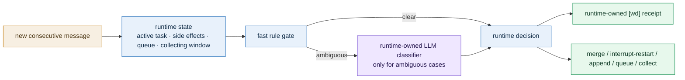

# Same-Session Message Routing

[English](README.md) | [中文](README.zh-CN.md)

> Status: Phase 8 shipped
> Scope: how consecutive user messages inside the same session should be routed across `steering / queueing / control-plane / collect-more`, with a runtime-owned `[wd]` receipt returned to the user

### 1. What this subproject is trying to solve

The roadmap already formalizes three same-session semantics:

- `same-session-steering`
- `agent-scoped-task-queue`
- `highest-priority-lane`

Real usage is more nuanced than those three labels:

- some second messages should be merged into the current task
- some second messages are independent new tasks and should queue separately
- some second messages mean “do not start yet, I will keep sending more”
- some second messages are control-plane instructions such as `continue / stop / status`

Without an explicit contract here, the system keeps drifting among these failures:

- treating clarifications as new queued tasks
- merging an actually independent request into the current task
- starting too early before the user finishes sending context
- making an automatic routing decision without explaining it to the user

This packet turns that capability into a reviewable design.

### 1.1 Current implementation checkpoint

- `Phase 0` review conclusions are being carried into code
- `Phase 1` now records a runtime-owned structured same-session routing record
- `Phase 2` has started with deterministic rules for obvious `control-plane / collect-more / queueing` cases
- `Phase 3` now maps obvious `steering` follow-ups through an execution-stage gate instead of leaving them as semantic-only labels
- `Phase 4` now projects routing decisions as runtime-owned `[wd]` receipt payloads for immediate control-plane delivery
- `Phase 5` now lets runtime trigger an injectable structured classifier only for ambiguous same-session follow-ups, with explicit low-confidence / error / unavailable fallback
- `Phase 6` now records a real collecting window in session truth source, buffers follow-up messages during the window, and materializes them into a task when the window expires
- `Phase 7` acceptance coverage is now wired into `same_session_routing_acceptance.py` and `stable_acceptance.py`
- `Phase 8` roadmap / testsuite / usage docs are now synced to the shipped behavior
- stale same-session observed placeholders such as `在么 / 可以`, plus `received/manual-review` backlog, are now reused as pre-start takeover targets instead of silently falling back to `no-active-task`

### 2. Core conclusion

This should not be solved by pure rules forever, and it should not be delegated entirely to the main conversational LLM either.

Recommended direction:

1. runtime handles obvious cases with cheap rules
2. only when it is `same session + active task exists + rules are ambiguous`
3. trigger one **runtime-owned structured LLM classifier**
4. runtime makes the final decision and returns a runtime-owned `[wd]` receipt

In one sentence:

> This is a “runtime adjudication + LLM-assisted classification + explicit `[wd]` result” problem, not a “let the main LLM guess on the fly” problem.

### 3. Why rules alone are not enough

These follow-up messages may all look like “clarifications”, but their true meaning is unstable:

- `Also make the tone more conversational`
- `Also check Hangzhou weather`
- `I’m not done yet, don’t start`
- `Continue`

Rules can cover obvious signals, but they break down quickly when:

1. a short second message is actually a separate goal
2. a message looks like a new goal but is really a refinement of the current one
3. whether the task can still be safely rewritten depends on runtime stage, not only on text
4. the user intentionally sends multiple messages and expects batching

So accurate routing requires both:

- runtime state
- lightweight semantic classification

### 4. Why this should not be owned by the main LLM

If this is implemented as “the main LLM decides whether to call a tool,” three problems appear:

1. this is fundamentally a producer/runtime responsibility, not a business-generation responsibility
2. the main LLM may not trigger the tool path consistently
3. timeout, fallback, auditability, and low-confidence handling become much harder

So the better shape is:

- implementation may look like a tool
- ownership belongs to runtime
- runtime decides when to invoke it, how to fall back, and how to produce the final `[wd]`

### 5. Capability diagram

### 6. What this should feel like to the user

The ideal feeling is not “the system is clever.”

It is “the system is clear”:

- when a message is merged, the system says it was merged into the current task
- when a message becomes a new task, the system says it queued separately
- when the user is still sending context, the system says it is waiting for more
- when a running task is affected, the system says whether it merged, restarted, or appended

So this capability should not ship without the following product rule:

> Every same-session follow-up message must produce a runtime-owned `[wd]` routing receipt.

### 7. Subdocuments

- [decision_contract.md](./decision_contract.md)
  - formal decision types
  - classifier trigger conditions
  - interrupt / restart / append / queue state machine
  - `[wd]` receipt contract

- [test_cases.md](./test_cases.md)
  - scenario set
  - expected decisions
  - expected `[wd]`
  - suggested future automated tests

- [development_plan.md](./development_plan.md)
  - phased implementation plan
  - exit criteria
  - suggested test and rollout order

### 8. Current shipped shape

This is now a shipped runtime-owned same-session routing capability:

- it extends the existing producer contract
- it preserves the supervisor-first constraint
- it does not turn task-system into a universal front-door classifier
- it absorbs the already formalized `same-session-steering / agent-scoped-task-queue / highest-priority-lane`
- it is validated by `same_session_routing_acceptance.py` and folded into `stable_acceptance.py`
