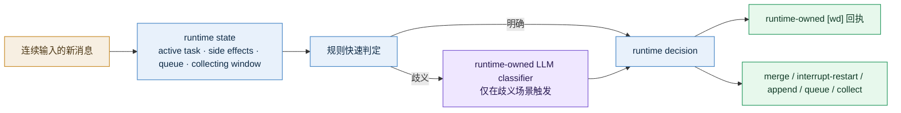

# Same-Session Message Routing

[English](README.md) | [中文](README.zh-CN.md)

> 状态：已完成到 Phase 8 shipped
> 范围：同一 session 内连续多条用户消息，如何在 `steering / queueing / control-plane / collect-more` 之间做自动判定，并向用户返回 runtime-owned `[wd]` 回执

### 1. 这份子项目解决什么问题

当前 roadmap 已经正式固定了同一 session 的三类基础语义：

- `same-session-steering`
- `agent-scoped-task-queue`
- `highest-priority-lane`

但真实使用里，连续输入往往比这三类名词复杂：

- 有些第二条消息是第一条的补充，应并入当前 task
- 有些第二条消息是独立新任务，应单独排队
- 有些第二条消息是“先别开始，我还要继续补充”，应进入短暂收集窗口
- 有些第二条消息是 `继续 / 停止 / 状态`，属于控制面，不应进入普通任务路径

如果这层没有明确 contract，系统就会在下面几种错误之间摇摆：

- 误把补充说明当新任务排队
- 误把独立新需求并到当前任务里
- 误在用户还没发完时就开始执行
- 自动决策后又不给用户解释，导致体感像“系统在乱来”

这份子项目要做的，就是把这层能力正式说清楚。

### 1.1 当前实现检查点

- `Phase 0` 的 review 结论正在落到代码里
- `Phase 1` 已开始补 runtime-owned 的 same-session routing 结构化记录
- `Phase 2` 已开始补 obvious `control-plane / collect-more / queueing` 的 deterministic rules
- `Phase 3` 已开始把 obvious `steering` follow-up 映射到 execution-stage gate，而不只停留在语义标签
- `Phase 4` 已开始把 routing decision 投影成 runtime-owned `[wd]` receipt payload，用于即时 control-plane 投递
- `Phase 5` 已开始把 runtime-owned structured classifier 接到歧义 same-session follow-up，上线了 low-confidence / error / unavailable 的显式 fallback
- `Phase 6` 已把 collecting window 做成 session truth source 中的正式状态，窗口内会缓冲后续输入，超时后再 materialize 成正式任务
- `Phase 7` 的 acceptance 覆盖已接入 `same_session_routing_acceptance.py` 与 `stable_acceptance.py`
- `Phase 8` 的 roadmap / testsuite / usage 文档已同步到已交付行为
- stale 的同 session observed 占位消息，例如 `在么 / 可以`，以及 `received/manual-review` backlog，现在都会被复用为 pre-start takeover target，而不再静默退回 `no-active-task`

### 2. 核心结论

这件事不能长期靠纯规则，也不能把决定权完全交给主对话 LLM。

推荐方向是：

1. runtime 先用低成本规则处理明显场景
2. 只有在“同一 session + 当前存在 active task + 规则判不准”的情况下
3. 才触发一次 **runtime-owned structured LLM classifier**
4. 最终动作由 runtime 决定，并返回一条 runtime-owned `[wd]` 回执

一句话总结：

> 这是一个“runtime 裁决 + LLM 辅助分类 + `[wd]` 明示结果”的问题，不是“让主 LLM 顺手猜一下”的问题。

### 3. 为什么不能只靠规则

下面这几组话，表面都像“第二条是补充”，但真实语义并不稳定：

- `顺便把语气改口语一点`
- `另外再帮我查一下杭州天气`
- `我还没发完，先别开始`
- `继续`

纯规则可以识别一部分明显信号，但在这些情况下会很快失真：

1. 第二条文本很短，但其实是独立新目标
2. 第二条文本像新目标，但其实是对当前目标的约束补充
3. 当前任务已经运行到不同阶段，能不能安全改写取决于运行态，而不是文本本身
4. 用户有时会故意分多条发完后再一起执行

因此，**准确判断要依赖两类信息同时存在**：

- runtime state
- 小型语义分类

### 4. 为什么不能完全交给主 LLM

如果把这件事做成“主对话 LLM 自己决定要不要调个 tool”，会有 3 个问题：

1. 这类判定本质上是 producer/runtime 职责，不是业务生成职责
2. 主 LLM 不一定稳定触发这条 tool 路径
3. 后续很难做统一审计、超时回退和低置信度兜底

因此更合适的形态是：

- 允许实现上长得像一个 tool
- 但 ownership 属于 runtime
- 由 runtime 决定何时调用、如何回退、如何生成最终 `[wd]`

### 5. 目标能力图



### 6. 这条能力最终要给用户什么感受

理想用户体感不是“系统很聪明”，而是“系统很清楚”：

- 用户补充一句时，系统会说这条已并入当前任务
- 用户又开新话题时，系统会说这条已单独排队
- 用户说还没发完时，系统会说先等你补齐
- 用户插话影响当前执行时，系统会说是并入、重启，还是作为后续步骤处理

所以这条能力上线的前提，不只是分类正确率，而是：

> 每一条后续输入，都要有一条 runtime-owned `[wd]` 判定回执。

### 7. 子文档目录

- [decision_contract.md](./decision_contract.md)
  - 正式 decision 类型
  - LLM classifier 触发条件
  - interrupt / restart / append / queue 的状态机
  - `[wd]` 回执 contract

- [test_cases.md](./test_cases.md)
  - 样例集
  - 预期 decision
  - 预期 `[wd]`
  - 后续自动化测试建议

- [development_plan.md](./development_plan.md)
  - 分阶段开发计划
  - 退出条件
  - 建议测试与 rollout 顺序

### 8. 当前已交付形态

这条能力现在已经作为 runtime-owned same-session routing capability 交付：

- 它沿着既有 `producer contract` 往前走
- 它延续了 `supervisor-first` 约束
- 它不要求 task-system 演化成新的前置主分类器
- 它能自然吸收当前已存在的 `same-session-steering / agent-scoped-task-queue / highest-priority-lane`
- 它已经由 `same_session_routing_acceptance.py` 验证，并并入 `stable_acceptance.py`

### 9. 验证入口

```bash
python3 scripts/runtime/same_session_routing_acceptance.py --json
```
