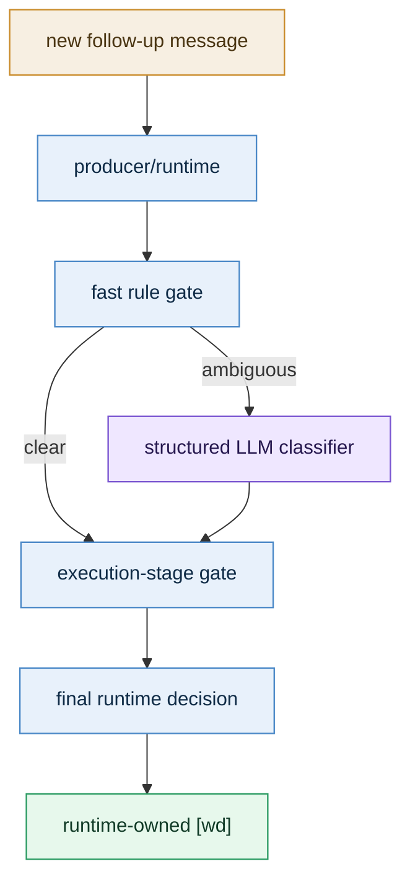

# Decision Contract

[English](decision_contract.md) | [中文](decision_contract.zh-CN.md)

### 1. Formal goal

Define an auditable, explainable, and recoverable contract for follow-up user messages inside the same session:

- classify the message first
- check whether the current task can still be safely rewritten
- let runtime make the final decision and return `[wd]`

### 2. Decision types

#### 2.1 message classification

Every follow-up message is first classified into one of four buckets:

| classification | meaning | enters normal task path |
|---|---|---|
| `control-plane` | status, cancel, pause, resume, continue, and similar management instructions | no |
| `steering` | refinement, correction, or constraint on the current active task | depends on stage |
| `queueing` | an independent new task | yes |
| `collect-more` | explicit “wait for more input before executing” | not yet |

#### 2.2 execution decision

If the classification is not `control-plane`, runtime still needs to choose an execution action:

| decision | meaning |
|---|---|
| `merge-before-start` | current task has not really started yet, so merge directly |
| `interrupt-and-restart` | current task is running but still safely restartable |
| `append-as-next-step` | current task already has side effects, so append the new input as the next step |
| `queue-as-new-task` | route it as a separate new task |
| `enter-collecting-window` | open a short collecting window and wait for more input |
| `handle-as-control-plane` | handle directly as control-plane |

### 3. Layer ownership



Ownership should stay fixed:

- runtime:
  - decides whether the classifier should be called
  - decides the final execution action
  - decides the `[wd]` wording
- LLM classifier:
  - only performs structured classification
  - does not directly decide execution
- main business LLM:
  - should not own lane / queue / interrupt adjudication

### 4. When the LLM classifier should run

It should not run for every follow-up message.

It should run only when all of the following are true:

1. an active task already exists in the same session
2. the new message is not obviously control-plane
3. the new message is not obviously collect-more
4. rules cannot reliably decide between `steering` and `queueing`

The classifier should not be used for:

- `continue / stop / status / cancel`
- `I’m not done yet, don’t start`
- ordinary new messages when no active task exists
- obviously independent new goals with weak relation to the current task

### 5. Recommended classifier shape

The classifier should be a **runtime-owned structured call**, not a free-form tool that the main LLM may or may not call.

Why:

1. this belongs to the producer/runtime contract
2. it needs strict timeout, caching, fallback, and auditability
3. low-confidence outcomes must be handled by runtime, not improvised by the main LLM

Recommended input:

```json
{
  "session_key": "agent:main:feishu:direct:...",
  "active_task_summary": "Rewrite the resume into a product-manager-oriented version",
  "active_task_stage": "running-no-side-effects",
  "recent_user_messages": [
    "Please review this resume",
    "Also make it more product-manager oriented"
  ],
  "new_message": "Make it more conversational too",
  "collecting_state": false,
  "queue_state": {
    "running_count": 1,
    "queued_count": 2
  }
}
```

Recommended output:

```json
{
  "classification": "steering",
  "confidence": 0.87,
  "needs_confirmation": false,
  "reason_code": "active-task-clarification",
  "reason_text": "The new message refines the active task rather than introducing a separate goal."
}
```

### 6. Execution-stage gate

Classification alone is not enough.

Runtime must also pass the result through an execution-stage gate:

| active task stage | recommended action |
|---|---|
| `received / queued` | `merge-before-start` |
| `running-no-side-effects` | `interrupt-and-restart` |
| `running-with-side-effects` | `append-as-next-step` or `queue-as-new-task` |
| `paused / continuation` | prefer `append-as-next-step` or `queue-as-new-task` |

#### 6.1 Why “live interruption” should not be the core assumption

From the user’s point of view, this feels like “interrupting and changing the current task.”

From runtime’s point of view, the safest implementation is usually not:

- keep the same LLM generation running and hot-update its context

It is usually:

- merge before start if execution has not started
- interrupt and restart if restart is still safe
- append or queue if side effects already exist

So the formal contract should be:

> “Interruption” is a user-facing semantic; the real execution action is chosen by runtime according to stage.

### 7. `[wd]` receipt contract

Every follow-up message needs a runtime-owned `[wd]` receipt.

#### 7.1 Structure

```json
{
  "decision": "interrupt-and-restart",
  "reason_code": "active-task-safe-restart",
  "reason_text": "This follow-up rewrites the current task, and execution is still in a safely restartable stage.",
  "target_task_id": "task_xxx",
  "user_visible_wd": "[wd] I restarted the current task with this update because it changes the current goal and the execution is still safely restartable."
}
```

#### 7.2 Wording rules

1. always say what happened
2. always say why
3. keep it short
4. keep it truthful rather than vague

#### 7.3 Suggested templates

| decision | suggested `[wd]` template |
|---|---|
| `merge-before-start` | `[wd] This update has been merged into the current task because execution has not formally started yet.` |
| `interrupt-and-restart` | `[wd] The current task has been restarted with this update because execution is still safely restartable.` |
| `append-as-next-step` | `[wd] This has been added as the next step of the current task because execution has already produced external actions.` |
| `queue-as-new-task` | `[wd] This has been queued as a separate task because it introduces a new independent goal.` |
| `enter-collecting-window` | `[wd] I will wait for your next inputs before starting execution.` |
| `handle-as-control-plane` | `[wd] This control instruction has been received and is being handled against the current task state.` |

### 8. Low-confidence fallback

This is a core safety layer.

When the classifier:

- times out
- errors
- returns low confidence

runtime must not pretend it fully understood the intent.

Suggested fallback order:

1. obvious control-plane -> keep it as control-plane
2. obvious collect-more -> still enter collecting
3. if the active task already has side effects -> default to `queue-as-new-task`
4. if the active task has not started yet -> default to `merge-before-start`
5. for high-risk ambiguity, allow a very short confirmation

### 9. Design boundary

This design explicitly rejects:

1. turning task-system into a universal front-door semantic classifier
2. growing phrase lists or regex as the long-term way to interpret same-session follow-up intent

The intended boundary is:

- normal request understanding stays on the original agent / LLM path
- task-system only adjudicates same-session follow-up routing
- the classifier is a constrained helper, not a new primary executor
