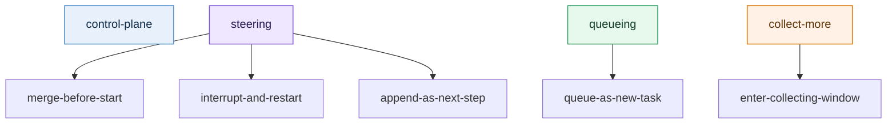

# Test Cases

[English](test_cases.md) | [中文](test_cases.zh-CN.md)

### 1. Goal

This document converts the design examples into future automated test candidates.

Each case includes at least:

- initial runtime state
- consecutive user inputs
- expected classification
- expected execution decision
- expected `[wd]`

### 2. At-a-glance map

### 3. Core case table

| Case | Initial state | Consecutive input | classification | decision |
|---|---|---|---|---|
| A | no active task | `Check Hangzhou weather` | `queueing` | `queue-as-new-task` |
| B | active task = `rewrite resume`, not started yet | `Also make it product-manager oriented` | `steering` | `merge-before-start` |
| C | active task = `rewrite resume`, running with no side effects | `Make it more conversational too` | `steering` | `interrupt-and-restart` |
| D | active task = `write files`, files already written | `Add one more conclusion section` | `steering` | `append-as-next-step` |
| E | active task = `rewrite resume` | `Also check Hangzhou weather` | `queueing` | `queue-as-new-task` |
| F | active task = `rewrite resume` | `Don’t start yet, I will send two more messages` | `collect-more` | `enter-collecting-window` |
| G | any active task | `Continue` | `control-plane` | `handle-as-control-plane` |

### 4. Detailed examples

#### Case B: steering merge before execution starts

**Initial state**

- active task: `rewrite the resume into a product-manager-oriented version`
- stage: `queued`

**Input**

1. `Please review this resume`
2. `Also make it more product-manager oriented`

**Expected**

- classification: `steering`
- decision: `merge-before-start`
- `[wd]`:
  - `[wd] This update has been merged into the current task because execution has not formally started yet.`

#### Case C: running but still safely restartable

**Initial state**

- active task: `rewrite the resume into a product-manager-oriented version`
- stage: `running-no-side-effects`

**Input**

1. `Please turn this resume into a more complete version`
2. `Make it more conversational too`

**Expected**

- classification: `steering`
- decision: `interrupt-and-restart`
- `[wd]`:
  - `[wd] The current task has been restarted with this update because execution is still safely restartable.`

#### Case D: side effects already exist, do not restart directly

**Initial state**

- active task: `rewrite README draft`
- stage: `running-with-side-effects`
- some files are already written

**Input**

1. `Rewrite the README`
2. `Add one more conclusion section at the end`

**Expected**

- classification: `steering`
- decision: `append-as-next-step`
- `[wd]`:
  - `[wd] This has been added as the next step of the current task because execution has already produced external actions.`

#### Case E: clearly a new goal

**Initial state**

- active task: `rewrite resume`
- stage: `running`

**Input**

1. `Please rewrite this resume`
2. `Also check Hangzhou weather`

**Expected**

- classification: `queueing`
- decision: `queue-as-new-task`
- `[wd]`:
  - `[wd] This has been queued as a separate task because it introduces a new independent goal.`

#### Case F: collect-more

**Initial state**

- active task: `none` or `queued`

**Input**

1. `I’m going to send three messages, don’t start yet`
2. `First: organize the directory`
3. `Second: update the README`
4. `Third: summarize everything`

**Expected**

- first message classification: `collect-more`
- decision: `enter-collecting-window`
- `[wd]`:
  - `[wd] I will wait for your next inputs before starting execution.`

### 5. Ambiguous classifier cases

These are meant to test when the runtime must call the classifier.

| Case | Input | Why ambiguous | Expected |
|---|---|---|---|
| H | `Add a bit more business perspective` | could refine current writing or start a new analysis task | classifier is triggered |
| I | `Give me another version` | could mean continue current task or open a new task | classifier is triggered |
| J | `Look at this one too` | depends heavily on context and reference resolution | classifier is triggered |

The point of these cases is not always a single final answer. The point is to verify:

1. runtime recognizes ambiguity
2. runtime calls the classifier
3. runtime produces a decision trace and `[wd]`

### 6. Suggested automation layers

Recommended future test layering:

1. pure contract tests
   - input state + input message
   - assert classification / decision / wd template

2. classifier trigger tests
   - assert which cases must invoke the classifier
   - assert obvious cases do not invoke it unnecessarily

3. end-to-end session tests
   - feed multiple consecutive messages
   - assert final queue / steering trace / wd receipt

### 6.1 Receipt coherence regressions

These cases specifically guard against a routing decision being correct in truth source while the user-visible wording is stale, generic, or silently skipped.

| Case | Initial state | Consecutive input | Expected |
|---|---|---|---|
| K | queued early-ack marker already exists | follow-up resolves to `same-session-routing-receipt` | plugin still sends the runtime-owned `[wd]` instead of skipping it as duplicate queue ack |
| L | same session only has a stale observed placeholder such as `在么`, or a `received/manual-review` task, and no `queued/running` task exists | new first real request | runtime reuses that observed task as a pre-start takeover target and returns a merge-style runtime-owned `[wd]` |

### 7. What reviewers should focus on

Recommended review focus:

1. which cases should be fully rule-based
2. which cases must invoke the classifier
3. which running stages should allow interrupt-and-restart
4. whether the `[wd]` messages are short, truthful, and clear enough
