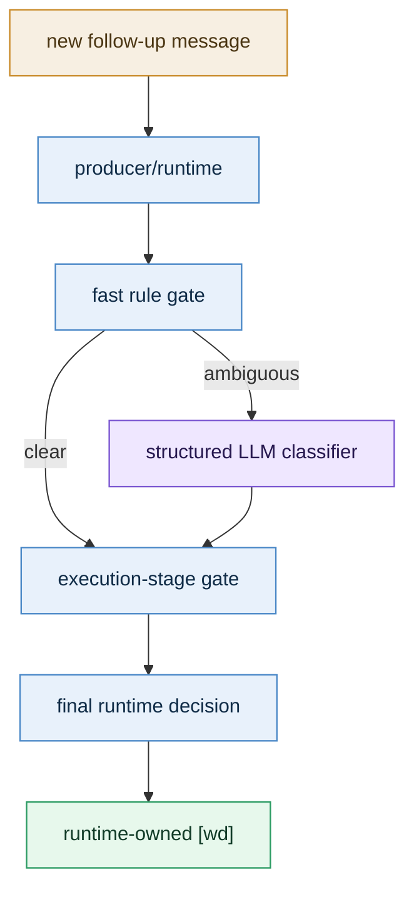
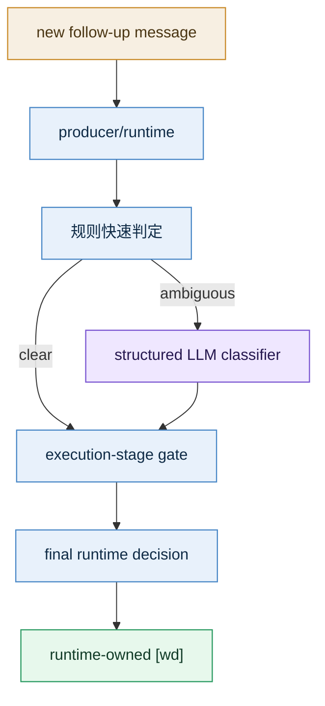

# Decision Contract

[English](#english) | [中文](#中文)

## English

### 1. Formal goal

Define an auditable, explainable, and recoverable contract for follow-up user messages inside the same session:

- classify the message first
- check whether the current task can still be safely rewritten
- let runtime make the final decision and return `[wd]`

### 2. Decision types

#### 2.1 message classification

Every follow-up message is first classified into one of four buckets:

| classification | meaning | enters normal task path |
|---|---|---|
| `control-plane` | status, cancel, pause, resume, continue, and similar management instructions | no |
| `steering` | refinement, correction, or constraint on the current active task | depends on stage |
| `queueing` | an independent new task | yes |
| `collect-more` | explicit “wait for more input before executing” | not yet |

#### 2.2 execution decision

If the classification is not `control-plane`, runtime still needs to choose an execution action:

| decision | meaning |
|---|---|
| `merge-before-start` | current task has not really started yet, so merge directly |
| `interrupt-and-restart` | current task is running but still safely restartable |
| `append-as-next-step` | current task already has side effects, so append the new input as the next step |
| `queue-as-new-task` | route it as a separate new task |
| `enter-collecting-window` | open a short collecting window and wait for more input |
| `handle-as-control-plane` | handle directly as control-plane |

### 3. Layer ownership



Ownership should stay fixed:

- runtime:
  - decides whether the classifier should be called
  - decides the final execution action
  - decides the `[wd]` wording
- LLM classifier:
  - only performs structured classification
  - does not directly decide execution
- main business LLM:
  - should not own lane / queue / interrupt adjudication

### 4. When the LLM classifier should run

It should not run for every follow-up message.

It should run only when all of the following are true:

1. an active task already exists in the same session
2. the new message is not obviously control-plane
3. the new message is not obviously collect-more
4. rules cannot reliably decide between `steering` and `queueing`

The classifier should not be used for:

- `continue / stop / status / cancel`
- `I’m not done yet, don’t start`
- ordinary new messages when no active task exists
- obviously independent new goals with weak relation to the current task

### 5. Recommended classifier shape

The classifier should be a **runtime-owned structured call**, not a free-form tool that the main LLM may or may not call.

Why:

1. this belongs to the producer/runtime contract
2. it needs strict timeout, caching, fallback, and auditability
3. low-confidence outcomes must be handled by runtime, not improvised by the main LLM

Recommended input:

```json
{
  "session_key": "agent:main:feishu:direct:...",
  "active_task_summary": "Rewrite the resume into a product-manager-oriented version",
  "active_task_stage": "running-no-side-effects",
  "recent_user_messages": [
    "Please review this resume",
    "Also make it more product-manager oriented"
  ],
  "new_message": "Make it more conversational too",
  "collecting_state": false,
  "queue_state": {
    "running_count": 1,
    "queued_count": 2
  }
}
```

Recommended output:

```json
{
  "classification": "steering",
  "confidence": 0.87,
  "needs_confirmation": false,
  "reason_code": "active-task-clarification",
  "reason_text": "The new message refines the active task rather than introducing a separate goal."
}
```

### 6. Execution-stage gate

Classification alone is not enough.

Runtime must also pass the result through an execution-stage gate:

| active task stage | recommended action |
|---|---|
| `received / queued` | `merge-before-start` |
| `running-no-side-effects` | `interrupt-and-restart` |
| `running-with-side-effects` | `append-as-next-step` or `queue-as-new-task` |
| `paused / continuation` | prefer `append-as-next-step` or `queue-as-new-task` |

#### 6.1 Why “live interruption” should not be the core assumption

From the user’s point of view, this feels like “interrupting and changing the current task.”

From runtime’s point of view, the safest implementation is usually not:

- keep the same LLM generation running and hot-update its context

It is usually:

- merge before start if execution has not started
- interrupt and restart if restart is still safe
- append or queue if side effects already exist

So the formal contract should be:

> “Interruption” is a user-facing semantic; the real execution action is chosen by runtime according to stage.

### 7. `[wd]` receipt contract

Every follow-up message needs a runtime-owned `[wd]` receipt.

#### 7.1 Structure

```json
{
  "decision": "interrupt-and-restart",
  "reason_code": "active-task-safe-restart",
  "reason_text": "This follow-up rewrites the current task, and execution is still in a safely restartable stage.",
  "target_task_id": "task_xxx",
  "user_visible_wd": "[wd] I restarted the current task with this update because it changes the current goal and the execution is still safely restartable."
}
```

#### 7.2 Wording rules

1. always say what happened
2. always say why
3. keep it short
4. keep it truthful rather than vague

#### 7.3 Suggested templates

| decision | suggested `[wd]` template |
|---|---|
| `merge-before-start` | `[wd] This update has been merged into the current task because execution has not formally started yet.` |
| `interrupt-and-restart` | `[wd] The current task has been restarted with this update because execution is still safely restartable.` |
| `append-as-next-step` | `[wd] This has been added as the next step of the current task because execution has already produced external actions.` |
| `queue-as-new-task` | `[wd] This has been queued as a separate task because it introduces a new independent goal.` |
| `enter-collecting-window` | `[wd] I will wait for your next inputs before starting execution.` |
| `handle-as-control-plane` | `[wd] This control instruction has been received and is being handled against the current task state.` |

### 8. Low-confidence fallback

This is a core safety layer.

When the classifier:

- times out
- errors
- returns low confidence

runtime must not pretend it fully understood the intent.

Suggested fallback order:

1. obvious control-plane -> keep it as control-plane
2. obvious collect-more -> still enter collecting
3. if the active task already has side effects -> default to `queue-as-new-task`
4. if the active task has not started yet -> default to `merge-before-start`
5. for high-risk ambiguity, allow a very short confirmation

### 9. Design boundary

This design explicitly rejects:

1. turning task-system into a universal front-door semantic classifier
2. growing phrase lists or regex as the long-term way to interpret same-session follow-up intent

The intended boundary is:

- normal request understanding stays on the original agent / LLM path
- task-system only adjudicates same-session follow-up routing
- the classifier is a constrained helper, not a new primary executor

## 中文

### 1. 正式目标

为同一 session 内的后续用户消息定义一个可审计、可解释、可回退的正式 contract：

- 先判断消息属于哪一类
- 再判断当前 task 是否可安全改写
- 最后由 runtime 做决定，并返回 `[wd]`

### 2. decision 类型

#### 2.1 message classification

后续消息先分成 4 类：

| classification | 含义 | 是否进入普通任务路径 |
|---|---|---|
| `control-plane` | 状态查询、取消、暂停、恢复、继续等控制面指令 | 否 |
| `steering` | 对当前 active task 的补充、修正或约束 | 视执行阶段而定 |
| `queueing` | 独立新任务 | 是，进入新 task |
| `collect-more` | 明确要求先等后续补充再执行 | 暂不进入 |

#### 2.2 execution decision

当 classification 不是 `control-plane` 时，runtime 还要进一步决定执行动作：

| decision | 含义 |
|---|---|
| `merge-before-start` | 当前 task 还没真正开始，直接并入 |
| `interrupt-and-restart` | 当前 task 正在运行，但仍处于可安全重启阶段 |
| `append-as-next-step` | 当前 task 已有副作用，把新消息作为当前 task 的后续步骤 |
| `queue-as-new-task` | 作为独立新 task 排队 |
| `enter-collecting-window` | 进入短暂收集窗口，等待后续输入 |
| `handle-as-control-plane` | 直接走控制面 |

### 3. 不同层的职责



职责固定为：

- runtime：
  - 决定是否触发 classifier
  - 决定最终执行动作
  - 决定 `[wd]` 文案
- LLM classifier：
  - 只做结构化分类
  - 不直接决定执行动作
- 主业务 LLM：
  - 不负责这一步的 lane / queue / interrupt 裁决

### 4. 什么时候触发 LLM classifier

默认不应每条消息都问一次 LLM。

只在下面条件同时满足时触发：

1. 同一 session 已存在 active task
2. 新消息不是明显 control-plane
3. 新消息不是明显 collect-more
4. 规则无法稳定判定是 `steering` 还是 `queueing`

反过来说，下面这些情况不需要 classifier：

- `继续 / 停止 / 状态 / 取消`
- `我还没发完，先别开始`
- 没有 active task 的普通新消息
- 明显全新目标且与当前任务弱相关

### 5. classifier 的推荐形态

推荐做成 **runtime-owned structured call**，而不是主 LLM 自由调用的 tool。

原因：

1. 这是 producer/runtime contract 的一部分
2. 需要严格超时、缓存、回退和审计
3. 低置信度时必须由 runtime 兜底，而不是让主 LLM 自行发挥

推荐输入：

```json
{
  "session_key": "agent:main:feishu:direct:...",
  "active_task_summary": "整理简历并输出产品经理方向版本",
  "active_task_stage": "running-no-side-effects",
  "recent_user_messages": [
    "帮我看一下这份简历",
    "顺便改成偏产品经理方向"
  ],
  "new_message": "再口语一点",
  "collecting_state": false,
  "queue_state": {
    "running_count": 1,
    "queued_count": 2
  }
}
```

推荐输出：

```json
{
  "classification": "steering",
  "confidence": 0.87,
  "needs_confirmation": false,
  "reason_code": "active-task-clarification",
  "reason_text": "The new message refines the active task rather than introducing a separate goal."
}
```

### 6. execution-stage gate

语义分类完，还不能直接 merge。

还必须过一层执行阶段 gate：

| active task stage | 推荐动作 |
|---|---|
| `received / queued` | `merge-before-start` |
| `running-no-side-effects` | `interrupt-and-restart` |
| `running-with-side-effects` | `append-as-next-step` 或 `queue-as-new-task` |
| `paused / continuation` | 优先 `append-as-next-step` 或 `queue-as-new-task` |

#### 6.1 为什么不能直接依赖“运行中的插话”

从用户视角看，这件事像“插话修改当前任务”。

但从 runtime 角度，更稳的实现通常不是：

- 让同一轮 LLM 在生成中热更新上下文

而是：

- 如果还没开始，直接并入
- 如果可安全打断，中断并重启
- 如果已有副作用，则追加步骤或排成新任务

所以这里的正式 contract 应是：

> “插话” 是用户语义；真正执行动作由 runtime 按执行阶段决定。

### 7. `[wd]` 回执 contract

每一条后续输入都需要一条 runtime-owned `[wd]` 回执。

#### 7.1 结构

```json
{
  "decision": "interrupt-and-restart",
  "reason_code": "active-task-safe-restart",
  "reason_text": "这条补充会改写当前任务；当前执行仍处于可安全重启阶段。",
  "target_task_id": "task_xxx",
  "user_visible_wd": "[wd] 已按这条补充重启当前任务；因为它会改写当前目标，而当前执行仍处于可安全重启阶段。"
}
```

#### 7.2 文案原则

1. 一定要说明“怎么处理了”
2. 一定要说明“为什么”
3. 一定要简短，不讲内部实现细节
4. 一定要真实，不能写成抽象空话

#### 7.3 模板建议

| decision | 推荐 `[wd]` 模板 |
|---|---|
| `merge-before-start` | `[wd] 已把这条补充并入当前任务；因为当前任务还没正式开始执行。`
| `interrupt-and-restart` | `[wd] 已按这条补充重启当前任务；因为当前执行仍处于可安全改写阶段。`
| `append-as-next-step` | `[wd] 这条已记入当前任务的后续步骤；因为当前执行已产生外部动作，不直接中断重跑。`
| `queue-as-new-task` | `[wd] 这条已单独排队；因为它引入了新的独立目标，不覆盖当前任务。`
| `enter-collecting-window` | `[wd] 先不开始执行；我会继续收集你接下来的补充后再一起处理。`
| `handle-as-control-plane` | `[wd] 已收到这条控制指令；正在按当前任务状态处理。`

### 8. 低置信度 fallback

这是整套设计里很重要的一层。

当 classifier：

- 超时
- 出错
- 置信度过低

runtime 不应假装自己已经看懂。

推荐 fallback 顺序：

1. 明显控制面 -> 仍走控制面
2. 明显 collect-more -> 仍进入 collecting
3. 若 active task 已有副作用 -> 默认 `queue-as-new-task`
4. 若 active task 还没开始 -> 默认 `merge-before-start`
5. 对高风险歧义场景，允许发极短确认

### 9. 设计边界

这套设计明确拒绝下面两条路线：

1. 把 task-system 做成前置万能语义分类器
2. 继续扩张 phrase list / regex 去猜连续输入的真实意图

正确边界是：

- 普通请求理解仍在原 agent / LLM 路径
- task-system 只对“同 session follow-up 路由”做受控裁决
- classifier 只是受控的辅助判断，不是新的主执行器
