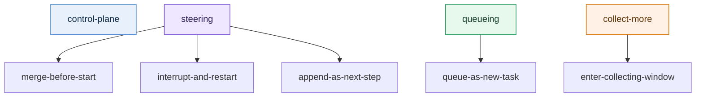

# Test Cases

[English](#english) | [中文](#中文)

## English

### 1. Goal

This document converts the design examples into future automated test candidates.

Each case includes at least:

- initial runtime state
- consecutive user inputs
- expected classification
- expected execution decision
- expected `[wd]`

### 2. At-a-glance map

### 3. Core case table

| Case | Initial state | Consecutive input | classification | decision |
|---|---|---|---|---|
| A | no active task | `Check Hangzhou weather` | `queueing` | `queue-as-new-task` |
| B | active task = `rewrite resume`, not started yet | `Also make it product-manager oriented` | `steering` | `merge-before-start` |
| C | active task = `rewrite resume`, running with no side effects | `Make it more conversational too` | `steering` | `interrupt-and-restart` |
| D | active task = `write files`, files already written | `Add one more conclusion section` | `steering` | `append-as-next-step` |
| E | active task = `rewrite resume` | `Also check Hangzhou weather` | `queueing` | `queue-as-new-task` |
| F | active task = `rewrite resume` | `Don’t start yet, I will send two more messages` | `collect-more` | `enter-collecting-window` |
| G | any active task | `Continue` | `control-plane` | `handle-as-control-plane` |

### 4. Detailed examples

#### Case B: steering merge before execution starts

**Initial state**

- active task: `rewrite the resume into a product-manager-oriented version`
- stage: `queued`

**Input**

1. `Please review this resume`
2. `Also make it more product-manager oriented`

**Expected**

- classification: `steering`
- decision: `merge-before-start`
- `[wd]`:
  - `[wd] This update has been merged into the current task because execution has not formally started yet.`

#### Case C: running but still safely restartable

**Initial state**

- active task: `rewrite the resume into a product-manager-oriented version`
- stage: `running-no-side-effects`

**Input**

1. `Please turn this resume into a more complete version`
2. `Make it more conversational too`

**Expected**

- classification: `steering`
- decision: `interrupt-and-restart`
- `[wd]`:
  - `[wd] The current task has been restarted with this update because execution is still safely restartable.`

#### Case D: side effects already exist, do not restart directly

**Initial state**

- active task: `rewrite README draft`
- stage: `running-with-side-effects`
- some files are already written

**Input**

1. `Rewrite the README`
2. `Add one more conclusion section at the end`

**Expected**

- classification: `steering`
- decision: `append-as-next-step`
- `[wd]`:
  - `[wd] This has been added as the next step of the current task because execution has already produced external actions.`

#### Case E: clearly a new goal

**Initial state**

- active task: `rewrite resume`
- stage: `running`

**Input**

1. `Please rewrite this resume`
2. `Also check Hangzhou weather`

**Expected**

- classification: `queueing`
- decision: `queue-as-new-task`
- `[wd]`:
  - `[wd] This has been queued as a separate task because it introduces a new independent goal.`

#### Case F: collect-more

**Initial state**

- active task: `none` or `queued`

**Input**

1. `I’m going to send three messages, don’t start yet`
2. `First: organize the directory`
3. `Second: update the README`
4. `Third: summarize everything`

**Expected**

- first message classification: `collect-more`
- decision: `enter-collecting-window`
- `[wd]`:
  - `[wd] I will wait for your next inputs before starting execution.`

### 5. Ambiguous classifier cases

These are meant to test when the runtime must call the classifier.

| Case | Input | Why ambiguous | Expected |
|---|---|---|---|
| H | `Add a bit more business perspective` | could refine current writing or start a new analysis task | classifier is triggered |
| I | `Give me another version` | could mean continue current task or open a new task | classifier is triggered |
| J | `Look at this one too` | depends heavily on context and reference resolution | classifier is triggered |

The point of these cases is not always a single final answer. The point is to verify:

1. runtime recognizes ambiguity
2. runtime calls the classifier
3. runtime produces a decision trace and `[wd]`

### 6. Suggested automation layers

Recommended future test layering:

1. pure contract tests
   - input state + input message
   - assert classification / decision / wd template

2. classifier trigger tests
   - assert which cases must invoke the classifier
   - assert obvious cases do not invoke it unnecessarily

3. end-to-end session tests
   - feed multiple consecutive messages
   - assert final queue / steering trace / wd receipt

### 6.1 Receipt coherence regressions

These cases specifically guard against a routing decision being correct in truth source while the user-visible wording is stale, generic, or silently skipped.

| Case | Initial state | Consecutive input | Expected |
|---|---|---|---|
| K | queued early-ack marker already exists | follow-up resolves to `same-session-routing-receipt` | plugin still sends the runtime-owned `[wd]` instead of skipping it as duplicate queue ack |
| L | same session only has a stale observed placeholder such as `在么`, or a `received/manual-review` task, and no `queued/running` task exists | new first real request | runtime reuses that observed task as a pre-start takeover target and returns a merge-style runtime-owned `[wd]` |

### 7. What reviewers should focus on

Recommended review focus:

1. which cases should be fully rule-based
2. which cases must invoke the classifier
3. which running stages should allow interrupt-and-restart
4. whether the `[wd]` messages are short, truthful, and clear enough

## 中文

### 1. 目标

这份文件把设计样例直接整理成后续自动化测试候选。

每条 case 都至少包含：

- 初始运行态
- 用户连续输入
- 预期 classification
- 预期 execution decision
- 预期 `[wd]`

### 2. 一眼看懂的总图

### 3. 核心 case 表

| Case | 初始状态 | 连续输入 | classification | decision |
|---|---|---|---|---|
| A | 无 active task | `帮我查杭州天气` | `queueing` | `queue-as-new-task` |
| B | active task = `整理简历`，尚未开始 | `顺便改成偏产品经理方向` | `steering` | `merge-before-start` |
| C | active task = `整理简历`，running 且无副作用 | `再口语一点` | `steering` | `interrupt-and-restart` |
| D | active task = `写文件并已落盘` | `再补一段结论` | `steering` | `append-as-next-step` |
| E | active task = `整理简历` | `另外再查一下杭州天气` | `queueing` | `queue-as-new-task` |
| F | active task = `整理简历` | `先别开始，我还会继续补两条` | `collect-more` | `enter-collecting-window` |
| G | active task = 任意 | `继续` | `control-plane` | `handle-as-control-plane` |

### 4. 详细样例

#### Case B: 未开始时的 steering merge

**初始状态**

- active task: `整理简历并输出产品经理方向版本`
- stage: `queued`

**输入**

1. `帮我看一下这份简历`
2. `顺便改成偏产品经理方向`

**预期**

- classification: `steering`
- decision: `merge-before-start`
- `[wd]`:
  - `[wd] 已把这条补充并入当前任务；因为当前任务还没正式开始执行。`

#### Case C: 运行中但可安全重启

**初始状态**

- active task: `整理简历并输出产品经理方向版本`
- stage: `running-no-side-effects`

**输入**

1. `帮我把这份简历整理成更完整的版本`
2. `再口语一点`

**预期**

- classification: `steering`
- decision: `interrupt-and-restart`
- `[wd]`:
  - `[wd] 已按这条补充重启当前任务；因为当前执行仍处于可安全改写阶段。`

#### Case D: 已有副作用，不直接重跑

**初始状态**

- active task: `写 README 草稿`
- stage: `running-with-side-effects`
- 已写出部分文件

**输入**

1. `把 README 重写一遍`
2. `最后再补一段结论`

**预期**

- classification: `steering`
- decision: `append-as-next-step`
- `[wd]`:
  - `[wd] 这条已记入当前任务的后续步骤；因为当前执行已产生外部动作，不直接中断重跑。`

#### Case E: 明确新目标

**初始状态**

- active task: `整理简历`
- stage: `running`

**输入**

1. `帮我整理这份简历`
2. `另外再查一下杭州天气`

**预期**

- classification: `queueing`
- decision: `queue-as-new-task`
- `[wd]`:
  - `[wd] 这条已单独排队；因为它引入了新的独立目标，不覆盖当前任务。`

#### Case F: collect-more

**初始状态**

- active task: `无` 或 `queued`

**输入**

1. `我接下来会连续发三条，你先别开始`
2. `第一条：整理目录`
3. `第二条：补 README`
4. `第三条：最后给我总结`

**预期**

- 第 1 条 classification: `collect-more`
- decision: `enter-collecting-window`
- `[wd]`:
  - `[wd] 先不开始执行；我会继续收集你接下来的补充后再一起处理。`

### 5. classifier 歧义 case

这类 case 用来验证“什么时候需要 LLM classifier”。

| Case | 输入 | 为什么歧义 | 预期 |
|---|---|---|---|
| H | `再补一点业务视角` | 可能是补充当前文案，也可能是新分析任务 | 触发 classifier |
| I | `再来一个版本` | 可能是当前任务继续，也可能是新任务 | 触发 classifier |
| J | `这个也一起看` | 依赖上文指代，规则不够 | 触发 classifier |

这些 case 的重点不是固定唯一结果，而是验证：

1. runtime 能识别它们是歧义场景
2. runtime 会触发 classifier
3. runtime 能给出 decision trace 和 `[wd]`

### 6. 自动化测试建议

建议后续拆成 3 层测试：

1. pure contract tests
   - 输入状态 + 输入消息
   - 断言 classification / decision / wd 模板

2. classifier trigger tests
   - 断言哪些场景必须触发 classifier
   - 断言明显场景不会误触发 classifier

3. end-to-end session tests
   - 连续输入多条消息
   - 断言最终 task queue / steering trace / wd receipt

### 6.1 receipt coherence 回归项

这组 case 专门防止一种断层：truth source 里的 routing decision 是对的，但用户最终看到的文案还是旧的、泛化的，或者被静默跳过。

| Case | 初始状态 | 连续输入 | 预期 |
|---|---|---|---|
| K | 已存在 queued early-ack marker | 后续消息被 runtime 判成 `same-session-routing-receipt` | plugin 仍然要发 runtime-owned `[wd]`，不能因为旧的 queue ack marker 就直接跳过 |
| L | 同 session 里只剩 stale observed 占位消息，例如 `在么`，或 `received/manual-review` 任务，没有 `queued/running` task | 用户发来新的第一条真实请求 | runtime 会复用这条 observed task 作为 pre-start takeover target，并返回 merge 风格的 runtime-owned `[wd]` |

### 7. review 时重点看什么

这份 case 包 review 时，建议重点看 4 件事：

1. 哪些 case 应该完全靠规则
2. 哪些 case 必须进 classifier
3. 哪些 running stage 允许中断重启
4. `[wd]` 是否足够短、够真、够清楚
