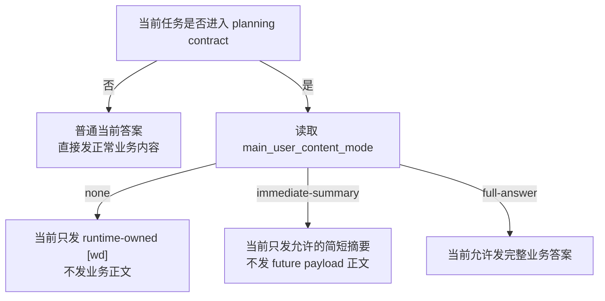

[English](task_user_content_decision.md) | [中文](task_user_content_decision.zh-CN.md)

# task_user_content decision note

> 目标：把 `task_user_content` 这件事讲清楚，方便人快速判断这套机制该继续修，还是该废弃。

## 1. 结论

`task_user_content` 不适合继续作为主机制。

原因不是它“还差几个 bug”，而是它要求系统去判断：

- 某段自然语言是不是“中间结果”
- 某段自然语言是不是“应该被 runtime 改写的内容”

这件事如果落在文本层做判断，长期做不准。

真正可以稳定判断的，不是文本，而是任务状态。

所以更稳的方向应该是：

1. 保留结构化 planning 状态
2. 让 runtime 根据任务状态决定“现在发不发业务内容”
3. 不再依赖 `<task_user_content> ... </task_user_content>` 这种文本协议

## 2. 原始目标

`task_user_content` 最初是为了解决一个真实问题：

- task tool 已经介入
- LLM 在同一轮里既会说业务结果，也会说调度状态
- 用户不应该直接看到那些“内部排程过程”

典型例子：

- `先查杭州天气，再查宁波天气；2分钟后告诉我杭州，3分钟后告诉我宁波。`

这里用户真正应该看到的是：

- 当前：[wd] 已安排妥当：2分钟后同步杭州天气。
- 当前：[wd] 已安排妥当：3分钟后同步宁波天气。
- 到点后：真正的天气正文

而不应该看到：

- 模型一边说“我已经排上了”
- 一边又把杭州/宁波结果直接提前发掉

## 3. 根本问题

问题不在于“有没有标签”，而在于“系统到底用什么来判断当前回复是否属于中间态”。

如果判断依据是文本本身，就会遇到这些情况：

- 正式答案和中间说明，字面上很像
- quoted message 里可能带旧的内部协议
- transcript / mirror / reply context 会把旧内容重新带回来
- 一旦宿主 reply-dispatcher 没有拦住，内部协议就会外发

也就是说：

- 文本层判断：不稳定
- 状态层判断：稳定

## 4. 正确判断方式

### 4.1 看任务状态，不看回复文本

当前更可靠的判断依据应该是：

1. 是否已经进入 planning contract
2. 是否已经 arm 了 promise guard
3. 是否已经创建 follow-up plan
4. 是否已经 materialize / finalize follow-up
5. 当前 `main_user_content_mode` 是什么

其中最重要的是：

- `main_user_content_mode = none`
- `main_user_content_mode = immediate-summary`
- `main_user_content_mode = full-answer`

### 4.2 一张图看判断流程

### 4.3 最短规则

- 没有 planning：正常发答案
- 有 planning，且 `mode=none`：当前内容算中间态，不直接发
- 有 planning，且 `mode=immediate-summary`：当前只发摘要
- 有 planning，且 `mode=full-answer`：当前允许完整发

## 5. 例子

### 例 1：future-first，当前不该发业务正文

用户请求：

`先查杭州天气，再查宁波天气；2分钟后告诉我杭州，3分钟后告诉我宁波。`

结构化状态：

- promise guard: armed
- followup plan: created
- `main_user_content_mode = none`

正确行为：

- 当前只发 `[wd]`
- 不把“杭州 28°C / 宁波 22°C”现在就发出去

为什么：

- 这里的即时回复属于中间态
- 这个判断来自 `mode=none`
- 不是因为文本里碰巧出现了“2分钟后”

### 例 2：普通即时查询，不是中间态

用户请求：

`现在帮我查杭州和宁波天气。`

结构化状态：

- 没有 promise guard
- 没有 followup plan
- 没有 delayed reply

正确行为：

- 直接发完整答案

例如：

- `杭州现在 28°C，宁波现在 22°C。`

为什么：

- 这不是 future-first
- 所以不应被 runtime 当成“中间内容”拦住

### 例 3：一部分现在发，一部分以后发

用户请求：

`先查杭州天气，现在就告诉我；宁波的 3 分钟后再告诉我。`

结构化状态：

- 已进入 planning
- 只对宁波建了 follow-up
- 当前允许 `full-answer` 或 `immediate-summary`

正确行为：

- 当前可以发杭州
- 当前只能说“宁波稍后同步”
- 宁波真正结果留到 follow-up

### 例 4：文本像“中间态”，但其实该直接发

用户请求：

`你刚说 2 分钟后再告诉我，但我现在就想知道结果，直接告诉我。`

如果这时新一轮状态已经允许即时答复，那么就应该直接发结果。

不能因为文本里还出现：

- `2分钟后`
- `安排`
- `同步`

就继续把这轮误判成“中间态”。

## 6. 为什么文本判断会失效

下面这些内容在字面上都可能看起来像“内部中间结果”，但来源完全不同：

- 模型的正式答案
- 模型的计划说明
- 旧消息被 quoted 回来
- session transcript 被 replay
- 宿主 reply-dispatcher 直接拿到了原始 payload
- tool protocol 被当成正文外发

这也是为什么最近会同时看到：

- raw `<task_user_content>`
- raw quoted message
- raw `<|tool_calls_section_begin|>`

它们都说明：

- 只要把内部协议放进自然语言主通道
- 污染面就会持续扩散

## 7. 设计建议

建议把 `task_user_content` 从“主机制”降级为“待废弃兼容层”，甚至直接准备移除。

长期方案应该是：

1. 保留 `promise_guard`
2. 保留 `followup_plan`
3. 保留 `main_user_content_mode`
4. runtime 根据结构化状态决定：
   - 只发 `[wd]`
   - 发摘要
   - 发完整答案
5. 不再要求模型输出 `<task_user_content> ... </task_user_content>`

## 8. Test Cases

下面这些 case 应该作为正式判断样例保留：

| Case | 输入类型 | 状态 | 预期 |
| --- | --- | --- | --- |
| A | 普通即时查询 | 无 planning | 正常发完整答案 |
| B | future-first 请求 | planning + `mode=none` | 当前只发 `[wd]`，不发业务正文 |
| C | 混合请求 | planning + `mode=full-answer` | 当前发 now 部分，later 部分等 follow-up |
| D | 历史 quoted message 带旧协议 | quoted / replay | 只能做 sanitize，不能拿它做中间态判断 |
| E | 原始工具协议串混入正文 | delivery leak | 必须硬拦截，不能依赖文本标签抽取 |

## 9. 当前建议

当前建议不是“继续加更多 `<task_user_content>` 修补逻辑”。

当前建议是：

1. 先承认文本协议方案不稳定
2. 用结构化状态接管“当前能不能发业务内容”的判定
3. 再逐步移除 `task_user_content`

## 10. 工作计划

建议按 4 个阶段收口，而不是一次性硬切。

### Phase 1：mode-first，标签降级为兼容层

目标：

- prompt 不再把 `<task_user_content>` 当成主协议
- runtime 以 `main_user_content_mode` 作为第一判断依据
- legacy `<task_user_content>` 仍然继续兼容抽取和清洗

要做的事：

1. 调整 planning prompt / runtime context 文案
2. `message_sending` 改成 mode-first gate
3. `before_message_write` 保持 legacy sanitize，但不再要求 full-answer 必须带标签
4. 保留 raw marker 泄漏检查

通过标准：

- `mode=none` 仍然能抑制即时业务内容
- `mode=full-answer` 即使没有标签，也能正常发出 plain text
- legacy block 仍能被正确抽取

### Phase 2：runtime summary contract

目标：

- 给 `immediate-summary` 一个正式 contract
- 把“简短摘要”从口头概念变成可测行为

要做的事：

1. 明确 summary 长度和字段
2. 避免模型自由混入调度状态
3. 为 summary 模式单独补回归

Phase 2 contract：

- `mode=immediate-summary` 时，runtime 只保留一条简短、面向用户的业务摘要
- 默认上限：约 `120` 个字符
- 优先保留第一条“业务向”句子
- 像 `内部调度状态`、`tool_call`、`follow-up` 这类内部协议噪音，不应进入最终摘要

通过标准：

- `mode=immediate-summary` 不再等同于 `full-answer`
- 冗长正文会被收成一条短摘要
- 内部调度噪音不会原样进入 summary

### Phase 3：去标签化主链路

目标：

- 新 planning 主链路不再依赖 `<task_user_content>`

要做的事：

1. 从主要提示词和文档里移除“必须输出 block”的要求
2. 让 tests 默认走 plain-text + mode
3. 只把 `<task_user_content>` 当成历史兼容输入

Phase 3 contract：

- planning 主链路的默认输入输出都按 plain text 处理
- `mode=none / immediate-summary / full-answer` 的行为，不再以“是否带 block”为前提
- legacy `<task_user_content>` 只保留为兼容输入，不能再成为默认测试样例

通过标准：

- planning decision tests 默认使用 plain text
- `mode=none` 对 plain text 同样生效
- `mode=full-answer` 对 plain text 同样生效
- legacy block 仍有单独回归，证明兼容还在

### Phase 4：运行时彻底废弃

目标：

- 在运行时主链路里彻底废弃 `task_user_content` 机制

前提：

- quoted / transcript / mirror / direct delivery 全部不再依赖它
- `mode-first` 行为已经足够稳定
- 历史数据和审计策略已经单独分层

完成后：

- 新运行时链路不再需要 `<task_user_content>`
- 中间态判断完全回到结构化 planning 状态

Phase 4 contract：

- `task_user_content` 不再被当成业务内容协议
- runtime 不再因为“存在 block”而改变业务判定
- marker 在运行时里只剩 sanitize / strip / malformed 拦截含义
- 新测试和新文档都不再把它当成正常写法

通过标准：

- marker 不再参与业务判定 reason
- legacy marker 仅作为兼容清洗对象存在
- 默认测试样例全部不再依赖 marker
- 新链路对 marker 的态度只剩两种：清洗，或拦截坏格式

### Phase 5：历史清理与物理删除

目标：

- 删除剩余 marker 兼容代码与历史审计阶段性过渡物

要做的事：

1. 清理 runtime / test 中仅为兼容旧 marker 保留的分支
2. 明确历史 session / reset / deleted 文件的清理策略
3. 让 leak checker 从“当前运行 contract”退到“历史审计工具”

当前可用入口：

- 审计：`python3 scripts/runtime/check_task_user_content_leaks.py --all-history --json`
- 重启后只看新日志：`python3 scripts/runtime/check_task_user_content_leaks.py --since 2026-04-11T12:18:34+08:00 --json`
- 历史清理预演：`python3 scripts/runtime/scrub_task_user_content_history.py --json`
- 历史清理落盘：`python3 scripts/runtime/scrub_task_user_content_history.py --apply --json`

通过标准：

- 主代码不再保留 marker 解析常量与兼容分支
- marker 只存在于历史迁移脚本或审计脚本中
- 文档不再把它描述成当前系统的一部分

当前状态：

- 已完成
- 运行时主链路、planning follow-up truth source、plugin 主测试都已移除 marker 兼容分支
- `task_user_content` 现在只保留在历史泄漏审计和历史文件 scrub 工具里

这才是能收敛的方向。

## 11. 2026-04-11 收口结论

### 11.1 直接回答

能否准确判断“哪些是中间内容，需要被 runtime 改写”？

- 如果判断依据是自然语言文本：不能稳定判断
- 如果判断依据是结构化 planning 状态：可以稳定决定“当前发不发业务内容”

因此结论不是“继续修 `task_user_content` 文本协议”，而是：

- 彻底废弃它作为运行时协议
- 继续保留结构化状态判定
- 仅保留历史泄漏审计与硬拦截

### 11.2 真实证据

#### 证据 A：最早想解决的问题，确实来自 future-first / delayed planning

历史 session reset 里能看到这类真实样例：

- `半小时后提醒我查天气`
- `35 分钟之后提醒我查火车票，40 分钟之后提醒我查飞机票`
- `你帮我查一下宁波舟山的天气，明天的天气2分钟后告诉我，后天的天气3分钟后告诉我`
- `2分钟后提醒我查明天义乌到宁波的火车票，3分钟后提醒我查飞机票；然后帮我查目的地的天气；2分半后告诉我天气`

这些例子说明：

- 真实问题不是“模型吐了某个标签”
- 而是 future-first / compound / delayed 请求里，当前输出和未来输出的边界需要被 runtime 接管

#### 证据 B：`task_user_content` 实际污染过的，不只是“中间态”

历史网关日志里泄漏过的内容包括：

- `失败：当前环境缺少可用的本地语音转写工具...`
- `转写这一步没跑成...`
- `装好了，whisper-cpp 已成功安装完成...`

这些内容本身其实是用户可见的正常结果或说明，只是被错误包进了 `<task_user_content>`。

这说明：

- `task_user_content` 不能可靠表示“中间内容”
- 它也会包住正常应该发给用户的最终内容
- 所以系统不能依赖它来判断“该不该改写”

#### 证据 C：当前代码里它已经不再参与业务判定

当前仓库里 `task_user_content` 的剩余用途只有两类：

1. 插件侧 sanitize / hard-block
   - 清洗或拦截 raw `<task_user_content>` marker，避免再次外发
2. 历史审计与历史清理
   - `check_task_user_content_leaks.py`
   - `scrub_task_user_content_history.py`

它已经不再是：

- planning prompt 主协议
- runtime 业务判定依据
- tests 默认输入输出 contract

#### 证据 D：当前新链路已无新增泄漏

执行：

- `python3 scripts/runtime/check_task_user_content_leaks.py --json`

当前结果：

- `ok: true`
- `total: 0`

说明当前新日志和最新 session 已经不再把它当成正常运行时协议使用。

### 11.3 最终决定

最终决定如下：

1. 不再继续修 `task_user_content` 机制本身
2. 不再尝试定义“哪些文本长得像中间态”
3. 当前能否发业务内容，只允许由结构化 planning 状态决定
4. `task_user_content` 只保留三种历史角色：
   - raw marker sanitize
   - raw marker hard-block
   - 历史泄漏审计 / 历史文件 scrub

### 11.4 后续边界

后续如果再出现“当前不该发业务内容，却发了”的问题，应归到这些方向排查：

1. `main_user_content_mode` 判定错误
2. `promise_guard / followup_plan` truth source 不完整
3. `message_sending / before_message_write` 的 mode-first gate 有漏洞
4. control-plane / business-content 分层不一致

不应再回到：

- 新增 `<task_user_content>` 协议
- 继续扩大 marker 解析分支
- 通过文本规则猜“这段像不像中间结果”
